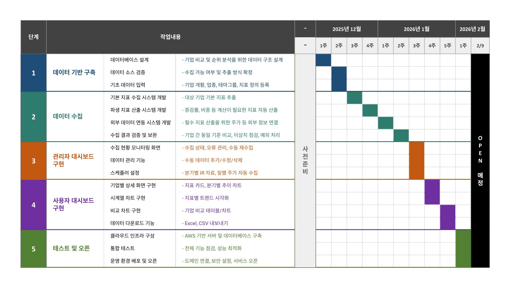

# Compass 기술 문서

Compass 시스템 기술 문서 모음.

---

## 개발 로드맵



> 상세 내용: [development-roadmap.md](./compass/development-roadmap.md) | 다운로드: [development-roadmap.xlsx](./compass/development-roadmap.xlsx)

---

## 문서 목록

### 프로젝트 관리

| 문서 | 설명 |
|------|------|
| [development-roadmap.md](./compass/development-roadmap.md) | 개발 로드맵 (마크다운) |
| [development-roadmap.xlsx](./compass/development-roadmap.xlsx) | 개발 로드맵 (엑셀) |

### 데이터베이스

| 문서 | 설명 |
|------|------|
| [database-design.md](./compass/database-design.md) | 설계 철학, 핵심 과제와 접근 방식 |
| [database-schema.md](./compass/database-schema.md) | 테이블 구조, 컬럼 명세, 쿼리 예시 |

### 데이터 수집

| 문서 | 설명 |
|------|------|
| [data-extraction-workflow.md](./compass/data-extraction-workflow.md) | 데이터 추출 서비스 구조 (분기말 저장 + 실시간 조회) |

---

## 문서 구조

```
docs/
├── README.md              # 이 파일 (인덱스)
└── compass/               # Compass 서비스
    ├── development-roadmap.md
    ├── development-roadmap.xlsx
    ├── database-design.md
    ├── database-schema.md
    ├── data-extraction-workflow.md
    └── images/
        └── development-roadmap.png
```

---

**최종 수정일**: 2025-12-08
