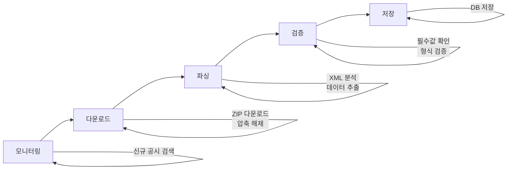
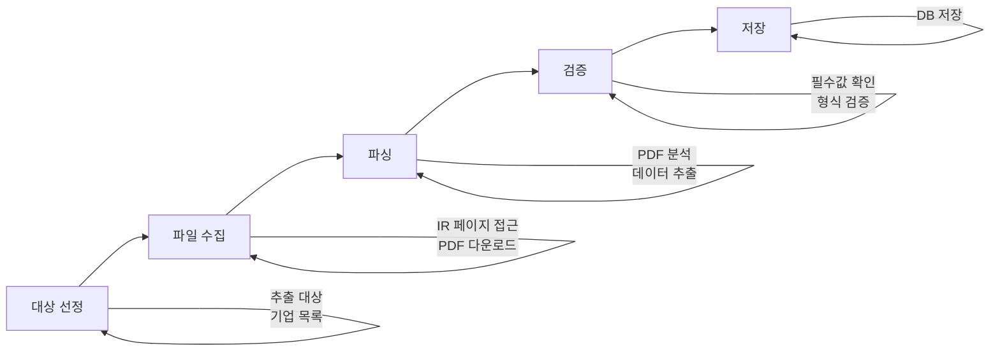
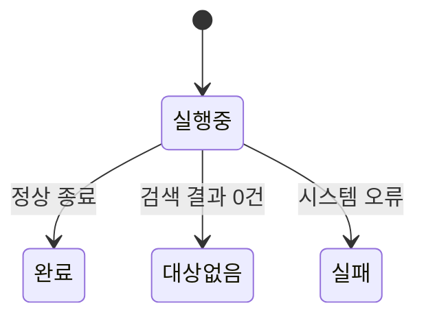
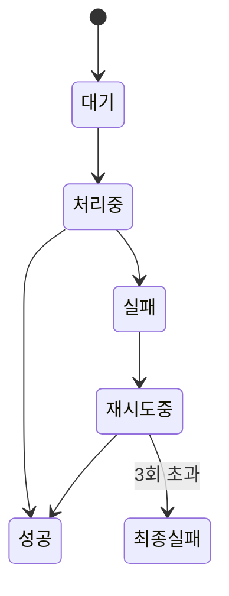

# Compass 데이터 추출 프로세스

공시 데이터가 수집되어 저장되기까지의 전체 과정을 설명하는 문서.
시스템 구조에 대한 이해가 필요한 경우 [database-design.md](./database-design.md) 참고.

---

## 목차

1. [개요](#1-개요)
2. [데이터 소스별 추출 흐름](#2-데이터-소스별-추출-흐름)
3. [상태 관리](#3-상태-관리)
4. [오류 처리와 재시도](#4-오류-처리와-재시도)

---

## 1. 개요

### 목표

외부 데이터 소스에서 기업 관련 정보를 자동으로 추출하여 데이터베이스에 저장.

### 데이터 소스

| 소스 | 설명 | 추출 대상 |
|------|------|----------|
| DART | 금융감독원 전자공시시스템 | 증권신고서, 사업보고서, 지배구조 보고서 등 |
| 기업 IR | 각 기업의 투자자 관계 페이지 | 공시 외 경영 정보, IR 자료 등 |

---

## 2. 데이터 소스별 추출 흐름

### 2.1 DART 공시 추출

DART에 제출된 공시 문서에서 데이터를 추출하는 과정.

#### 단계별 설명

| 단계 | 역할 | 상세 |
|------|------|------|
| 모니터링 | 신규 공시 발견 | DART 검색 → 접수번호, 회사명, 문서 종류 수집 |
| 다운로드 | 원본 파일 확보 | OpenDART API로 ZIP 다운로드 → XML 추출 |
| 파싱 | 데이터 추출 | XML 분석 → 문서 종류 판별 → 필요 정보 추출 |
| 검증 | 정합성 확인 | 필수 정보 존재 여부, 데이터 형식 적합성 확인 |
| 저장 | DB 저장 | 추출 데이터와 작업 이력 저장 |

### 2.2 기업 IR 추출

각 기업의 IR 페이지에서 컨퍼런스콜 자료, 경영실적 보고서 등을 추출하는 과정.

#### 단계별 설명

| 단계 | 역할 | 상세 |
|------|------|------|
| 대상 선정 | 추출 대상 결정 | 기업 목록에서 IR URL 보유 기업 선별 |
| 파일 수집 | 원본 파일 확보 | 기업별 IR 페이지 접근 → PDF 다운로드 |
| 파싱 | 데이터 추출 | PDF 분석 → 기업별 패턴에 맞춰 정보 추출 |
| 검증 | 정합성 확인 | 필수 정보 존재 여부, 데이터 형식 적합성 확인 |
| 저장 | DB 저장 | 추출 데이터와 작업 이력 저장 |

### 2.3 두 소스의 차이점

| 항목 | DART 공시 | 기업 IR |
|------|----------|---------|
| 추출 대상 | 증권신고서, 사업보고서 등 | 컨퍼런스콜, 경영실적 보고서 등 |
| 데이터 형식 | XML | PDF |
| 구조 일관성 | 높음 (표준 양식) | 낮음 (기업마다 다름) |
| 접근 방식 | API 제공 | 웹 크롤링 |

---

## 3. 상태 관리

### 3.1 배치 단위 상태

한 번의 추출 실행을 하나의 "배치"로 관리.

**배치 통계**:
- 처리 대상 문서 수
- 성공/실패 건수
- 소요 시간

### 3.2 개별 문서 상태

각 문서의 처리 상태를 개별 관리.

---

## 4. 오류 처리와 재시도

### 4.1 오류 유형

| 유형 | 원인 예시 | 대응 |
|------|----------|------|
| 다운로드 오류 | 네트워크 문제, 인증 오류 | 자동 재시도 |
| 파싱 오류 | 예상치 못한 문서 구조 | 수동 확인 필요 |
| 검증 오류 | 필수 정보 누락 | 원본 문서 확인 |

### 4.2 자동 재시도

실패한 문서는 자동으로 재시도:

| 재시도 횟수 | 대기 시간 |
|------------|----------|
| 1차 | 5초 |
| 2차 | 15초 |
| 3차 | 30초 |

3회 재시도 후에도 실패하면 "최종 실패"로 표시되며, 수동 확인이 필요함.

### 4.3 오류 기록

실패한 작업에는 다음 정보가 기록됨:
- 오류 종류
- 오류 메시지
- 발생 시점
- 재시도 횟수

---

## 관련 문서

- **데이터베이스 설계**: [database-design.md](./database-design.md)
- **테이블 스키마**: [database-schema.md](./database-schema.md)

---

**작성일**: 2025-11-27
**버전**: 1.1
