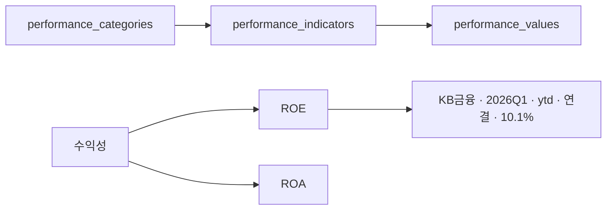
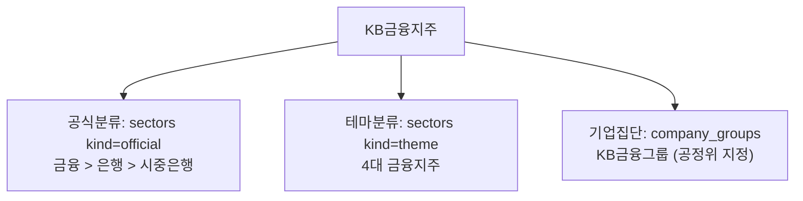
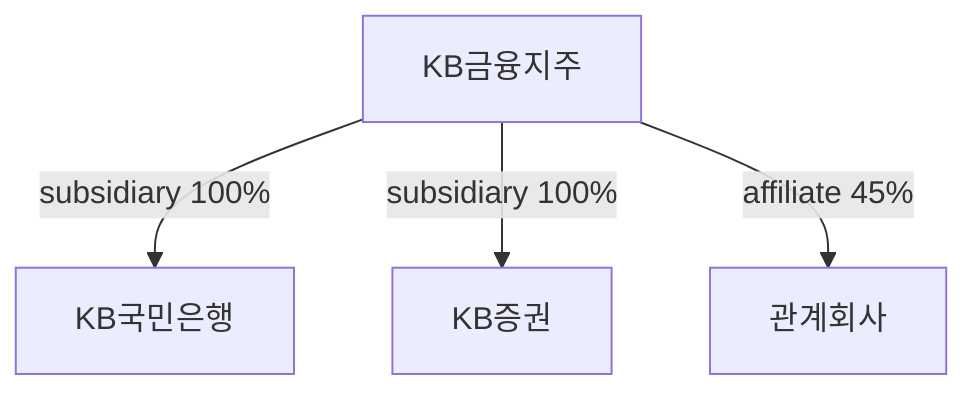
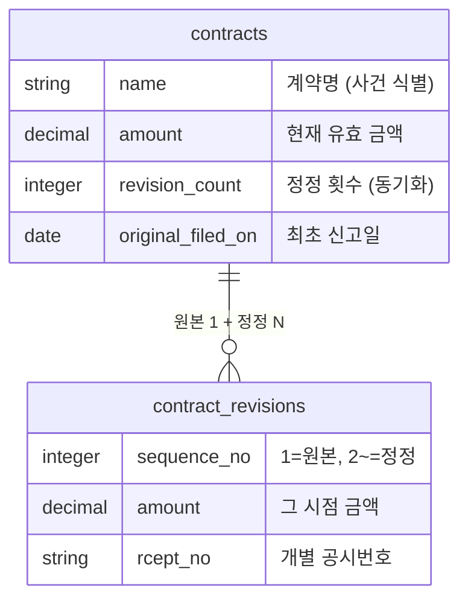
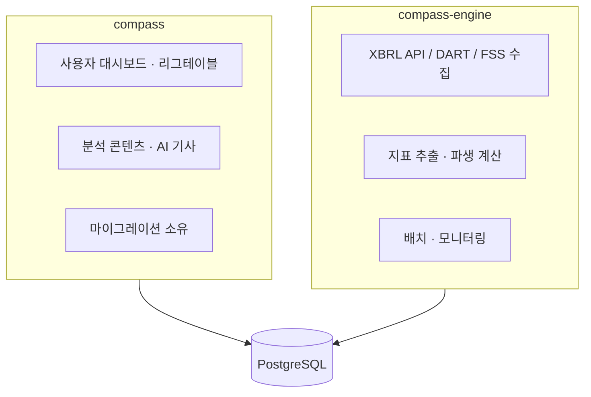
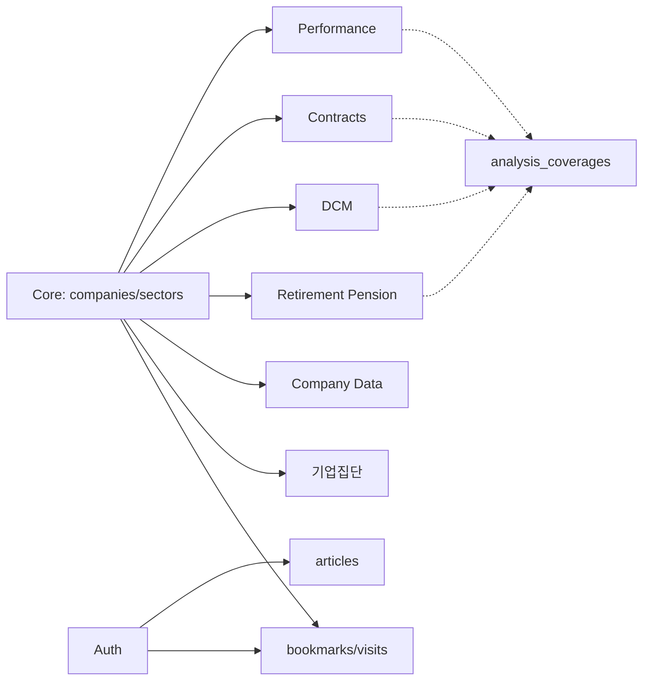

# Compass 데이터베이스 설계

Compass 데이터베이스가 **왜 지금의 구조인지**를 설명하는 문서.
테이블·컬럼·인덱스 명세는 [database-schema.md](./database-schema.md), 데이터 추출 흐름은 [data-extraction-workflow.md](./data-extraction-workflow.md) 참고.

---

## 0. 한눈에 보기

Compass의 핵심 콘텐츠는 **"의미 있는 비교가 가능한 기업들을 묶어 여러 각도에서 비교하는 것"**이다.
이 목표에서 파생된 설계 과제와 각각의 접근 방식은 다음과 같다.

| # | 과제 | 접근 방식 | 구현 |
|---|------|----------|------|
| 1 | 지표가 계속 늘고 바뀐다 | 지표를 코드가 아닌 **데이터**로 관리 | 카테고리–지표–값 3단계 |
| 2 | 같은 숫자도 기준에 따라 다르다 | 기간·연결기준을 **키의 일부**로 승격 | `period_type` × `basis` 복합 유니크 |
| 3 | 비교 그룹이 하나가 아니다 | 분류 축을 **3중으로 분리** | 공식분류 / 테마 / 기업집단 |
| 4 | 기업 관계는 두 종류다 | 지분관계와 그룹소속을 **다른 테이블로** | `company_relations` / `company_groups` |
| 5 | "이 회사, 이 분석 되나?" 판정이 비싸다 | 커버리지를 **역정규화**해 단일 진실원천화 | `analysis_coverages` |
| 6 | 공시는 정정된다 | 사건과 시점별 스냅샷을 **분리** | `contracts` / `contract_revisions` |
| 7 | 모든 걸 저장할 필요는 없다 | 재료만 저장, **순위·표는 런타임 산출** | `league_indicators` 모듈 |

---

## 1. 지표의 유연한 관리: 카테고리–지표–값

### 고려 사항

- 업종마다 중요한 지표가 다르다 (은행 BIS비율, 증권 NCR, 카드 연체율, 일반업종 EV/EBITDA…)
- 비교 지표는 수시로 추가·수정된다
- 단일 지표 비교와 카테고리 단위 비교를 모두 지원해야 한다

### 접근 방식

지표를 테이블 컬럼이 아니라 **레코드**로 관리한다. 지표를 하나 추가하는 데 마이그레이션도 배포도 필요 없다.



**세로형(EAV) 구조의 대가와 그 상쇄**

| 대가 | 상쇄 방법 |
|------|----------|
| 행 수 폭증 (현재 290만 행) | `(company_id, year, quarter)` / `(indicator_id, basis, year, quarter)` 복합 인덱스 |
| 타입 안정성 없음 | `value`(numeric)와 `value_text`(string) 분리, 둘 중 하나 필수 검증 |
| 조인 비용 | 리그테이블은 서비스 계층에서 한 번에 벌크 로딩 후 메모리 조립 |

### 단위(unit)를 값과 분리한 이유

값은 **항상 원 단위**로 저장하고, 표시 배율은 `performance_indicators.unit`이 결정한다
(`Performance::Indicator::UNIT_SCALES`: 조원/십억원/억원/백만원/…). 저장값이 단위에 오염되지 않으므로
업종이 달라도 같은 지표를 그대로 합산·비교할 수 있다. `%`, `bp`, `배`는 비율 단위로 취급해 변환하지 않는다.

### 적용 범위

`performance_values`는 경영성과뿐 아니라 **밸류에이션·Z-Score·DuPont의 입력 재료**까지 담는다.
즉 이 테이블 하나가 "기업의 수치 데이터"에 대한 단일 저장소다.

| 축 | 대상 | 카테고리 |
|----|------|---------|
| 금융 | 금융지주 4, 은행 4, 증권 26, 카드 8 | 수익성, 성장성, 건전성, 자본적정성 |
| 비금융 | 코스피·코스닥 수천 개사 | 성장성, 수익성, 생산성, 현금흐름, 시장가치, 밸류에이션 |

---

## 2. 시점과 기준의 명시적 관리

### 고려 사항

"2026년 1분기 영업이익"은 하나의 숫자가 아니다.

- 그 분기만의 값인지, 연초 누적인지, 직전 12개월인지
- 연결 기준인지 별도 기준인지
- 유량(flow)인지 시점 잔액(stock)인지

이걸 구분하지 않으면 **틀린 비교가 조용히 성립한다.** 리그테이블에서 A사는 누적, B사는 분기 값을
쓰는 사고는 눈에 띄지 않는다.

### 접근 방식

기간 유형과 연결기준을 값의 **부가정보가 아니라 식별자의 일부**로 승격시켰다.

```
UNIQUE (company_id, indicator_id, year, quarter, period_type, basis)
```

| `period_type` | 의미 | 쓰임 |
|---------------|------|------|
| `q` | 해당 분기 단독 | 분기 추이, QoQ |
| `ytd` | 연초 누적 | **리그테이블 기본값** |
| `pit` | 시점 잔액 (자산, 자본, 시가총액 등) | 스톡 지표 |
| `ttm` | 직전 12개월 | 밸류에이션 배수(PER, EV/EBITDA) |
| `annualized` | 단순 연환산 (YTD ÷ 경과분기 × 4) | TTM 대체 불가 시 |

| `basis` | 의미 |
|---------|------|
| `consolidated` | 연결 (기본값, 전체의 99.5%) |
| `separate` | 별도 |

**설계 의도**: 같은 지표·같은 분기라도 기준이 다르면 **다른 행**이다. 덕분에 한 화면에서
"연결 누적"과 "별도 분기"를 동시에 보여줘도 데이터가 섞이지 않고, 잘못된 기준으로 덮어쓰는 사고가
유니크 제약에서 걸린다.

**대가**: 모든 조회 쿼리가 `period_type`과 `basis`를 명시해야 한다. 생략하면 여러 기준의 행이
함께 딸려온다. → [database-schema.md §17 쿼리 패턴](./database-schema.md#17-쿼리-패턴) 참고.

---

## 3. 다양한 관점의 기업 비교: 3중 분류 축

### 고려 사항

- 공식 산업분류만으로는 의미 있는 비교가 어렵다 (KSIC "금융업"에 지주·은행·증권이 뒤섞인다)
- 분석 목적에 따라 임의 그룹핑이 필요하다 (4대 금융지주, 2차전지 관련주)
- 재벌 그룹 단위 분석은 위 둘 중 어느 것으로도 표현되지 않는다

### 접근 방식

성격이 다른 세 축을 각각 다른 구조로 관리한다.



| 축 | 저장소 | 기업당 개수 | 출처 | 이력 |
|----|--------|-----------|------|------|
| 공식 분류 | `sectors` (kind=official, 121개) | depth당 1개 | WICS 기반 계층 | 없음 |
| 테마 분류 | `sectors` (kind=theme, 4개) | 여러 개 | 편집자 지정 | 없음 |
| 기업집단 | `company_groups` (92개) | 여러 개 | 공정거래위원회 | **있음** |

**공식·테마를 한 테이블(`sectors`)에 둔 이유**: 둘 다 "기업을 묶는 라벨"이고 `company_sectors`
조인을 공유한다. `kind`로 구분하되, 공식 분류만 `Company#one_official_sector_per_depth` 검증으로
depth당 1개 제약을 건다.

**기업집단을 분리한 이유**: 공정위 기업집단은 법인이 아닌 **그룹 단위 엔티티**로, 지정연도·동일인·
자산총액 같은 그룹 고유 속성과 계열편입/제외 이력을 가진다. `sectors`의 단순 라벨 모델로는 담기지 않는다.

---

## 4. 기업 간 관계: 지분관계와 그룹소속의 분리

### 고려 사항

- 지주사 분석 시 자회사(은행·증권·보험)를 함께 비교해야 한다
- 지배구조 파악에 관계 유형과 지분율이 필요하다
- 한국 재벌에는 **순환출자·상호출자**가 존재한다
- 관계 변동 이력을 조회할 수 있어야 한다

### 접근 방식

**법인 간 지분관계**는 `company_relations`, **공정위 그룹 소속**은 `company_group_memberships`로
분리했다. 전자는 A→B 방향성과 지분율을 가진 엣지, 후자는 그룹↔법인 멤버십이다.



| 관계 유형 | 지분 기준 | 현재 건수 |
|----------|----------|----------|
| `subsidiary` (자회사) | 50% 이상 | 117 |
| `affiliate` (계열사) | 20–50% | 180 |
| `associate` (관계회사) | 20% 미만 | 979 |
| `parent` (모회사) | — | 0 |

**역방향 관계를 허용하는 이유**: 초기 설계는 A→B가 있으면 B→A를 막았으나, 한국 재벌의
**순환출자·상호출자 구조를 표현할 수 없어 제거**했다. 현재는 자기참조(`A→A`)만 차단하고,
양방향이 존재하는 경우 적재 스크립트가 `metadata.cross_holding = true`를 기록한다.

**유효 기간**: `effective_from` / `effective_to`(NULL = 현재 유효)로 시점 조회를 지원한다.
유니크 키에 `effective_from`이 포함되어 있어 "관계 종료 → 재편입"이 별도 행으로 보존된다.
동일 패턴이 `company_group_memberships`의 `affiliated_on` / `removed_on`에도 적용된다.

---

## 5. 분석 커버리지: 판정을 저장한다

### 고려 사항

기업 상세 페이지는 밸류에이션·Z-Score·DuPont·DCM·퇴직연금·수주 탭을 조건부로 노출한다.
"이 회사가 밸류에이션 분석이 되는가"를 판정하려면 원래는 **290만 행짜리 `performance_values`에
특정 지표 존재 여부를 EXISTS 쿼리**해야 했다. 탭마다, 회사마다, 목록 화면에서는 회사 수만큼.

### 접근 방식

판정 결과 자체를 테이블로 승격시켰다. `analysis_coverages`의 **행 존재 = 그 테마 보유**.

```
analysis_coverages (company_id, theme)   -- UNIQUE(theme, company_id)
themes: valuation, performance, dcm, zscore, dupont, pension, contracts
```

| 테마 | 커버 기업 수 |
|------|------------|
| performance | 2,707 |
| dupont | 2,514 |
| zscore | 2,424 |
| valuation | 2,410 |
| pension | 44 |
| dcm | 32 |
| contracts | 21 |

**규칙**: 각 도메인 파이프라인이 자기 테마 행의 **단일 writer**다. 적재가 끝나면
`AnalysisCoverage.mark(company_id, theme)`를 멱등 호출한다.

**대가**: 역정규화이므로 원본과 어긋날 수 있다. `bin/rails coverage:resync`로 재산출하되,
정책은 **ADDITIVE(추가만)**다 — 재현되지 않는 stale 행을 자동 삭제하지 않는다. 파이프라인으로
재현 불가하지만 정당하게 보유한 케이스(예: 특수 통화 처리 기업)를 파괴하지 않기 위한 선택이다.
커버리지는 **UI 게이팅 전용**이며, 실제 값 조회는 항상 원본 테이블을 본다.

---

## 6. 이력 보존: 공시는 정정된다

### 고려 사항

DART 단일판매·공급계약 공시는 최초 신고 후 계약금액·기간이 여러 차례 정정된다.
"최종 금액"만 저장하면 *얼마에서 얼마로 바뀌었는지*를 잃고, 정정 공시를 각각 별건으로 저장하면
같은 계약이 여러 건으로 중복 집계된다.

### 접근 방식

**사건(event)과 시점별 스냅샷(revision)을 분리**한다.



- `contracts` = 하나의 계약 사건. 집계·리그테이블의 단위.
- `contract_revisions` = 정정 이력의 **단일 진실원천**. `after_save`/`after_destroy` 콜백이
  부모의 `revision_count`와 `original_filed_on`을 자동 동기화한다.
- `Contract#amount_drift_pct`로 "최초 신고 대비 몇 % 변동"을 산출한다.

**잠정 수주 분리**: 본계약 전 "투자판단 관련 주요경영사항"은 확정 계약과 성격이 달라
`provisional_contracts`로 분리했다. `link_status`로 확정연결(링크/명칭)과 잠정단독을 구분해,
확정연결 건이 `contracts`와 **이중 집계되지 않도록** 한다.

---

## 7. 저장할 것과 산출할 것의 경계

모든 파생 데이터를 저장하지는 않는다. 판단 기준은 **"입력이 바뀌면 반드시 다시 계산되어야 하는가"**다.

| 대상 | 처리 | 이유 |
|------|------|------|
| 원천 지표 (매출, 자산…) | **저장** (`performance_values`) | 외부 소스에서 온 사실 |
| 파생 비율 (ROE, EV/EBITDA…) | **저장** (`calculated: true`) | 계산 비용이 크고 소스 조합이 복잡 |
| 리그테이블 순위·표 | **런타임 산출** | 대상 기업·기간·정렬이 요청마다 다름 |
| 카테고리별 UI 구조 | **코드** (`CATEGORY_SCHEMA`) | 표현 계층이지 데이터가 아님 |
| 분석 가능 여부 | **저장** (`analysis_coverages`) | 판정 비용이 조회 빈도에 비해 큼 |

### 리그테이블

리그테이블은 DB 테이블이 아니라 `app/lib/league_indicators/` 모듈에서 정의된다.
리그별로 두 상수를 가진다.

- `INDICATORS` — DB 지표 코드 매핑 (데이터 로딩용)
- `CATEGORY_SCHEMA` — UI 표시 구조 (화면 렌더링용)

`Performance::BaseLeagueDataService`가 Template Method 패턴으로 공통 로직(기간 해석, 벌크 로딩,
전기 대비 산출, 캐싱)을 제공하고, 리그별 서브클래스가 `sector_code`·`categories`를 구현한다.

> ⚠️ **INDICATORS와 CATEGORY_SCHEMA는 반드시 함께 수정한다.** 불일치하면 데이터는 존재하는데
> 화면에 나오지 않는, 추적이 어려운 버그가 생긴다.

---

## 8. 데이터 소유권: 두 애플리케이션, 하나의 DB

`compass`(웹)와 `compass-engine`(추출)이 **동일한 PostgreSQL 데이터베이스**를 공유한다.



**규칙**

1. **스키마 마이그레이션은 compass에서만 생성한다.** engine은 DB를 참조만 한다.
2. 테이블마다 **주 writer를 하나로 유지한다.** 소유권 표는
   [database-schema.md §1.2](./database-schema.md#12-테이블별-쓰기-소유권) 참고.
3. engine이 쓰는 테이블의 스키마를 바꿀 때는 engine 코드도 함께 확인한다.

> ⚠️ 현재 `compass-engine/db/schema.rb`는 **stale하다** (버전 `2026_05_14_100000`,
> compass는 `2026_07_08_090000`). 구 테이블명 `think_tank_reports` / `report_sectors`가 남아 있다.
> 런타임에는 영향이 없으나 engine에서 스키마를 참조할 때 오해의 소지가 있다.

---

## 9. 도메인 전체 맵

현재 **33개 테이블 / 14개 도메인**.

```
┌──────────────────────────────────────────────────────────────────────────┐
│                            Compass Database                              │
├──────────────────────────────────────────────────────────────────────────┤
│                                                                          │
│  Core (기업·분류)               기업집단 (공정위)                          │
│  ├── companies                 ├── company_groups                        │
│  ├── sectors                   └── company_group_memberships             │
│  ├── company_sectors                                                     │
│  └── company_relations         Coverage (분석 게이팅)                     │
│                                └── analysis_coverages                    │
│  Performance (지표)                                                       │
│  ├── performance_categories    Contracts (수주·계약)                      │
│  ├── performance_indicators    ├── contracts                             │
│  └── performance_values        ├── contract_revisions                    │
│      └ valuation/zscore/       └── provisional_contracts                 │
│        dupont 입력 겸용                                                   │
│                                DCM (채권시장)                             │
│  Company Data (기업 부가정보)   ├── dcm_bond_programs                     │
│  ├── major_shareholders        ├── dcm_bond_issues                       │
│  ├── business_report_summaries └── dcm_underwritings                     │
│  └── latest_market_caps                                                  │
│                                Retirement Pension (퇴직연금)              │
│  Library (참고문서)             └── retirement_pension_performances       │
│  ├── library_documents                                                   │
│  └── document_sectors          Content (AI 기사)                          │
│                                └── articles                              │
│  Auth & AI                                                               │
│  ├── users                     Personalization (개인화)                   │
│  ├── sessions                  ├── bookmarks                             │
│  ├── ai_token_allocations      └── company_visits                        │
│  └── ai_usage_logs                                                       │
│                                Feedback                                  │
│  Ops (운영)                    ├── feedbacks                             │
│  ├── ingestions                └── feedback_likes                        │
│  └── data_migrations                                                     │
│                                                                          │
└──────────────────────────────────────────────────────────────────────────┘
```

### 도메인 간 의존 방향



`companies`가 유일한 허브다. 도메인 테이블끼리는 직접 참조하지 않으며,
`analysis_coverages`만 여러 도메인에서 역방향으로 기록된다.

---

## 10. 알려진 설계 부채

문서화된 타협점. 고쳐야 할 때를 판단하기 위해 남긴다.

| 항목 | 현황 | 영향 |
|------|------|------|
| `analysis_coverages` FK 없음 | `t.bigint :company_id`로 선언 (`t.references` 미사용) | 기업 삭제 시 고아 행 잔존 |
| `provisional_contracts` FK 없음 | `company_id`, `linked_contract_id` 모두 동일 | 동일 |
| `ingestions` 부분 유니크 인덱스 유실 | 마이그레이션에는 있으나 실제 DB에 부재 | 아래 상세 참고 |
| `period_type: annualized` 미사용 | 상수만 정의, 실데이터 0건 | 정책상 폐기 여부 미확정 |
| `sectors.kind` 이중 용도 | 공식/테마가 한 테이블 | 테마가 늘면 분리 검토 |
| `companies.market_type` NULL 다수 | 5,586건 중 3,025건 | 비상장·미확인 혼재, `listed` 스코프 신뢰도 |

### 10.1 FK 미선언 (analysis_coverages / provisional_contracts)

두 테이블 모두 `t.references :company, foreign_key: true` 대신 `t.bigint :company_id, null: false`로
선언되어 **DB 외래키가 생성되지 않았다.** 같은 시기 같은 패턴으로 작성된 `contracts`는
`t.references :company, null: false, foreign_key: true`를 쓴 것으로 보아 **설계 의도가 아니라 누락**이다.

- **현재 고아 행: 0건** — 즉시 손실은 없다
- 다만 기업 삭제는 실제로 일어난다 (`scripts/data_migrations/`의 정리 스크립트)
- FK가 없으므로 삭제 스크립트가 **수동으로 보상**하고 있다
  (`20260720_007_purge_expansion_contract_data.rb`가 `ProvisionalContract`를 직접 지운다)
- 보상을 빠뜨리면 조용히 고아 행이 남고, `analysis_coverages`의 경우
  **데이터 없는 분석 탭이 노출**된다

`add_foreign_key` 추가가 정석이나, `analysis_coverages`는 캐시 성격이므로
`on_delete: :cascade`가 적절하다.

### 10.2 ingestions 부분 유니크 인덱스

`(year, quarter, source) WHERE company_id IS NULL` 인덱스가 마이그레이션
`20260211010324`에 선언되어 있으나 실제 DB에 없다.

**원인**: 해당 인덱스는 마이그레이션이 **이미 실행된 뒤 원본 파일에 3줄 추가**되는 방식으로 들어갔다
(2026-02-11, 커밋 `6a3a5e98`). Rails는 `schema_migrations`에 기록된 마이그레이션을 다시 실행하지
않으므로, 이미 적용을 마친 DB에는 이 인덱스가 영원히 생성되지 않는다.
그 결과 `db/schema.rb`에서 이 줄이 **추가 → 삭제 → 추가 → 삭제**를 반복했다 —
인덱스를 가진 환경과 갖지 못한 환경에서 번갈아 schema를 덤프했기 때문이다.

**그러나 인덱스를 그대로 복구하면 안 된다.** `company_id IS NULL` 행의 유일한 writer는
`Dart::Base::Logger.start_job`(회사채 추출)이다. 여기서 NULL은 **과도 상태**다 — 문서를 파싱해
발행사를 알아낸 뒤 `update_company_info` / `complete_job`이 `company`를 채운다.

문제는 NULL이 **영구히 남는 두 경로**다.

| 경로 | company_id | 이유 |
|------|-----------|------|
| `complete_job` (정상) | 채워짐 | `find_or_create_company(extracted_data)` |
| `complete_job` (발행사 코드 추출 실패) | **NULL 유지** | `find_or_create_company_by_code`가 `nil` 반환 |
| `fail_job` | **NULL 유지** | company를 갱신하지 않음 |

`extract_job`은 문서를 순차 처리하므로 정상 흐름만 있으면 인덱스가 있어도 통과한다.
그러나 **한 분기에 실패 건이 하나라도 쌓이는 순간, 그 분기의 이후 모든 회사채 문서가
`start_job` INSERT에서 유니크 위반으로 막힌다.** 실패 1건이 분기 전체를 봉쇄하는 셈이다.

애초에 원 커밋의 전제("동일 `(year, quarter, source)` 중복 삽입 방지")가 이 writer의
동작과 맞지 않는다. 문서 1건당 1행은 중복이 아니라 정상이며,
실제 멱등 키는 `source_document_id`(DART 접수번호)다.

> 교훈: **이미 적용된 마이그레이션은 절대 수정하지 않는다.** 변경이 필요하면 새 마이그레이션을
> 추가한다 (CLAUDE.md의 방어적 마이그레이션 규칙과 같은 맥락).

---

## 관련 문서

- **[database-schema.md](./database-schema.md)** — 테이블 33개 전체 명세, 모델 구조, 쿼리 패턴, 확장 가이드
- **[data-extraction-workflow.md](./data-extraction-workflow.md)** — compass-engine 추출 파이프라인
- **[service-manual.md](./service-manual.md)** — 서비스 기능 매뉴얼

---

**작성일**: 2026-07-27
**버전**: 4.0 (전면 개정 — 33개 테이블 / 14개 도메인, 신규 도메인 7종 반영)
**기준 스키마**: `2026_07_08_090000`
