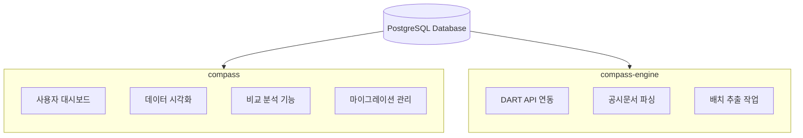
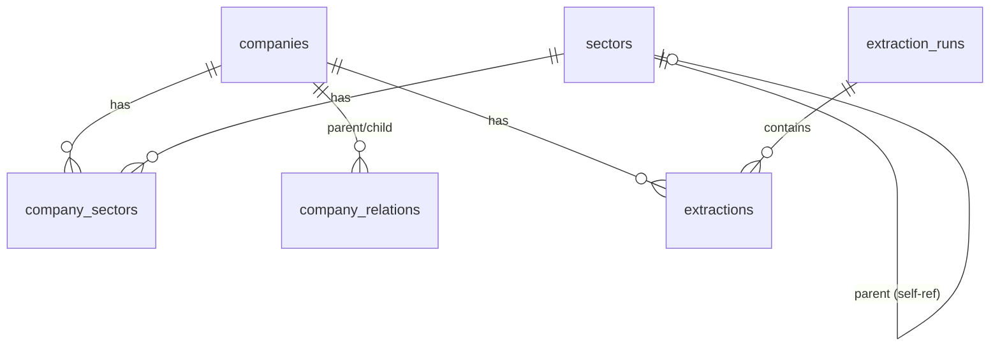
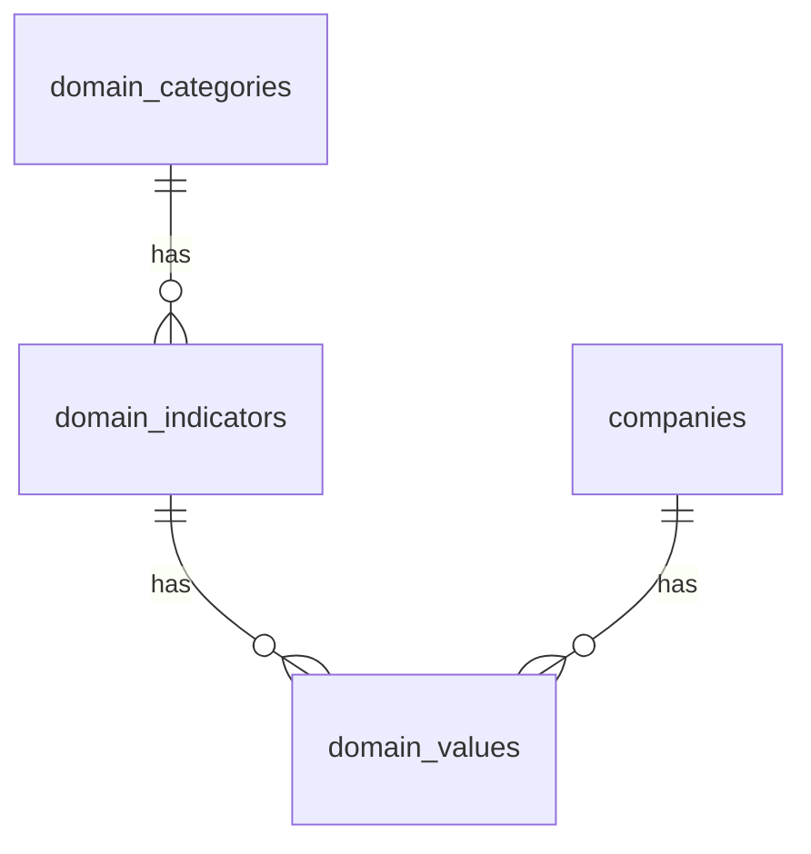
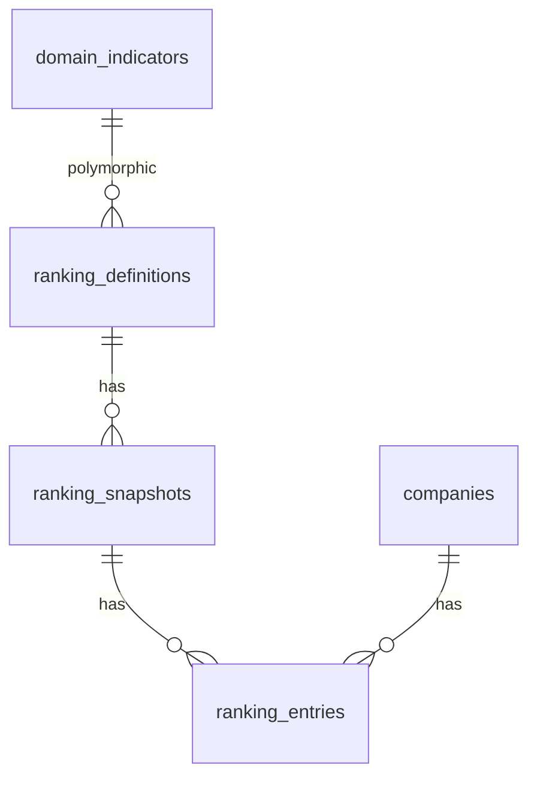
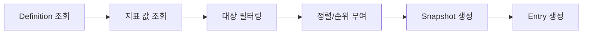

# Compass 데이터베이스 스키마

Compass 데이터베이스 구조와 구현 세부사항을 파악하기 위한 문서.
설계 배경과 원칙은 [database-design.md](./database-design.md) 참고.

---

## 목차

**Part 1. 구조 이해** (온보딩용)
1. [프로젝트 아키텍처](#1-프로젝트-아키텍처)
2. [도메인 구조](#2-도메인-구조)

**Part 2. 레퍼런스** (개발 중 참조용)
3. [Rails 모델 구조](#3-rails-모델-구조)
4. [테이블 스키마 요약](#4-테이블-스키마-요약)
5. [쿼리 패턴](#5-쿼리-패턴)

**Part 3. 가이드** (실무 작업용)
6. [확장 가이드](#6-확장-가이드)
7. [주의사항](#7-주의사항)

**부록**
- [테이블 스키마 상세 (DDL)](#부록-테이블-스키마-상세-ddl)
- [설계 노트](#부록-설계-노트)

---

# Part 1. 구조 이해

## 1. 프로젝트 아키텍처

### 1.1 멀티 프로젝트 구조



**핵심 규칙**:
- 두 프로젝트가 동일한 데이터베이스 공유
- 마이그레이션은 compass에서만 생성/관리 (extractor는 DB 참조만)

### 1.2 ERD 개요

#### Core Domain (기업 및 분류)



#### Metrics Domain (경영성과 / 지배구조 / 재무)

3개 도메인에 동일한 카테고리-지표-값 패턴 적용:



#### League Table Domain (리그테이블)



---

## 2. 도메인 구조

설계 원칙의 구체적 구현 방법. 원칙 자체는 [database-design.md](./database-design.md) 참고.

### 2.1 Core Domain (기업 및 분류)

**역할**: 시스템의 중심 엔티티인 기업과 분류 체계 관리

**핵심 테이블**:

| 테이블 | 역할 | 비고 |
|--------|------|------|
| companies | 기업 정보 | dart_code가 사실상 자연키 |
| sectors | 분류 체계 | kind로 공식/테마 구분, self-ref로 계층 표현 |
| company_sectors | 기업-분류 연결 | 다대다 관계 |
| company_relations | 기업 간 관계 | 지분율, 유효 기간 포함 |

**주요 특징**:
- dart_code를 기업 식별자로 사용 (DART가 주요 데이터 소스이며, 모든 법인에 고유 번호 부여)
- stock_code는 상장사만 존재
- 기업 간 관계에 effective_from/effective_to로 유효 기간 관리

### 2.2 Metrics Domain (지표 데이터)

**역할**: 경영성과, 지배구조, 재무지표 데이터 관리

**핵심 테이블**:

| 도메인 | 테이블 접두어 | 목적 | 데이터 주기 |
|--------|-------------|------|------------|
| Performance | performance_ | 경영실적 (매출, 이익 등) | 연간/분기 |
| Governance | governance_ | 기업지배구조 (이사회, 감사위원회 등) | 연간만 |
| Finance | finance_ | 재무비율 (부채비율, BIS비율 등) | 연간/분기 |

**도메인별 차이점**:

| 항목 | Performance | Governance | Finance |
|------|-------------|------------|---------|
| quarter 컬럼 | O | X | O |
| 특수 컬럼 | common (공통지표 여부) | data_type (값 유형) | - |

**Governance의 data_type**:
- 0: boolean (예: 감사위원회 설치 여부)
- 1: numeric (예: 사외이사 수)
- 2: text (예: 최대주주명)
- 3: enum (예: 준법지원인 있음/없음/해당없음)

### 2.3 League Table Domain (리그테이블)

**역할**: 리그테이블 정의, 스냅샷, 순위 항목 관리

**핵심 테이블**:

| 테이블 | 역할 | 저장 정보 |
|--------|------|----------|
| ranking_definitions | 리그테이블 기준 설정 | 기준 지표, 대상 범위, 정렬 방향 |
| ranking_snapshots | 특정 시점 계산 결과 | 계산일, 대상 기업 수 |
| ranking_entries | 기업별 순위와 값 | 순위, 값, 변동폭, 백분위 |

**Polymorphic Association**:
- ranking_definitions.indicator_type: "Performance::Indicator", "Governance::Indicator", "Finance::Indicator"
- ranking_definitions.indicator_id: 해당 테이블의 ID

**순위 계산 흐름**:



### 2.4 Extraction Domain (데이터 추출)

**역할**: DART 등 외부 소스에서 데이터 추출 이력 관리

**핵심 테이블**:

| 테이블 | 역할 | 예시 |
|--------|------|------|
| extraction_runs | 배치 단위 실행 | "2024년 1분기 전체 금융사 재무제표 수집" |
| extractions | 개별 문서 추출 | "KB금융 2024Q1 분기보고서 추출" |

**상태 값**:

| extraction_runs.status | extractions.status |
|------------------------|-------------------|
| 0: running | 0: pending |
| 1: completed | 1: running |
| 2: no_target | 2: success |
| 3: failed | 3: failed |
| | 4: retrying |

---

# Part 2. 레퍼런스

## 3. Rails 모델 구조

### 3.1 네임스페이스 구조

```
app/models/
├── company.rb
├── sector.rb
├── company_sector.rb
├── company_relation.rb
├── extraction_run.rb
├── extraction.rb
├── performance/
│   ├── category.rb
│   ├── indicator.rb
│   └── value.rb
├── governance/
│   ├── category.rb
│   ├── indicator.rb
│   └── value.rb
├── finance/
│   ├── category.rb
│   ├── indicator.rb
│   └── value.rb
└── ranking/
    ├── definition.rb
    ├── snapshot.rb
    └── entry.rb
```

### 3.2 Company 모델 (중심 엔티티)

```ruby
class Company < ApplicationRecord
  # 분류
  has_many :company_sectors
  has_many :sectors, through: :company_sectors

  # 기업간 관계
  has_many :child_relations, class_name: 'CompanyRelation',
           foreign_key: :parent_company_id
  has_many :parent_relations, class_name: 'CompanyRelation',
           foreign_key: :child_company_id

  # 지표 값
  has_many :performance_values, class_name: 'Performance::Value'
  has_many :governance_values, class_name: 'Governance::Value'
  has_many :finance_values, class_name: 'Finance::Value'

  # 리그테이블
  has_many :ranking_entries
end
```

### 3.3 Metrics 모델 (Performance 예시)

```ruby
# app/models/performance/indicator.rb
module Performance
  class Indicator < ApplicationRecord
    self.table_name = 'performance_indicators'

    belongs_to :category, class_name: 'Performance::Category'
    has_many :values, class_name: 'Performance::Value',
             foreign_key: :indicator_id, dependent: :destroy
    has_many :ranking_definitions, as: :indicator

    validates :code, presence: true, uniqueness: true
    validates :name, presence: true
  end
end

# app/models/performance/value.rb
module Performance
  class Value < ApplicationRecord
    self.table_name = 'performance_values'

    belongs_to :company
    belongs_to :indicator, class_name: 'Performance::Indicator'
    belongs_to :extraction, optional: true

    validates :year, presence: true
    validates :company_id, uniqueness: {
      scope: [:indicator_id, :year, :quarter]
    }

    scope :annual, -> { where(quarter: nil) }
    scope :quarterly, -> { where.not(quarter: nil) }
    scope :for_year, ->(year) { where(year: year) }
  end
end
```

---

## 4. 테이블 스키마 요약

전체 DDL은 [부록](#부록-테이블-스키마-상세-ddl) 참고.

### 4.1 companies

| 컬럼 | 타입 | 설명 |
|------|------|------|
| dart_code | VARCHAR(8) | DART 고유번호 (UNIQUE, 사실상 자연키) |
| name | VARCHAR | 기업명 |
| stock_code | VARCHAR(6) | 종목코드 (상장사만) |
| market_type | VARCHAR | KOSPI, KOSDAQ, KONEX, NULL(비상장) |
| fiscal_month | INTEGER | 결산월 (12 = 12월 결산) |

**주요 인덱스**: dart_code (UNIQUE), stock_code, market_type

### 4.2 sectors

| 컬럼 | 타입 | 설명 |
|------|------|------|
| code | VARCHAR(6) | 분류 코드 (UNIQUE) |
| name | VARCHAR | 분류명 |
| kind | VARCHAR | official(공식), theme(테마) |
| depth | INTEGER | 계층 깊이 (1, 2, 3...) |
| parent_id | BIGINT | 상위 분류 (self-reference) |

**주요 인덱스**: code (UNIQUE), kind, (kind, depth), parent_id

### 4.3 company_relations

| 컬럼 | 타입 | 설명 |
|------|------|------|
| parent_company_id | BIGINT | 모회사 |
| child_company_id | BIGINT | 자회사 |
| relation_type | VARCHAR | subsidiary, affiliate, associate, parent |
| ownership_percentage | DECIMAL(5,2) | 지분율 (0.00 ~ 100.00) |
| effective_from | DATE | 유효 시작일 |
| effective_to | DATE | 유효 종료일 (NULL = 현재 유효) |

**UNIQUE 제약**: (parent_company_id, child_company_id, effective_from)

### 4.4 {domain}_categories / indicators / values

**categories** (3개 도메인 동일):

| 컬럼 | 타입 | 설명 |
|------|------|------|
| code | VARCHAR | 카테고리 코드 (UNIQUE) |
| name | VARCHAR | 카테고리명 |
| display_order | INTEGER | UI 표시 순서 |

**indicators** (공통 + 도메인별 차이):

| 컬럼 | 타입 | 설명 | Performance | Governance | Finance |
|------|------|------|-------------|------------|---------|
| code | VARCHAR | 지표 코드 | O | O | O |
| name | VARCHAR | 지표명 | O | O | O |
| unit | VARCHAR | 단위 (%, 백만원 등) | O | O | O |
| common | BOOLEAN | 전 업종 공통 지표 | O | X | X |
| data_type | INTEGER | 값 유형 | X | O | X |

**values** (공통 + 도메인별 차이):

| 컬럼 | 타입 | Performance | Governance | Finance |
|------|------|-------------|------------|---------|
| company_id | BIGINT | O | O | O |
| indicator_id | BIGINT | O | O | O |
| year | INTEGER | O | O | O |
| quarter | INTEGER | O (NULL=연간) | X | O (NULL=연간) |
| value | DECIMAL | O | O | O |
| value_text | VARCHAR | O | O | O |

### 4.5 ranking_definitions / snapshots / entries

**definitions**:

| 컬럼 | 타입 | 설명 |
|------|------|------|
| name | VARCHAR | 리그테이블명 |
| indicator_type | VARCHAR | Polymorphic 타입 |
| indicator_id | BIGINT | Polymorphic ID |
| scope_type | VARCHAR | all, sector, market |
| sort_direction | VARCHAR | desc, asc |

**snapshots**:

| 컬럼 | 타입 | 설명 |
|------|------|------|
| ranking_definition_id | BIGINT | 정의 참조 |
| year | INTEGER | 연도 |
| quarter | INTEGER | 분기 (NULL = 연간) |
| calculated_at | TIMESTAMP | 계산 시점 |
| total_companies | INTEGER | 포함된 기업 수 |

**entries**:

| 컬럼 | 타입 | 설명 |
|------|------|------|
| ranking_snapshot_id | BIGINT | 스냅샷 참조 |
| company_id | BIGINT | 기업 참조 |
| rank | INTEGER | 순위 |
| value | DECIMAL | 기준 지표 값 |
| percentile | DECIMAL(5,2) | 백분위 |
| rank_change | INTEGER | 이전 대비 순위 변동 |

---

## 5. 쿼리 패턴

### 5.1 기본 조회

```ruby
# 특정 기업의 최근 5년 ROE 추이
company = Company.find_by(dart_code: '00164779')
roe = Performance::Indicator.find_by(code: 'ROE')

company.performance_values
       .where(indicator: roe, year: 2020..2024)
       .annual
       .order(:year)
```

```ruby
# 은행 업종의 2024년 BIS비율 비교
bank = Sector.find_by(code: 'BANK', kind: 'official')
bis = Finance::Indicator.find_by(code: 'BIS_RATIO')

Finance::Value.joins(company: :sectors)
              .where(sectors: { id: bank.id })
              .where(indicator: bis, year: 2024, quarter: nil)
```

### 5.2 그룹사 연계 분석

```ruby
# KB금융지주의 현재 자회사 목록
kb = Company.find_by(name: 'KB금융지주')
today = Date.current

kb.child_relations
  .where(relation_type: 'subsidiary')
  .where('effective_from <= ?', today)
  .where('effective_to IS NULL OR effective_to >= ?', today)
  .includes(:child_company)
```

```ruby
# KB금융지주와 자회사들의 ROE 비교
subsidiary_ids = kb.child_relations
                   .where(relation_type: 'subsidiary')
                   .where('effective_to IS NULL')
                   .pluck(:child_company_id)

Performance::Value.where(company_id: [kb.id] + subsidiary_ids)
                  .where(indicator: roe, year: 2024, quarter: nil)
                  .includes(:company)
```

```ruby
# 4대 금융지주의 은행 자회사끼리 비교
# (KB국민은행 vs 신한은행 vs 하나은행 vs 우리은행)
holdings_theme = Sector.find_by(code: '4_FINANCIAL_HOLDINGS', kind: 'theme')
bank_sector = Sector.find_by(code: 'BANK', kind: 'official')

holding_ids = Company.joins(:sectors)
                     .where(sectors: { id: holdings_theme.id })
                     .pluck(:id)

bank_subsidiary_ids = CompanyRelation
  .where(parent_company_id: holding_ids, relation_type: 'subsidiary')
  .where('effective_to IS NULL')
  .joins(:child_company => :sectors)
  .where(sectors: { id: bank_sector.id })
  .pluck(:child_company_id)

Performance::Value.where(company_id: bank_subsidiary_ids)
                  .where(indicator: roe, year: 2024)
```

### 5.3 지배구조 비교

```ruby
# 4대 금융지주 이사회 구조 비교
theme = Sector.find_by(code: '4_FINANCIAL_HOLDINGS', kind: 'theme')
category = Governance::Category.find_by(code: 'board_structure')

Governance::Value.joins(:indicator, company: :sectors)
                 .where(sectors: { id: theme.id })
                 .where(indicators: { category_id: category.id })
                 .where(year: 2024)
```

### 5.4 리그테이블 조회

```ruby
# 특정 도메인의 리그테이블 목록
RankingDefinition.where(indicator_type: 'Performance::Indicator')
                 .includes(:indicator)

# 최신 스냅샷과 순위 조회
RankingSnapshot.includes(entries: :company)
               .where(ranking_definition: definition)
               .order(year: :desc, quarter: :desc)
               .first
               .entries
               .order(:rank)
```

---

# Part 3. 가이드

## 6. 확장 가이드

### 6.1 새로운 지표 추가

코드 수정 없이 데이터베이스에 레코드만 추가:

```ruby
# 1. 카테고리 확인 또는 생성
category = Performance::Category.find_or_create_by!(code: 'profitability') do |c|
  c.name = '수익성'
  c.display_order = 1
end

# 2. 지표 생성
indicator = Performance::Indicator.create!(
  category: category,
  code: 'NEW_RATIO',
  name: '신규 비율',
  unit: '%',
  formula: '(A / B) * 100',
  common: true
)

# 3. 값 저장
Performance::Value.create!(
  company: company,
  indicator: indicator,
  year: 2024,
  quarter: nil,
  value: 15.5
)
```

### 6.2 새로운 도메인 추가

경영성과/지배구조/재무 외에 새로운 도메인(예: ESG)이 필요한 경우:

```bash
# 1. 마이그레이션 생성
rails g migration CreateEsgTables

# 2. 동일한 카테고리-지표-값 구조 생성
- esg_categories
- esg_indicators
- esg_values

# 3. 모델 생성
app/models/esg/
├── category.rb
├── indicator.rb
└── value.rb

# 4. ranking_definitions의 indicator_type에 'Esg::Indicator' 추가
```

### 6.3 새로운 리그테이블 생성

```ruby
RankingDefinition.create!(
  name: 'ESG 종합점수 리그테이블',
  description: 'ESG 종합점수 기준 전체 기업 순위',
  ranking_type: 'esg',
  indicator_type: 'Esg::Indicator',
  indicator_id: Esg::Indicator.find_by(code: 'TOTAL_SCORE').id,
  scope_type: 'all',
  sort_direction: 'desc',
  active: true
)
```

---

## 7. 주의사항

### 7.1 필수 규칙

#### 마이그레이션 관리

```ruby
# ✅ compass 프로젝트에서만 마이그레이션 생성
rails g migration AddNewColumnToCompanies

# ❌ compass-engine에서 마이그레이션 생성 금지
# 두 프로젝트가 같은 DB를 공유하므로 충돌 발생
```

#### 삭제 정책

| 대상 | 정책 | 이유 |
|------|------|------|
| 기업 삭제 | CASCADE (연관 데이터 모두 삭제) | 데이터 정합성 |
| 카테고리 삭제 | RESTRICT (지표 있으면 삭제 불가) | 참조 무결성 |
| 추출 기록 삭제 | SET NULL (값의 extraction_id만 NULL) | 값 데이터 보존 |

```ruby
# 카테고리 삭제 시 지표 먼저 삭제 필요
Performance::Indicator.where(category: category).destroy_all
category.destroy
```

### 7.2 쿼리 작성

#### 시계열 데이터 조회

```ruby
# ✅ 연간 데이터
Performance::Value.where(quarter: nil)

# ✅ 분기 데이터
Performance::Value.where.not(quarter: nil)

# ✅ 특정 분기
Performance::Value.where(year: 2024, quarter: 1)

# ❌ quarter: 0 사용 금지 (연간은 NULL로 표현)
```

#### Polymorphic 쿼리

```ruby
# ✅ indicator를 함께 로드
RankingDefinition.includes(:indicator)

# ✅ 특정 도메인만 조회
RankingDefinition.where(indicator_type: 'Performance::Indicator')

# ❌ joins 사용 시 주의 (polymorphic은 직접 join 불가)
```

### 7.3 성능 최적화

#### 대량 데이터 처리

```ruby
# ✅ find_each 사용 (메모리 효율)
Company.find_each(batch_size: 100) do |company|
  # 처리
end

# ✅ bulk insert
Performance::Value.insert_all([
  { company_id: 1, indicator_id: 1, year: 2024, value: 10.5 },
  { company_id: 2, indicator_id: 1, year: 2024, value: 12.3 },
])

# ❌ 루프 내 개별 저장 (N+1 문제)
companies.each { |c| Performance::Value.create!(...) }
```

#### 인덱스 활용

자주 사용되는 쿼리 패턴에 맞게 인덱스 설계됨:

```ruby
# 인덱스 활용되는 패턴
company.performance_values.where(year: 2024)
# → index_performance_values_on_company_id_and_year_and_quarter

Performance::Value.where(indicator_id: 1, year: 2024)
# → index_performance_values_on_indicator_id_and_year
```

---

# 부록

## 부록: 테이블 스키마 상세 (DDL)

### companies

```sql
CREATE TABLE companies (
  id              BIGSERIAL PRIMARY KEY,
  dart_code       VARCHAR(8) NOT NULL UNIQUE,
  name            VARCHAR NOT NULL,
  legal_name      VARCHAR,
  english_name    VARCHAR,
  stock_code      VARCHAR(6),
  corporate_number VARCHAR(13),
  business_number VARCHAR(10),
  market_type     VARCHAR,
  representative_name VARCHAR,
  fiscal_month    INTEGER,
  established_on  DATE,
  address         TEXT,
  phone           VARCHAR,
  fax             VARCHAR,
  website_url     TEXT,
  ir_url          TEXT,
  created_at      TIMESTAMP NOT NULL,
  updated_at      TIMESTAMP NOT NULL
);

CREATE UNIQUE INDEX index_companies_on_dart_code ON companies(dart_code);
CREATE INDEX index_companies_on_stock_code ON companies(stock_code);
CREATE INDEX index_companies_on_market_type ON companies(market_type);
```

### sectors

```sql
CREATE TABLE sectors (
  id         BIGSERIAL PRIMARY KEY,
  code       VARCHAR(6) NOT NULL UNIQUE,
  name       VARCHAR NOT NULL,
  kind       VARCHAR DEFAULT 'official',
  depth      INTEGER NOT NULL,
  parent_id  BIGINT REFERENCES sectors(id) ON DELETE CASCADE,
  created_at TIMESTAMP NOT NULL,
  updated_at TIMESTAMP NOT NULL
);

CREATE UNIQUE INDEX index_sectors_on_code ON sectors(code);
CREATE INDEX index_sectors_on_kind ON sectors(kind);
CREATE INDEX index_sectors_on_kind_and_depth ON sectors(kind, depth);
CREATE INDEX index_sectors_on_parent_id ON sectors(parent_id);
```

### company_sectors

```sql
CREATE TABLE company_sectors (
  id            BIGSERIAL PRIMARY KEY,
  company_id    BIGINT NOT NULL REFERENCES companies(id) ON DELETE CASCADE,
  sector_id     BIGINT NOT NULL REFERENCES sectors(id) ON DELETE CASCADE,
  display_order INTEGER DEFAULT 0,
  created_at    TIMESTAMP NOT NULL,
  updated_at    TIMESTAMP NOT NULL,
  UNIQUE(company_id, sector_id)
);
```

### company_relations

```sql
CREATE TABLE company_relations (
  id                   BIGSERIAL PRIMARY KEY,
  parent_company_id    BIGINT NOT NULL REFERENCES companies(id) ON DELETE CASCADE,
  child_company_id     BIGINT NOT NULL REFERENCES companies(id) ON DELETE CASCADE,
  relation_type        VARCHAR NOT NULL,
  ownership_percentage DECIMAL(5,2),
  effective_from       DATE,
  effective_to         DATE,
  metadata             JSONB DEFAULT '{}',
  created_at           TIMESTAMP NOT NULL,
  updated_at           TIMESTAMP NOT NULL,
  UNIQUE(parent_company_id, child_company_id, effective_from)
);
```

### {domain}_categories

```sql
CREATE TABLE {domain}_categories (
  id            BIGSERIAL PRIMARY KEY,
  code          VARCHAR NOT NULL UNIQUE,
  name          VARCHAR NOT NULL,
  description   TEXT,
  display_order INTEGER DEFAULT 0,
  metadata      JSONB DEFAULT '{}',
  created_at    TIMESTAMP NOT NULL,
  updated_at    TIMESTAMP NOT NULL
);
```

### {domain}_indicators

```sql
-- 공통 구조
CREATE TABLE {domain}_indicators (
  id          BIGSERIAL PRIMARY KEY,
  category_id BIGINT NOT NULL REFERENCES {domain}_categories(id) ON DELETE RESTRICT,
  code        VARCHAR NOT NULL UNIQUE,
  name        VARCHAR NOT NULL,
  unit        VARCHAR,
  formula     TEXT,
  hierarchy   JSONB DEFAULT '{}',
  metadata    JSONB DEFAULT '{}',
  created_at  TIMESTAMP NOT NULL,
  updated_at  TIMESTAMP NOT NULL
);

-- performance_indicators 추가: common BOOLEAN DEFAULT false
-- governance_indicators 추가: data_type INTEGER DEFAULT 0, definition TEXT
```

### {domain}_values

```sql
-- 공통 구조
CREATE TABLE {domain}_values (
  id            BIGSERIAL PRIMARY KEY,
  company_id    BIGINT NOT NULL REFERENCES companies(id) ON DELETE CASCADE,
  indicator_id  BIGINT NOT NULL REFERENCES {domain}_indicators(id) ON DELETE CASCADE,
  extraction_id BIGINT REFERENCES extractions(id) ON DELETE SET NULL,
  year          INTEGER NOT NULL,
  value         DECIMAL(20,4),
  value_text    VARCHAR,
  calculated    BOOLEAN DEFAULT false,
  metadata      JSONB DEFAULT '{}',
  created_at    TIMESTAMP NOT NULL,
  updated_at    TIMESTAMP NOT NULL
);

-- performance_values, finance_values 추가: quarter INTEGER
-- UNIQUE(company_id, indicator_id, year, quarter)

-- governance_values: quarter 없음
-- UNIQUE(company_id, indicator_id, year)
```

### ranking_definitions

```sql
CREATE TABLE ranking_definitions (
  id             BIGSERIAL PRIMARY KEY,
  name           VARCHAR NOT NULL,
  description    TEXT,
  ranking_type   VARCHAR NOT NULL,
  indicator_type VARCHAR NOT NULL,
  indicator_id   BIGINT NOT NULL,
  scope_type     VARCHAR NOT NULL,
  sector_id      BIGINT REFERENCES sectors(id),
  market_type    VARCHAR,
  sort_direction VARCHAR NOT NULL,
  filters        JSONB DEFAULT '{}',
  display_config JSONB DEFAULT '{}',
  active         BOOLEAN DEFAULT true,
  created_at     TIMESTAMP NOT NULL,
  updated_at     TIMESTAMP NOT NULL
);
```

### ranking_snapshots

```sql
CREATE TABLE ranking_snapshots (
  id                    BIGSERIAL PRIMARY KEY,
  ranking_definition_id BIGINT NOT NULL REFERENCES ranking_definitions(id) ON DELETE CASCADE,
  year                  INTEGER NOT NULL,
  quarter               INTEGER,
  calculated_at         TIMESTAMP NOT NULL,
  total_companies       INTEGER,
  metadata              JSONB DEFAULT '{}',
  created_at            TIMESTAMP NOT NULL,
  updated_at            TIMESTAMP NOT NULL,
  UNIQUE(ranking_definition_id, year, quarter)
);
```

### ranking_entries

```sql
CREATE TABLE ranking_entries (
  id                  BIGSERIAL PRIMARY KEY,
  ranking_snapshot_id BIGINT NOT NULL REFERENCES ranking_snapshots(id) ON DELETE CASCADE,
  company_id          BIGINT NOT NULL REFERENCES companies(id) ON DELETE CASCADE,
  rank                INTEGER NOT NULL,
  value               DECIMAL(20,4),
  score               DECIMAL(10,4),
  grade               VARCHAR,
  percentile          DECIMAL(5,2),
  vs_average          DECIMAL(20,4),
  rank_change         INTEGER,
  value_change        DECIMAL(20,4),
  value_change_rate   DECIMAL(10,4),
  created_at          TIMESTAMP NOT NULL,
  updated_at          TIMESTAMP NOT NULL,
  UNIQUE(ranking_snapshot_id, company_id)
);
```

### extraction_runs / extractions

```sql
CREATE TABLE extraction_runs (
  id              BIGSERIAL PRIMARY KEY,
  extraction_type INTEGER NOT NULL DEFAULT 0,
  source_type     INTEGER NOT NULL DEFAULT 0,
  triggered_by    INTEGER DEFAULT 0,
  status          INTEGER NOT NULL DEFAULT 0,
  total_count     INTEGER DEFAULT 0,
  success_count   INTEGER DEFAULT 0,
  failed_count    INTEGER DEFAULT 0,
  started_at      TIMESTAMP NOT NULL,
  completed_at    TIMESTAMP,
  config          JSONB DEFAULT '{}',
  metadata        JSONB DEFAULT '{}',
  created_at      TIMESTAMP NOT NULL,
  updated_at      TIMESTAMP NOT NULL
);

CREATE TABLE extractions (
  id                 BIGSERIAL PRIMARY KEY,
  extraction_run_id  BIGINT REFERENCES extraction_runs(id) ON DELETE SET NULL,
  company_id         BIGINT REFERENCES companies(id) ON DELETE CASCADE,
  extraction_type    INTEGER NOT NULL DEFAULT 0,
  source_type        INTEGER NOT NULL DEFAULT 0,
  source_document_id VARCHAR NOT NULL,
  source_url         VARCHAR,
  status             INTEGER NOT NULL DEFAULT 0,
  retry_count        INTEGER DEFAULT 0,
  started_at         TIMESTAMP,
  completed_at       TIMESTAMP,
  duration_ms        INTEGER,
  error_message      TEXT,
  error_details      JSONB DEFAULT '{}',
  extracted_summary  JSONB DEFAULT '{}',
  metadata           JSONB DEFAULT '{}',
  created_at         TIMESTAMP NOT NULL,
  updated_at         TIMESTAMP NOT NULL,
  UNIQUE(source_document_id, source_type, extraction_type)
);
```

---

## 부록: 설계 노트

### dart_code를 PK로 사용하지 않은 이유

Rails 컨벤션(bigint auto-increment PK)을 따르면서, dart_code에 UNIQUE 인덱스를 걸어 사실상 자연키 역할 수행. 외래키 관계에서 bigint가 더 효율적.

### 3개 도메인을 분리한 이유

- 도메인별로 약간씩 다른 컬럼 존재 (governance의 data_type 등)
- 분리하면 각 도메인 독립적으로 확장 가능
- 쿼리 성능 면에서 특정 도메인만 조회할 때 유리

### JSONB 컬럼 사용 기준

구조가 유동적이거나 도메인별로 다를 수 있는 메타데이터에 사용. 자주 검색하는 필드는 별도 컬럼으로 분리 권장.

---

**작성일**: 2025-11-27
**버전**: 3.1
**스키마 버전**: 2025_11_25_024156
