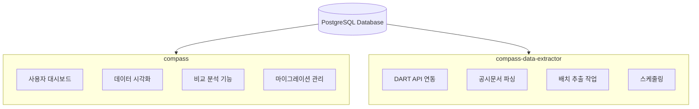
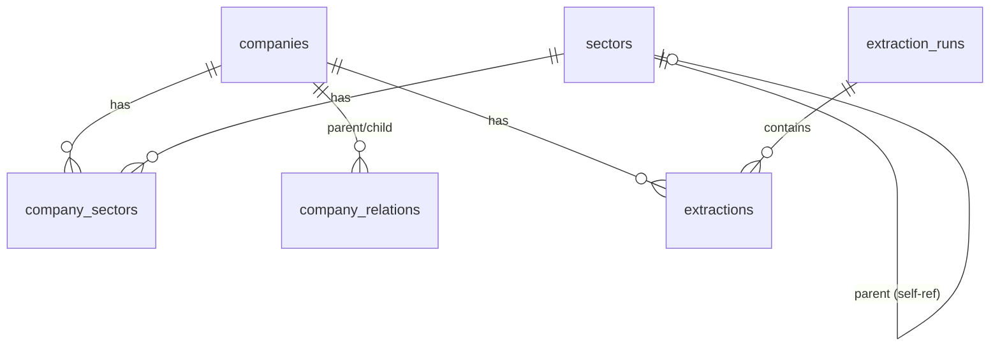
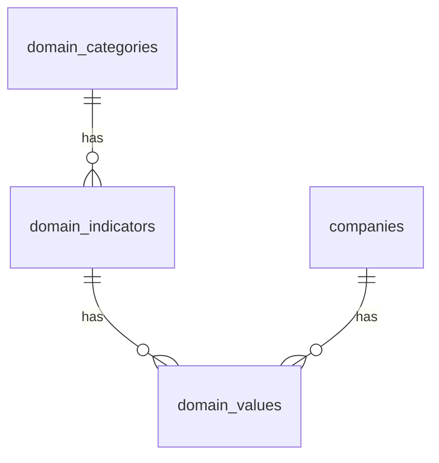
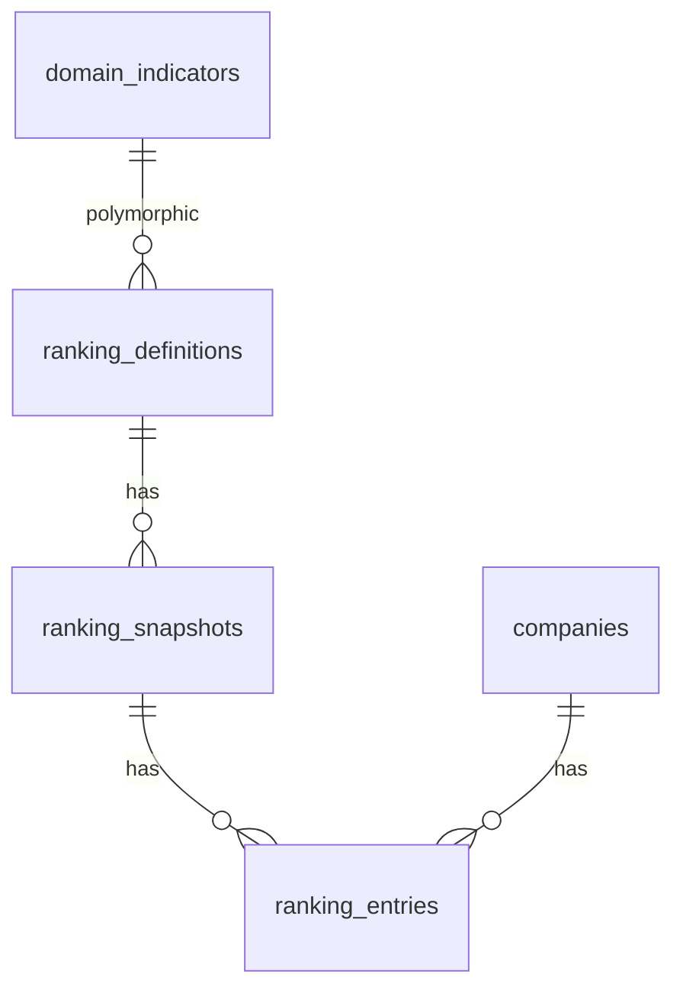
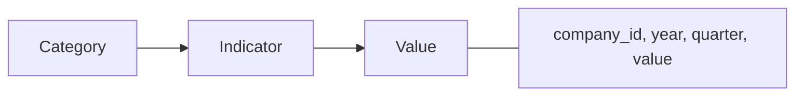
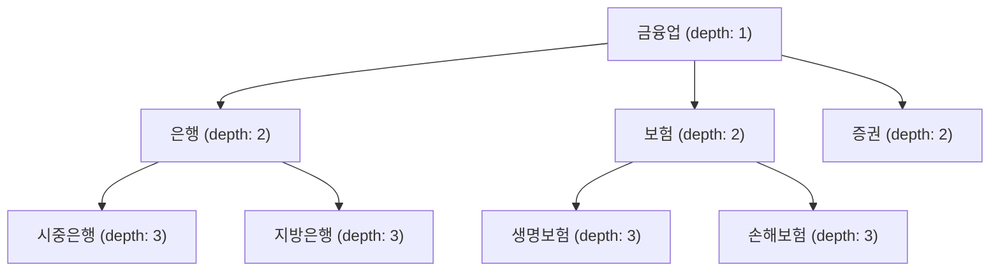
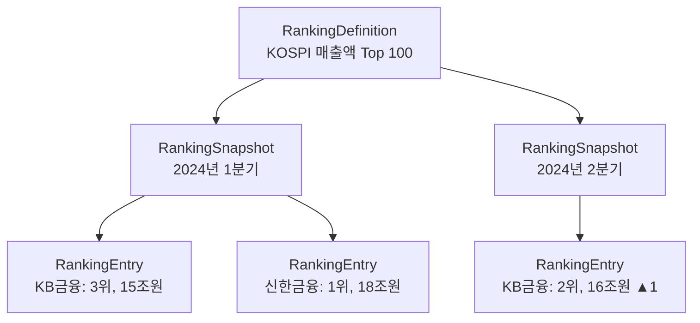
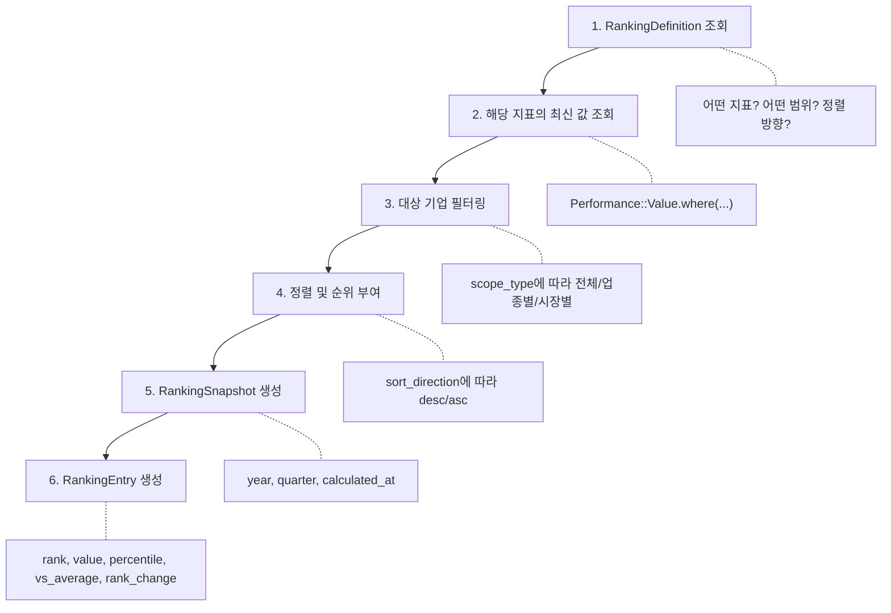
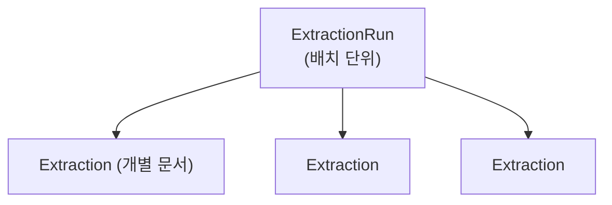
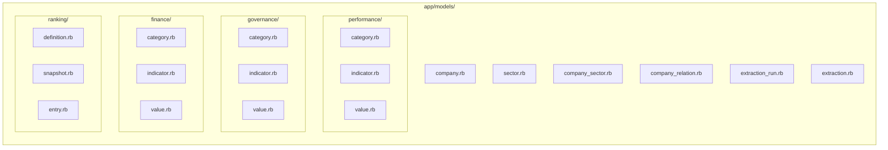

# Compass 데이터베이스 스키마 (개발자용)

새로운 개발자가 Compass 데이터베이스 구조와 구현 세부사항을 파악하기 위한 문서.
설계 철학과 핵심 개념은 [database-structure.md](./database-structure.md) 참고.

---

## 목차

1. [프로젝트 아키텍처](#1-프로젝트-아키텍처)
2. [설계 원칙과 구현](#2-설계-원칙과-구현)
3. [도메인별 상세](#3-도메인별-상세)
4. [Rails 모델 구조](#4-rails-모델-구조)
5. [테이블 스키마](#5-테이블-스키마)
6. [쿼리 패턴](#6-쿼리-패턴)
7. [확장 가이드](#7-확장-가이드)
8. [주의사항](#8-주의사항)

---

## 1. 프로젝트 아키텍처

### 멀티 프로젝트 구조



핵심 사항:
- 두 프로젝트가 **동일한 데이터베이스** 공유
- 모든 마이그레이션은 **compass**에서만 생성/관리
- compass-data-extractor는 DB 참조만

### ERD 개요

#### Core Domain (기업 및 분류 체계)



#### Metrics Domain (경영성과 / 지배구조 / 재무)

3개 도메인(performance, governance, finance)에 동일 패턴 적용:



#### League Table Domain (리그테이블 및 시계열 분석)



---

## 2. 설계 원칙과 구현

[database-structure.md](./database-structure.md)에서 정의한 설계 결정의 구체적 구현 방법.

### 2.1 카테고리-지표-값 3계층 구조

**설계 결정**: 지표를 코드에 하드코딩하지 않고 메타데이터로 관리

**구현 방식**:



**코드 비교**:
```ruby
# Bad: 지표를 코드에 하드코딩
class Company
  def bis_ratio
    # BIS비율 계산 로직
  end
end

# Good: 지표를 메타데이터로 관리
indicator = Finance::Indicator.find_by(code: 'BIS_RATIO')
value = Finance::Value.find_by(company: company, indicator: indicator, year: 2024)
```

**3개 도메인에 동일하게 적용**:
- `performance_*`: 경영성과 (매출, 이익 등)
- `governance_*`: 지배구조 (이사회, 감사위원회 등)
- `finance_*`: 재무지표 (부채비율, BIS비율 등)

### 2.2 공식 분류와 테마 분류 분리

**설계 결정**: 다대다 관계로 공식 분류와 테마 분류 모두 지원

**구현 방식**:
```ruby
# sectors 테이블의 kind 컬럼
- official: 공식 산업분류 (KSIC)
- theme: 테마 분류

# 한 기업이 여러 분류에 속할 수 있음
kb_financial.sectors
# => [<금융업(official)>, <4대금융지주(theme)>, <ESG우수기업(theme)>]
```

**계층 구조 표현**: sectors 테이블의 self-referential 관계



### 2.3 시점별 기업간 관계

**설계 결정**: effective_from/effective_to로 유효 기간 관리

**구현 방식**:
```ruby
# 2020년에 인수, 2023년에 매각한 경우
CompanyRelation.create!(
  parent_company: kb_financial,
  child_company: some_subsidiary,
  relation_type: 'subsidiary',
  ownership_percentage: 100.0,
  effective_from: Date.new(2020, 1, 1),
  effective_to: Date.new(2023, 6, 30)
)

# 특정 시점의 자회사 조회
kb_financial.subsidiaries
  .where('effective_from <= ? AND (effective_to IS NULL OR effective_to >= ?)', date, date)
```

### 2.4 리그테이블 정의와 결과 분리

**설계 결정**: 정의-스냅샷-항목 3단계 구조

**구현 방식**:



**Polymorphic Association**:
```ruby
class RankingDefinition < ApplicationRecord
  belongs_to :indicator, polymorphic: true
  # indicator_type: "Performance::Indicator", "Governance::Indicator", "Finance::Indicator"
  # indicator_id: 해당 테이블의 ID
end

# 사용 예
RankingDefinition.create!(
  name: 'KOSPI ROE 리그테이블',
  indicator_type: 'Performance::Indicator',
  indicator_id: Performance::Indicator.find_by(code: 'ROE').id,
  scope_type: 'market',
  market_type: 'KOSPI',
  sort_direction: 'desc'
)
```

---

## 3. 도메인별 상세

### 3.1 Core Domain (기업 및 분류)

#### Company - 시스템의 중심 엔티티

모든 데이터가 기업을 기준으로 연결.

```ruby
class Company < ApplicationRecord
  # 분류
  has_many :company_sectors
  has_many :sectors, through: :company_sectors

  # 기업간 관계
  has_many :child_relations, class_name: 'CompanyRelation', foreign_key: :parent_company_id
  has_many :parent_relations, class_name: 'CompanyRelation', foreign_key: :child_company_id

  # 지표 값
  has_many :performance_values, class_name: 'Performance::Value'
  has_many :governance_values, class_name: 'Governance::Value'
  has_many :finance_values, class_name: 'Finance::Value'

  # 리그테이블
  has_many :ranking_entries
end
```

**dart_code가 기업 식별자인 이유**:
- DART(전자공시시스템)가 주요 데이터 소스
- 모든 상장/비상장 법인에 고유 번호 부여
- stock_code는 상장사만 존재

### 3.2 Metrics Domain (지표 데이터)

#### 3개 도메인의 차이점

| 항목 | Performance | Governance | Finance |
|------|-------------|------------|---------|
| 목적 | 경영실적 | 기업지배구조 | 재무비율 |
| 데이터 주기 | 연간/분기 | 연간만 | 연간/분기 |
| quarter 컬럼 | O | X | O |
| 특수 컬럼 | common (공통지표) | data_type (값 유형) | - |

#### Governance의 data_type

지배구조 지표는 다양한 데이터 유형 가능:
```ruby
# governance_indicators.data_type
enum data_type: {
  boolean: 0,   # 예/아니오 (감사위원회 설치 여부)
  numeric: 1,   # 숫자 (사외이사 수)
  text: 2,      # 텍스트 (최대주주명)
  enum: 3       # 선택형 (준법지원인: 있음/없음/해당없음)
}
```

### 3.3 League Table Domain (리그테이블 시스템)

#### 순위 계산 흐름



### 3.4 Extraction Domain (데이터 추출)

#### 2단계 구조



- **ExtractionRun**: "2024년 1분기 전체 금융사 재무제표 수집"
- **Extraction**: "KB금융 2024Q1 분기보고서 추출"

#### 상태 관리

```ruby
# extraction_runs.status
enum status: {
  running: 0,    # 실행 중
  completed: 1,  # 완료
  no_target: 2,  # 대상 없음
  failed: 3      # 실패
}

# extractions.status
enum status: {
  pending: 0,    # 대기
  running: 1,    # 실행 중
  success: 2,    # 성공
  failed: 3,     # 실패
  retrying: 4    # 재시도 중
}
```

---

## 4. Rails 모델 구조

### 4.1 네임스페이스 구조



### 4.2 모델 관계 예시

```ruby
# app/models/performance/indicator.rb
module Performance
  class Indicator < ApplicationRecord
    self.table_name = 'performance_indicators'

    belongs_to :category, class_name: 'Performance::Category'
    has_many :values, class_name: 'Performance::Value',
             foreign_key: :indicator_id, dependent: :destroy
    has_many :ranking_definitions, as: :indicator

    validates :code, presence: true, uniqueness: true
    validates :name, presence: true
  end
end

# app/models/performance/value.rb
module Performance
  class Value < ApplicationRecord
    self.table_name = 'performance_values'

    belongs_to :company
    belongs_to :indicator, class_name: 'Performance::Indicator'
    belongs_to :extraction, optional: true

    validates :year, presence: true
    validates :company_id, uniqueness: {
      scope: [:indicator_id, :year, :quarter],
      message: 'already has value for this indicator/year/quarter'
    }

    scope :annual, -> { where(quarter: nil) }
    scope :quarterly, -> { where.not(quarter: nil) }
    scope :for_year, ->(year) { where(year: year) }
  end
end
```

---

## 5. 테이블 스키마

### 5.1 companies

```sql
CREATE TABLE companies (
  id              BIGSERIAL PRIMARY KEY,
  dart_code       VARCHAR(8) NOT NULL UNIQUE,  -- DART 고유번호 (PK 역할)
  name            VARCHAR NOT NULL,             -- 기업명
  legal_name      VARCHAR,                      -- 법인명
  english_name    VARCHAR,                      -- 영문명
  stock_code      VARCHAR(6),                   -- 종목코드 (상장사만)
  corporate_number VARCHAR(13),                 -- 법인등록번호
  business_number VARCHAR(10),                  -- 사업자등록번호
  market_type     VARCHAR,                      -- KOSPI, KOSDAQ, KONEX, NULL(비상장)
  representative_name VARCHAR,                  -- 대표자명
  fiscal_month    INTEGER,                      -- 결산월 (12 = 12월 결산)
  established_on  DATE,                         -- 설립일
  address         TEXT,                         -- 주소
  phone           VARCHAR,                      -- 전화번호
  fax             VARCHAR,                      -- 팩스번호
  website_url     TEXT,                         -- 홈페이지
  ir_url          TEXT,                         -- IR 페이지
  created_at      TIMESTAMP NOT NULL,
  updated_at      TIMESTAMP NOT NULL
);

CREATE UNIQUE INDEX index_companies_on_dart_code ON companies(dart_code);
CREATE INDEX index_companies_on_stock_code ON companies(stock_code);
CREATE INDEX index_companies_on_market_type ON companies(market_type);
```

### 5.2 sectors

```sql
CREATE TABLE sectors (
  id         BIGSERIAL PRIMARY KEY,
  code       VARCHAR(6) NOT NULL UNIQUE,  -- 분류 코드
  name       VARCHAR NOT NULL,             -- 분류명
  kind       VARCHAR DEFAULT 'official',   -- official(공식), theme(테마)
  depth      INTEGER NOT NULL,             -- 계층 깊이 (1, 2, 3...)
  parent_id  BIGINT REFERENCES sectors(id) ON DELETE CASCADE,
  created_at TIMESTAMP NOT NULL,
  updated_at TIMESTAMP NOT NULL
);

CREATE UNIQUE INDEX index_sectors_on_code ON sectors(code);
CREATE INDEX index_sectors_on_kind ON sectors(kind);
CREATE INDEX index_sectors_on_kind_and_depth ON sectors(kind, depth);
CREATE INDEX index_sectors_on_parent_id ON sectors(parent_id);
```

### 5.3 company_sectors (다대다 연결)

```sql
CREATE TABLE company_sectors (
  id            BIGSERIAL PRIMARY KEY,
  company_id    BIGINT NOT NULL REFERENCES companies(id) ON DELETE CASCADE,
  sector_id     BIGINT NOT NULL REFERENCES sectors(id) ON DELETE CASCADE,
  display_order INTEGER DEFAULT 0,
  created_at    TIMESTAMP NOT NULL,
  updated_at    TIMESTAMP NOT NULL,
  UNIQUE(company_id, sector_id)
);
```

### 5.4 company_relations (기업간 관계)

```sql
CREATE TABLE company_relations (
  id                   BIGSERIAL PRIMARY KEY,
  parent_company_id    BIGINT NOT NULL REFERENCES companies(id) ON DELETE CASCADE,
  child_company_id     BIGINT NOT NULL REFERENCES companies(id) ON DELETE CASCADE,
  relation_type        VARCHAR NOT NULL,  -- subsidiary, affiliate, associate, parent
  ownership_percentage DECIMAL(5,2),      -- 지분율 (0.00 ~ 100.00)
  effective_from       DATE,              -- 유효 시작일
  effective_to         DATE,              -- 유효 종료일 (NULL = 현재 유효)
  metadata             JSONB DEFAULT '{}',
  created_at           TIMESTAMP NOT NULL,
  updated_at           TIMESTAMP NOT NULL,
  UNIQUE(parent_company_id, child_company_id, effective_from)
);
```

### 5.5 {domain}_categories (공통 구조)

```sql
-- performance_categories, governance_categories, finance_categories 동일 구조
CREATE TABLE {domain}_categories (
  id            BIGSERIAL PRIMARY KEY,
  code          VARCHAR NOT NULL UNIQUE,  -- 카테고리 코드 (예: profitability)
  name          VARCHAR NOT NULL,          -- 카테고리명 (예: 수익성)
  description   TEXT,                      -- 설명
  display_order INTEGER DEFAULT 0,         -- UI 표시 순서
  metadata      JSONB DEFAULT '{}',
  created_at    TIMESTAMP NOT NULL,
  updated_at    TIMESTAMP NOT NULL
);
```

### 5.6 {domain}_indicators (공통 구조 + 차이점)

```sql
-- 공통 구조
CREATE TABLE {domain}_indicators (
  id          BIGSERIAL PRIMARY KEY,
  category_id BIGINT NOT NULL REFERENCES {domain}_categories(id) ON DELETE RESTRICT,
  code        VARCHAR NOT NULL UNIQUE,  -- 지표 코드 (예: ROE)
  name        VARCHAR NOT NULL,          -- 지표명 (예: 자기자본이익률)
  unit        VARCHAR,                   -- 단위 (예: %, 백만원, 배)
  formula     TEXT,                      -- 계산식
  hierarchy   JSONB DEFAULT '{}',        -- 계층 정보 (parent_code, depth)
  metadata    JSONB DEFAULT '{}',
  created_at  TIMESTAMP NOT NULL,
  updated_at  TIMESTAMP NOT NULL
);

-- performance_indicators 추가 컬럼
common BOOLEAN DEFAULT false  -- 전 업종 공통 지표 여부

-- governance_indicators 추가 컬럼
data_type INTEGER DEFAULT 0 NOT NULL  -- 0:boolean, 1:numeric, 2:text, 3:enum
definition TEXT                        -- 지표 정의
```

### 5.7 {domain}_values (공통 구조 + 차이점)

```sql
-- 공통 구조
CREATE TABLE {domain}_values (
  id            BIGSERIAL PRIMARY KEY,
  company_id    BIGINT NOT NULL REFERENCES companies(id) ON DELETE CASCADE,
  indicator_id  BIGINT NOT NULL REFERENCES {domain}_indicators(id) ON DELETE CASCADE,
  extraction_id BIGINT REFERENCES extractions(id) ON DELETE SET NULL,
  year          INTEGER NOT NULL,
  value         DECIMAL(20,4),      -- 수치 값
  value_text    VARCHAR,            -- 텍스트 값 (또는 수치의 포맷된 표현)
  calculated    BOOLEAN DEFAULT false,  -- 계산된 값 여부
  metadata      JSONB DEFAULT '{}',
  created_at    TIMESTAMP NOT NULL,
  updated_at    TIMESTAMP NOT NULL
);

-- performance_values, finance_values 추가 컬럼
quarter INTEGER  -- 1, 2, 3, 4 또는 NULL(연간)
UNIQUE(company_id, indicator_id, year, quarter)

-- governance_values (분기 없음)
UNIQUE(company_id, indicator_id, year)
```

### 5.8 ranking_definitions

```sql
CREATE TABLE ranking_definitions (
  id             BIGSERIAL PRIMARY KEY,
  name           VARCHAR NOT NULL,           -- 리그테이블명
  description    TEXT,                        -- 설명
  ranking_type   VARCHAR NOT NULL,           -- performance, governance, finance, composite
  indicator_type VARCHAR NOT NULL,           -- Polymorphic: Performance::Indicator 등
  indicator_id   BIGINT NOT NULL,            -- Polymorphic: 해당 indicator의 ID
  scope_type     VARCHAR NOT NULL,           -- all, sector, market
  sector_id      BIGINT REFERENCES sectors(id),  -- scope_type=sector인 경우
  market_type    VARCHAR,                    -- scope_type=market인 경우 (KOSPI 등)
  sort_direction VARCHAR NOT NULL,           -- desc, asc
  filters        JSONB DEFAULT '{}',         -- 추가 필터 조건
  display_config JSONB DEFAULT '{}',         -- UI 표시 설정
  active         BOOLEAN DEFAULT true,       -- 활성화 여부
  created_at     TIMESTAMP NOT NULL,
  updated_at     TIMESTAMP NOT NULL
);
```

### 5.9 ranking_snapshots

```sql
CREATE TABLE ranking_snapshots (
  id                   BIGSERIAL PRIMARY KEY,
  ranking_definition_id BIGINT NOT NULL REFERENCES ranking_definitions(id) ON DELETE CASCADE,
  year                 INTEGER NOT NULL,
  quarter              INTEGER,              -- NULL = 연간
  calculated_at        TIMESTAMP NOT NULL,   -- 계산 시점
  total_companies      INTEGER,              -- 포함된 기업 수
  metadata             JSONB DEFAULT '{}',   -- 통계: 평균, 중앙값, 표준편차 등
  created_at           TIMESTAMP NOT NULL,
  updated_at           TIMESTAMP NOT NULL,
  UNIQUE(ranking_definition_id, year, quarter)
);
```

### 5.10 ranking_entries

```sql
CREATE TABLE ranking_entries (
  id                  BIGSERIAL PRIMARY KEY,
  ranking_snapshot_id BIGINT NOT NULL REFERENCES ranking_snapshots(id) ON DELETE CASCADE,
  company_id          BIGINT NOT NULL REFERENCES companies(id) ON DELETE CASCADE,
  rank                INTEGER NOT NULL,       -- 순위 (1부터 시작)
  value               DECIMAL(20,4),          -- 기준 지표 값
  score               DECIMAL(10,4),          -- 정규화 점수
  grade               VARCHAR,                -- 등급 (A, B, C 등)
  percentile          DECIMAL(5,2),           -- 백분위 (0~100)
  vs_average          DECIMAL(20,4),          -- 평균 대비 차이
  rank_change         INTEGER,                -- 이전 대비 순위 변동 (양수=상승)
  value_change        DECIMAL(20,4),          -- 값 변동
  value_change_rate   DECIMAL(10,4),          -- 값 변동률 (%)
  created_at          TIMESTAMP NOT NULL,
  updated_at          TIMESTAMP NOT NULL,
  UNIQUE(ranking_snapshot_id, company_id)
);
```

### 5.11 extraction_runs / extractions

```sql
CREATE TABLE extraction_runs (
  id              BIGSERIAL PRIMARY KEY,
  extraction_type INTEGER NOT NULL DEFAULT 0,  -- 0:bond, 1:stock, 2:finance, 3:governance
  source_type     INTEGER NOT NULL DEFAULT 0,  -- 0:dart, 1:ir_website
  triggered_by    INTEGER DEFAULT 0,           -- 0:manual, 1:scheduled
  status          INTEGER NOT NULL DEFAULT 0,  -- 0:running, 1:completed, 2:no_target, 3:failed
  total_count     INTEGER DEFAULT 0,
  success_count   INTEGER DEFAULT 0,
  failed_count    INTEGER DEFAULT 0,
  started_at      TIMESTAMP NOT NULL,
  completed_at    TIMESTAMP,
  config          JSONB DEFAULT '{}',          -- 실행 설정 (기간, 필터 등)
  metadata        JSONB DEFAULT '{}',
  created_at      TIMESTAMP NOT NULL,
  updated_at      TIMESTAMP NOT NULL
);

CREATE TABLE extractions (
  id                 BIGSERIAL PRIMARY KEY,
  extraction_run_id  BIGINT REFERENCES extraction_runs(id) ON DELETE SET NULL,
  company_id         BIGINT REFERENCES companies(id) ON DELETE CASCADE,
  extraction_type    INTEGER NOT NULL DEFAULT 0,
  source_type        INTEGER NOT NULL DEFAULT 0,
  source_document_id VARCHAR NOT NULL,         -- DART 접수번호 등
  source_url         VARCHAR,
  status             INTEGER NOT NULL DEFAULT 0,  -- 0:pending ~ 4:retrying
  retry_count        INTEGER DEFAULT 0,
  started_at         TIMESTAMP,
  completed_at       TIMESTAMP,
  duration_ms        INTEGER,
  error_message      TEXT,
  error_details      JSONB DEFAULT '{}',
  extracted_summary  JSONB DEFAULT '{}',       -- 추출 결과 요약
  metadata           JSONB DEFAULT '{}',
  created_at         TIMESTAMP NOT NULL,
  updated_at         TIMESTAMP NOT NULL,
  UNIQUE(source_document_id, source_type, extraction_type)
);
```

---

## 6. 쿼리 패턴

### 6.1 기본 조회

```ruby
# 특정 기업의 최근 5년 ROE 추이
company = Company.find_by(dart_code: '00164779')
roe_indicator = Performance::Indicator.find_by(code: 'ROE')

company.performance_values
       .where(indicator: roe_indicator)
       .where(year: 2020..2024)
       .annual
       .order(:year)

# 은행 업종의 2024년 BIS비율 비교
bank_sector = Sector.find_by(code: 'BANK', kind: 'official')
bis_indicator = Finance::Indicator.find_by(code: 'BIS_RATIO')

Company.joins(:sectors)
       .where(sectors: { id: bank_sector.id })
       .includes(:finance_values)
       .where(finance_values: {
         indicator_id: bis_indicator.id,
         year: 2024,
         quarter: nil
       })
```

### 6.2 복합 조회

```ruby
# 4대 금융지주 지배구조 비교
theme = Sector.find_by(code: '4_FINANCIAL_HOLDINGS', kind: 'theme')
category = Governance::Category.find_by(code: 'board_structure')

Governance::Value.joins(:indicator, company: :sectors)
                 .where(sectors: { id: theme.id })
                 .where(indicators: { category_id: category.id })
                 .where(year: 2024)

# KB금융지주의 자회사 목록 (현재 시점)
kb = Company.find_by(name: 'KB금융지주')
today = Date.current

kb.child_relations
  .where('effective_from <= ?', today)
  .where('effective_to IS NULL OR effective_to >= ?', today)
  .where(relation_type: 'subsidiary')
  .includes(:child_company)
```

### 6.3 리그테이블 조회

```ruby
# 리그테이블 정의 조회
RankingDefinition.includes(:indicator)

# 특정 도메인의 리그테이블만 조회
RankingDefinition.where(indicator_type: 'Performance::Indicator')

# 최신 스냅샷과 항목 조회
RankingSnapshot.includes(:entries => :company)
               .where(year: 2024, quarter: 1)
               .order('entries.rank')
```

---

## 7. 확장 가이드

### 7.1 새로운 지표 추가

코드 수정 없이 데이터베이스에 레코드만 추가:

```ruby
# 1. 카테고리 확인 또는 생성
category = Performance::Category.find_or_create_by!(code: 'profitability') do |c|
  c.name = '수익성'
  c.display_order = 1
end

# 2. 지표 정의 생성
Performance::Indicator.create!(
  category: category,
  code: 'NEW_RATIO',
  name: '신규 비율',
  unit: '%',
  formula: '(A / B) * 100',
  common: true
)

# 3. 값 저장 (추출 시스템에서)
Performance::Value.create!(
  company: company,
  indicator: indicator,
  year: 2024,
  quarter: nil,
  value: 15.5
)
```

### 7.2 새로운 도메인 추가

경영성과/지배구조/재무 외에 새로운 도메인(예: ESG)이 필요한 경우:

```bash
# 1. 마이그레이션 생성
rails g migration CreateEsgTables

# 2. 동일한 3계층 구조 생성
- esg_categories
- esg_indicators
- esg_values

# 3. 모델 생성
app/models/esg/
├── category.rb
├── indicator.rb
└── value.rb

# 4. ranking_definitions의 indicator_type에 추가
# 'Esg::Indicator'
```

### 7.3 새로운 리그테이블 유형 추가

```ruby
RankingDefinition.create!(
  name: 'ESG 종합점수 리그테이블',
  description: 'ESG 종합점수 기준 전체 기업 순위',
  ranking_type: 'esg',  # 새로운 타입
  indicator_type: 'Esg::Indicator',
  indicator_id: Esg::Indicator.find_by(code: 'TOTAL_SCORE').id,
  scope_type: 'all',
  sort_direction: 'desc',
  active: true
)
```

---

## 8. 주의사항

### 8.1 마이그레이션 관리

```ruby
# ✅ DO: compass 프로젝트에서만 마이그레이션 생성
rails g migration AddNewColumnToCompanies

# ❌ DON'T: compass-data-extractor에서 마이그레이션 생성
# 두 프로젝트가 같은 DB를 공유하므로 충돌 발생
```

### 8.2 삭제 정책

- 기업 삭제 시: 연관 데이터 모두 삭제 (CASCADE)
- 카테고리 삭제 시: 지표가 있으면 삭제 불가 (RESTRICT)
- 추출 기록 삭제 시: 값의 extraction_id만 NULL로 (SET NULL)

```ruby
# 카테고리를 지우려면 먼저 지표를 모두 삭제해야 함
Performance::Indicator.where(category: category).destroy_all
category.destroy
```

### 8.3 시계열 데이터 조회

```ruby
# ✅ 연간 데이터 조회
Performance::Value.where(quarter: nil)

# ✅ 분기 데이터 조회
Performance::Value.where.not(quarter: nil)

# ✅ 특정 분기 조회
Performance::Value.where(year: 2024, quarter: 1)

# ❌ quarter: 0 으로 연간 표현하지 않음 (NULL 사용)
```

### 8.4 Polymorphic 쿼리

```ruby
# ✅ indicator를 함께 로드
RankingDefinition.includes(:indicator)

# ✅ 특정 도메인의 리그테이블만 조회
RankingDefinition.where(indicator_type: 'Performance::Indicator')

# ❌ joins 사용 시 주의 (polymorphic은 직접 join 불가)
```

### 8.5 대량 데이터 처리

```ruby
# ✅ find_each 사용 (메모리 효율)
Company.find_each(batch_size: 100) do |company|
  # 처리
end

# ✅ bulk insert
Performance::Value.insert_all([
  { company_id: 1, indicator_id: 1, year: 2024, value: 10.5 },
  { company_id: 2, indicator_id: 1, year: 2024, value: 12.3 },
])

# ❌ 루프 내 개별 저장 지양
companies.each do |company|
  Performance::Value.create!(...)  # N+1 문제
end
```

### 8.6 인덱스 활용

자주 사용되는 쿼리 패턴에 맞게 인덱스 설계:

```ruby
# 이미 인덱스가 있는 패턴
company.performance_values.where(year: 2024)
# → index_performance_values_on_company_id_and_year_and_quarter

Performance::Value.where(indicator_id: 1, year: 2024)
# → index_performance_values_on_indicator_id_and_year
```

---

## 부록: 자주 묻는 질문

### Q: 왜 dart_code를 PK로 사용하지 않나요?

Rails 컨벤션(bigint auto-increment PK)을 따르면서도, dart_code에 unique 인덱스를 걸어 사실상 자연키 역할. 외래키 관계에서 bigint가 더 효율적.

### Q: 왜 3개 도메인을 하나의 테이블로 합치지 않았나요?

- 도메인별로 약간씩 다른 컬럼 존재 (governance의 data_type 등)
- 분리하면 각 도메인 독립적으로 확장 가능
- 쿼리 성능 면에서 특정 도메인만 조회할 때 유리

### Q: JSONB 컬럼은 언제 사용하나요?

구조가 유동적이거나 도메인별로 다를 수 있는 메타데이터에 사용. 정규화된 컬럼 추가보다 유연하지만, 자주 검색하는 필드는 별도 컬럼으로 분리 고려.

---

**작성일**: 2025-11-27
**버전**: 3.0
**스키마 버전**: 2025_11_25_024156
