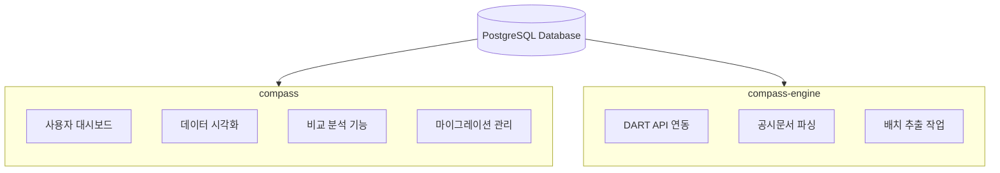
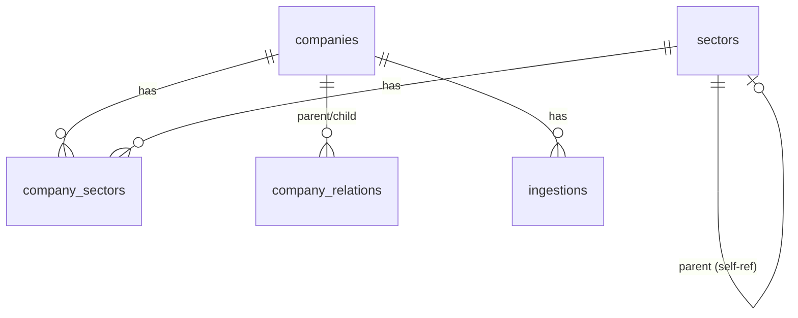
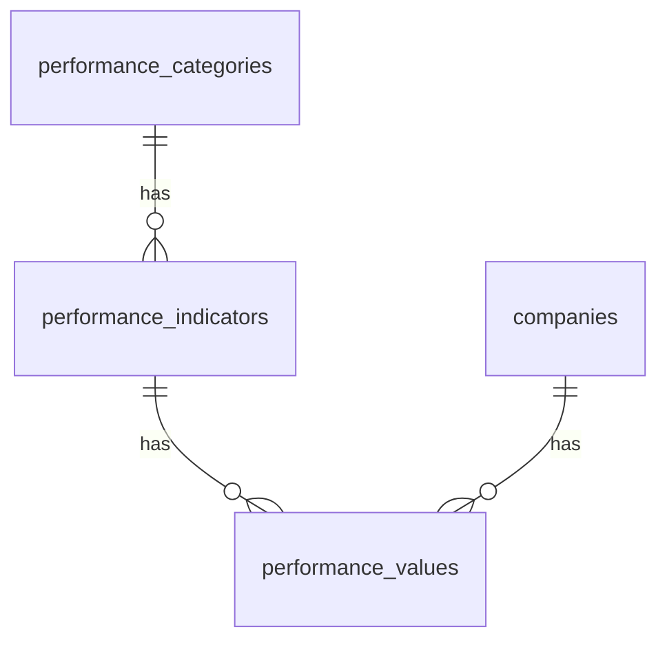
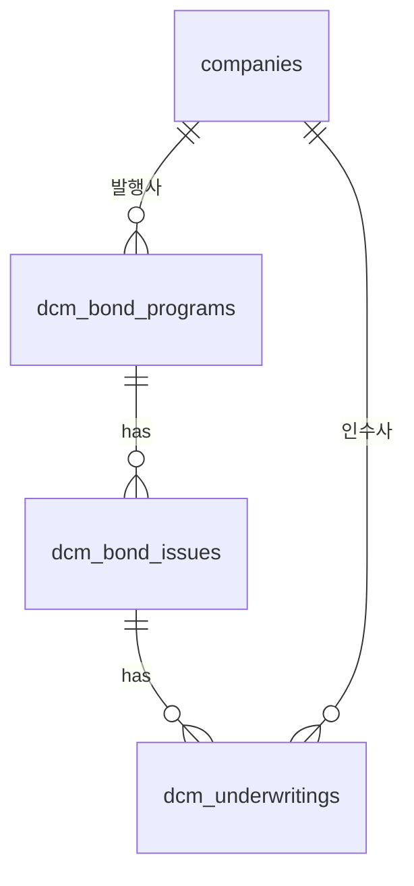
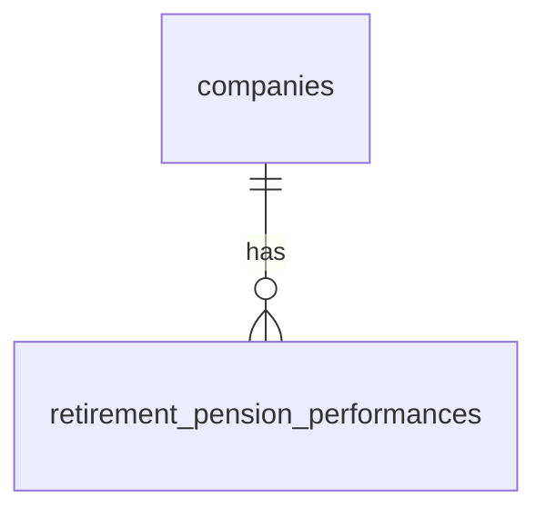
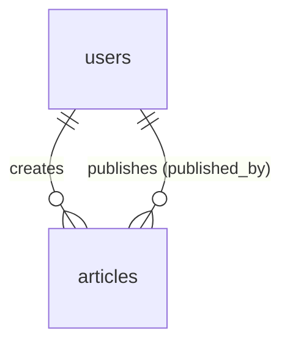
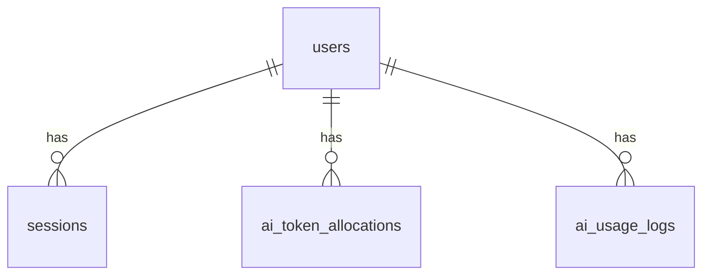
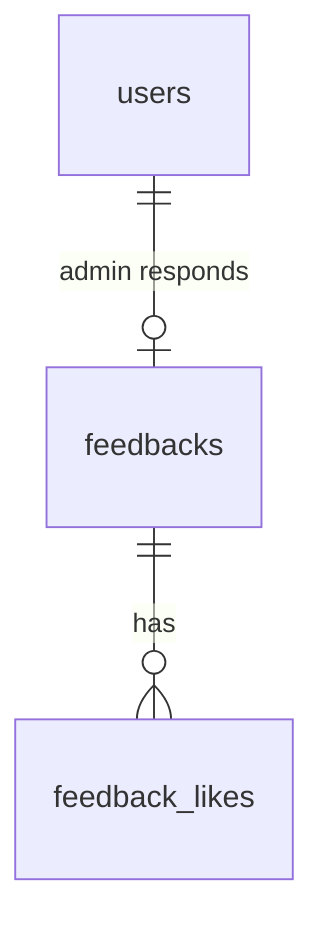

# Compass 데이터베이스 스키마

Compass 데이터베이스의 테이블 구조, 컬럼 명세, 쿼리 예시를 다루는 문서.
설계 철학과 핵심 과제는 [database-design.md](./database-design.md) 참고.

---

## 목차

**Part 1. 구조 이해** (온보딩용)
1. [프로젝트 아키텍처](#1-프로젝트-아키텍처)
2. [도메인 구조](#2-도메인-구조)

**Part 2. 레퍼런스** (개발 중 참조용)
3. [Rails 모델 구조](#3-rails-모델-구조)
4. [테이블 스키마 요약](#4-테이블-스키마-요약)
5. [쿼리 패턴](#5-쿼리-패턴)

**Part 3. 가이드** (실무 작업용)
6. [확장 가이드](#6-확장-가이드)
7. [주의사항](#7-주의사항)

**부록**
- [테이블 스키마 상세 (DDL)](#부록-테이블-스키마-상세-ddl)
- [설계 노트](#부록-설계-노트)

---

# Part 1. 구조 이해

## 1. 프로젝트 아키텍처

### 1.1 멀티 프로젝트 구조



**핵심 규칙**:
- 두 프로젝트가 동일한 데이터베이스 공유
- 마이그레이션은 compass에서만 생성/관리 (compass-engine은 DB 참조만)

**테이블별 쓰기 소유권**:

| 쓰기 주체 | 테이블 | 비고 |
|-----------|--------|------|
| compass-engine | companies | DART API로 기업 정보 수집 |
| compass-engine | performance_values | 공시문서에서 지표 추출 |
| compass-engine | retirement_pension_performances | FSS 데이터 수집 |
| compass-engine | dcm_bond_programs, dcm_bond_issues, dcm_underwritings | DART 공시에서 채권 발행 정보 추출 |
| compass-engine | ingestions | 자체 수집 이력 기록 |
| compass | users, sessions | 인증 |
| compass | articles | AI 기사 생성 |
| compass | ai_token_allocations, ai_usage_logs | AI 사용 추적 |
| compass | feedbacks, feedback_likes | 사용자 피드백 |
| 양쪽 | sectors, company_sectors, company_relations | compass에서 시드, engine에서도 업데이트 가능 |
| compass | performance_categories, performance_indicators | 시드/마이그레이션으로 관리 |

> **주의**: compass-engine이 쓰는 테이블의 스키마를 변경할 때는 engine 코드도 함께 확인해야 한다.

### 1.2 ERD 개요

#### Core Domain (기업 및 분류)



#### Performance Domain (경영성과)



#### DCM Domain (채권시장)



#### Retirement Pension Domain (퇴직연금)



#### Articles Domain (AI 기사)



#### Auth & AI Domain



#### Feedback Domain



---

## 2. 도메인 구조

설계 원칙의 구체적 구현 방법. 원칙 자체는 [database-design.md](./database-design.md) 참고.

### 2.1 Core Domain (기업 및 분류)

**역할**: 시스템의 중심 엔티티인 기업과 분류 체계 관리

**핵심 테이블**:

| 테이블 | 역할 | 비고 |
|--------|------|------|
| companies | 기업 정보 | dart_code가 사실상 자연키 |
| sectors | 분류 체계 | kind로 공식/테마 구분, self-ref로 계층 표현 |
| company_sectors | 기업-분류 연결 | 다대다 관계 |
| company_relations | 기업 간 관계 | 지분율, 유효 기간 포함 |

**주요 특징**:
- dart_code를 기업 식별자로 사용 (DART가 주요 데이터 소스이며, 모든 법인에 고유 번호 부여)
- stock_code는 상장사만 존재
- industry_code: DART 업종코드 (5자리)
- listed_shares, stock_price, stock_price_date: 시가총액 산출용
- 기업 간 관계에 effective_from/effective_to로 유효 기간 관리

### 2.2 Performance Domain (경영성과)

**역할**: 경영성과 지표 데이터 관리

**핵심 테이블**:

| 테이블 | 역할 | 비고 |
|--------|------|------|
| performance_categories | 지표 카테고리 | 수익성, 성장성 등 |
| performance_indicators | 지표 정의 | ROE, ROA 등 |
| performance_values | 지표 값 | 기업별, 기간별 실적 |

**indicators 주요 컬럼**:
- `common`: 전 업종 공통 지표 여부
- `applicable_to`: 적용 대상 업종 배열 (예: `["banks", "securities"]`)
- `supported_period_types`: 지원하는 기간 유형 배열 (예: `["q", "ytd"]`)

**values 주요 컬럼**:
- `basis`: 연결/별도 기준 (`consolidated` 또는 `separate`)
- `period_type`: 기간 유형 (`q`=분기, `ytd`=누적, `pit`=시점)
- `source_cell`, `source_sheet`: 원본 데이터 추적용

**유니크 제약**: `(company_id, indicator_id, year, quarter, period_type, basis)`

### 2.3 DCM Domain (채권시장)

**역할**: 채권 발행 및 인수 데이터 관리

**핵심 테이블**:

| 테이블 | 역할 | 비고 |
|--------|------|------|
| dcm_bond_programs | MTN 프로그램 등 | 발행사(company)와 연결 |
| dcm_bond_issues | 개별 채권 발행 건 | 발행 조건, 수요예측 결과 |
| dcm_underwritings | 인수 참여 | 인수사(company)와 연결 |

**관계 구조**: `companies → bond_programs → bond_issues → underwritings ↔ companies`

### 2.4 Retirement Pension Domain (퇴직연금)

**역할**: 퇴직연금 사업자별 실적 관리

**핵심 테이블**:

| 테이블 | 역할 | 비고 |
|--------|------|------|
| retirement_pension_performances | 사업자별 실적 | DB/DC/IRP 적립금·수익률 |

**주요 컬럼**:

`product_type` — **integer enum** (시스템 내 유일한 정수형 enum):

| 값 | 키 | 설명 | 비고 |
|----|----|------|------|
| 0 | guaranteed | 원리금보장 | 2025Q2 이전: 통합, 2025Q3~: deposit+market 합산 |
| 1 | guaranteed_deposit | 예금성 원리금보장 | 2025Q3부터 신규 |
| 2 | guaranteed_market | 시장성 원리금보장 | 2025Q3부터 신규 |
| 3 | non_guaranteed | 원리금비보장 | |

> **스키마 변경 이력**: 2025Q3부터 금융감독원이 원리금보장을 예금성/시장성으로 분리 공시. `guaranteed`(0)는 과거 데이터 및 합산 비교용으로 유지.

`provider_type` — 사업자 유형: `bank`, `securities`, `life_insurance`, `general_insurance`

기타 상수:
- `PLAN_TYPES`: `db`, `dc`, `irp`
- `RETURN_PERIODS`: `1y`, `3y`, `5y`, `7y`, `10y`
- DB/DC/IRP별 적립금(`*_reserve`) 및 기간별 수익률(`*_return_1y` ~ `*_return_10y`)

### 2.5 Articles Domain (AI 기사)

**역할**: AI 생성 기사 관리

**핵심 테이블**:

| 테이블 | 역할 | 비고 |
|--------|------|------|
| articles | AI 기사 | 유형, 리그, 기간, 본문 등 |

**주요 컬럼**:

`article_type` — 기사 유형:

| 값 | 설명 |
|----|------|
| league_table | 리그테이블 종합 |
| category_detail | 부문별 심층 |
| pension | 퇴직연금 |
| deep_analysis | 심층 분석 |
| z_score | Z-Score 분석 |
| productivity | 생산성 분석 |
| construction | 구성 분석 |

`league_type`: `financial_holdings`, `banks`, `securities`, `cards`

`category_key`: 부문별 심층 분석 시 카테고리 키 (예: `growth`, `profitability`, `soundness`)

`data_snapshot`, `prompt_snapshot`: 생성 시점의 데이터/프롬프트를 JSON으로 보존하여 재현 가능성 확보

### 2.6 Auth & AI Domain

**역할**: 사용자 인증 및 AI 토큰 관리

**핵심 테이블**:

| 테이블 | 역할 | 비고 |
|--------|------|------|
| users | 사용자 계정 | bcrypt 인증, role(reporter/editor/admin) |
| sessions | 로그인 세션 | IP, User-Agent 추적 |
| ai_token_allocations | 월별 AI 토큰 할당 | 사용자별 월 50만 크레딧 기본 |
| ai_usage_logs | AI 사용 이력 | 요청 유형, 모델, 토큰 수 |

**역할별 권한**:

| 역할 | 설명 | 고유 권한 |
|------|------|----------|
| reporter | 기자 (기본값) | 기본 조회, AI 질의 |
| editor | 편집자 | + 팀 사용량 조회 |
| admin | 관리자 | + 사용자 관리, 팀 사용량 조회 |

**AI 사용 조건**: `active == true` AND 월 토큰 한도 미초과 (`can_use_ai?`)

**토큰 크레딧 시스템**:
- `ai_token_allocations.used_tokens`는 실제 API 토큰이 아닌 **가중 크레딧**
- 배율: Haiku 1배, Sonnet 3배 (`Ai::TokenManager::TOKEN_COST_MULTIPLIER`)
- `ai_usage_logs`에는 실제 API 토큰 수가 기록됨 (가중 아님)

**유효한 query_type 값** (`AiUsageLog::QUERY_TYPES`):
`intent_extraction`, `answer_generation`, `metric_insight`, `draft_generation`, `article_generation`,
`category_insight`, `category_insight_stream`, `category_chat`, `category_chat_summary`,
`trend_insight`, `trend_insight_stream`, `trend_chat`, `trend_chat_summary`,
`integrated_insight_stream`, `integrated_chat`, `integrated_chat_summary`,
`securities_insight_stream`, `securities_chat`, `securities_chat_summary`

**User 검증 규칙**:
- 이메일: 자동 정규화 (strip + downcase, `normalizes`)
- 비밀번호: 8자 이상, 영문+숫자 필수 (`/\A(?=.*[a-zA-Z])(?=.*\d).+\z/`)

### 2.7 Feedback Domain

**역할**: 사용자 피드백 관리

**핵심 테이블**:

| 테이블 | 역할 | 비고 |
|--------|------|------|
| feedbacks | 피드백 | 카테고리(bug/feature/improvement/other) |
| feedback_likes | 공감 | IP 해시 기반 중복 방지 |

### 2.8 Ingestion Domain (데이터 수집 이력)

**역할**: compass-engine의 데이터 수집 이력 관리

**핵심 테이블**:

| 테이블 | 역할 | 비고 |
|--------|------|------|
| ingestions | 수집 이력 | 소스(dart/factbook/fss/crefia), 상태, 결과 |

**주요 컬럼**:
- `source`: 데이터 출처 (dart, factbook, fss, crefia)
- `sector`: 대상 업종 (holdings, banks, securities, cards)
- `status`: 처리 상태 (success, partial, failed)
- `saved_count`, `updated_count`: 처리 건수

---

# Part 2. 레퍼런스

## 3. Rails 모델 구조

### 3.1 네임스페이스 구조

```
app/models/
├── company.rb
├── sector.rb
├── company_sector.rb
├── company_relation.rb
├── performance/
│   ├── category.rb
│   ├── indicator.rb
│   └── value.rb
├── dcm/
│   ├── bond_program.rb
│   ├── bond_issue.rb
│   └── underwriting.rb
├── retirement_pension/
│   └── performance.rb
├── article.rb
├── user.rb
├── session.rb
├── current.rb
├── ai_token_allocation.rb
├── ai_usage_log.rb
├── ingestion.rb
├── feedback.rb
└── feedback_like.rb
```

### 3.2 Company 모델 (중심 엔티티)

```ruby
class Company < ApplicationRecord
  # 분류
  has_many :company_sectors
  has_many :sectors, through: :company_sectors

  # 기업간 관계
  has_many :child_relations, class_name: 'CompanyRelation',
           foreign_key: :parent_company_id
  has_many :parent_relations, class_name: 'CompanyRelation',
           foreign_key: :child_company_id
  has_many :subsidiaries, through: :child_relations, source: :child_company
  has_many :parent_companies, through: :parent_relations, source: :parent_company

  # 데이터
  has_many :ingestions

  # 주요 검증
  validates :dart_code, presence: true, uniqueness: true, length: { is: 8 }
  validates :name, presence: true
  validates :stock_code, length: { is: 6 }, allow_blank: true
  validates :market_type, inclusion: { in: %w[kospi kosdaq konex unlisted] }, allow_blank: true

  # 주요 스코프
  scope :listed, -> { where(market_type: %w[kospi kosdaq konex]) }
  scope :by_market, ->(market) { where(market_type: market) }
end
```

> **설계 의도**: Company 모델에는 `performance_values`, `dcm_bond_programs`, `retirement_pension_performances` 등에 대한 `has_many`가 **의도적으로 정의되어 있지 않다**. 이는 대량 데이터의 우발적 eager loading을 방지하기 위함이다. 이들 데이터는 `Performance::Value.where(company: company)` 형태로 직접 쿼리한다.

### 3.3 Performance 모델

```ruby
# app/models/performance/indicator.rb
module Performance
  class Indicator < ApplicationRecord
    self.table_name = 'performance_indicators'

    belongs_to :category, class_name: 'Performance::Category'
    has_many :values, class_name: 'Performance::Value',
             foreign_key: :indicator_id, dependent: :destroy

    validates :code, presence: true, uniqueness: true
    validates :name, presence: true
  end
end

# app/models/performance/value.rb
module Performance
  class Value < ApplicationRecord
    self.table_name = 'performance_values'

    PERIOD_TYPES = { quarterly: "q", ytd: "ytd", point_in_time: "pit" }.freeze

    belongs_to :company
    belongs_to :indicator, class_name: 'Performance::Indicator'

    validates :year, presence: true
    validates :quarter, inclusion: { in: 1..4 }, allow_nil: true
    validates :period_type, inclusion: { in: PERIOD_TYPES.values }, allow_nil: true
    validates :company_id, uniqueness: {
      scope: [:indicator_id, :year, :quarter, :period_type, :basis]
    }
    validate :value_or_value_text_present  # value 또는 value_text 중 하나 필수

    scope :for_company, ->(company) { where(company: company) }
    scope :for_year, ->(year) { where(year: year) }
    scope :for_quarter, ->(q) { where(quarter: q) }
    scope :for_period_type, ->(pt) { where(period_type: pt) }
  end
end
```

---

## 4. 테이블 스키마 요약

전체 DDL은 [부록](#부록-테이블-스키마-상세-ddl) 참고.

### 4.1 companies

| 컬럼 | 타입 | 설명 |
|------|------|------|
| dart_code | VARCHAR(8) | DART 고유번호 (UNIQUE, 사실상 자연키) |
| name | VARCHAR | 기업명 |
| stock_code | VARCHAR(6) | 종목코드 (상장사만) |
| market_type | VARCHAR | kospi, kosdaq, konex, unlisted (소문자) |
| fiscal_month | INTEGER | 결산월 (12 = 12월 결산) |
| industry_code | VARCHAR(5) | DART 업종코드 |
| listed_shares | BIGINT | 상장주식수 |
| stock_price | DECIMAL(12,2) | 주가 |
| stock_price_date | DATE | 주가 기준일 |

**주요 인덱스**: dart_code (UNIQUE), stock_code, market_type, industry_code

### 4.2 sectors

| 컬럼 | 타입 | 설명 |
|------|------|------|
| code | VARCHAR | 분류 코드 (UNIQUE) |
| name | VARCHAR | 분류명 |
| kind | VARCHAR | official(공식), theme(테마) |
| depth | INTEGER | 계층 깊이 (1, 2, 3...) |
| parent_id | BIGINT | 상위 분류 (self-reference) |

**주요 인덱스**: code (UNIQUE), kind, (kind, depth), parent_id

### 4.3 company_relations

| 컬럼 | 타입 | 설명 |
|------|------|------|
| parent_company_id | BIGINT | 모회사 |
| child_company_id | BIGINT | 자회사 |
| relation_type | VARCHAR | subsidiary, affiliate, associate, parent |
| ownership_percentage | DECIMAL(5,2) | 지분율 (0.00 ~ 100.00) |
| effective_from | DATE | 유효 시작일 |
| effective_to | DATE | 유효 종료일 (NULL = 현재 유효) |

**UNIQUE 제약**: (parent_company_id, child_company_id, effective_from)

**모델 검증 규칙**:
- 자기 자신과의 관계 생성 불가 (`parent == child`)
- 역방향 관계 중복 방지 (A→B 존재 시 B→A 생성 불가)
- `effective_to`는 `effective_from` 이후여야 함

### 4.4 performance_categories

| 컬럼 | 타입 | 설명 |
|------|------|------|
| code | VARCHAR | 카테고리 코드 (UNIQUE) |
| name | VARCHAR | 카테고리명 |
| display_order | INTEGER | UI 표시 순서 |

### 4.5 performance_indicators

| 컬럼 | 타입 | 설명 |
|------|------|------|
| category_id | BIGINT | 카테고리 FK (RESTRICT) |
| code | VARCHAR | 지표 코드 (UNIQUE) |
| name | VARCHAR | 지표명 |
| unit | VARCHAR | 단위 (%, 백만원 등) |
| common | BOOLEAN | 전 업종 공통 지표 여부 |
| applicable_to | VARCHAR[] | 적용 대상 업종 배열 |
| supported_period_types | VARCHAR[] | 지원 기간 유형 배열 |
| formula | TEXT | 산출 공식 |
| hierarchy | JSONB | 계층 구조 |

### 4.6 performance_values

| 컬럼 | 타입 | 설명 |
|------|------|------|
| company_id | BIGINT | 기업 FK |
| indicator_id | BIGINT | 지표 FK |
| year | INTEGER | 연도 |
| quarter | INTEGER | 분기 (NULL=연간) |
| value | DECIMAL(20,4) | 수치 값 |
| value_text | VARCHAR | 텍스트 값 |
| basis | VARCHAR(15) | 연결/별도 (consolidated/separate) |
| period_type | VARCHAR(10) | 기간 유형 (q/ytd/pit) |
| source_cell | VARCHAR(10) | 원본 셀 위치 |
| source_sheet | VARCHAR(50) | 원본 시트명 |
| calculated | BOOLEAN | 계산값 여부 |

**UNIQUE 제약**: (company_id, indicator_id, year, quarter, period_type, basis)

### 4.7 dcm_bond_programs

| 컬럼 | 타입 | 설명 |
|------|------|------|
| company_id | BIGINT | 발행사 FK |
| established_on | DATE | 프로그램 설정일 |
| total_limit_amount | DECIMAL(20) | 총 한도 금액 |

### 4.8 dcm_bond_issues

| 컬럼 | 타입 | 설명 |
|------|------|------|
| bond_program_id | BIGINT | 프로그램 FK |
| issue_number | VARCHAR | 회차 (NOT NULL) |
| bond_type | VARCHAR | corporate(일반), subordinated(후순위), hybrid(신종자본) |
| issue_date | DATE | 발행일 |
| maturity_date | DATE | 만기일 |
| issue_amount | DECIMAL(20) | 발행금액 |
| coupon_rate | DECIMAL(6,4) | 표면금리 |
| determined_rate | DECIMAL(6,4) | 확정금리 |
| rating | VARCHAR | 신용등급 |
| demand_amount | DECIMAL(20) | 수요예측 참여금액 |
| competition_rate | DECIMAL(8,2) | 경쟁률 |
| filing_date | DATE | 신고일 |

**주요 인덱스**: bond_program_id, bond_type, issue_date, filing_date, rating, issue_number

### 4.9 dcm_underwritings

| 컬럼 | 타입 | 설명 |
|------|------|------|
| bond_issue_id | BIGINT | 채권 FK |
| company_id | BIGINT | 인수사 FK |
| role | VARCHAR | lead/co_lead/co_manager/syndicate |
| amount | DECIMAL(20) | 인수금액 |
| fee_rate | DECIMAL(6,4) | 수수료율 |
| fee_amount | DECIMAL(20) | 수수료 금액 |
| task | VARCHAR | 업무 내용 |

**UNIQUE 제약**: (bond_issue_id, company_id)

### 4.10 retirement_pension_performances

| 컬럼 | 타입 | 설명 |
|------|------|------|
| company_id | BIGINT | 사업자 FK |
| year | INTEGER | 연도 |
| quarter | INTEGER | 분기 |
| product_type | INTEGER | 상품 유형: 0=guaranteed, 1=guaranteed_deposit, 2=guaranteed_market, 3=non_guaranteed |
| provider_type | VARCHAR | 사업자 유형: bank, securities, life_insurance, general_insurance |
| db_reserve / dc_reserve / irp_reserve | DECIMAL(15,2) | 유형별 적립금 |
| db_return_1y ~ 10y | DECIMAL(8,4) | DB형 기간별 수익률 |
| dc_return_1y ~ 10y | DECIMAL(8,4) | DC형 기간별 수익률 |
| irp_return_1y ~ 10y | DECIMAL(8,4) | IRP형 기간별 수익률 |

**UNIQUE 제약**: (company_id, year, quarter, product_type)

### 4.11 articles

| 컬럼 | 타입 | 설명 |
|------|------|------|
| user_id | BIGINT | 작성자(생성자) FK |
| article_type | VARCHAR | 기사 유형: league_table, category_detail, pension, deep_analysis, z_score, productivity, construction |
| league_type | VARCHAR | 리그 (financial_holdings, banks 등) |
| category_key | VARCHAR | 카테고리 키 (부문별 심층용) |
| year | INTEGER | 연도 |
| quarter | INTEGER | 분기 |
| period_type | VARCHAR | 기간 유형 |
| title | VARCHAR | 제목 |
| subtitle | VARCHAR | 부제 |
| body | TEXT | 본문 (마크다운) |
| status | VARCHAR | 상태 (draft/reviewing/published) |
| data_snapshot | TEXT | 생성 시 데이터 스냅샷 |
| prompt_snapshot | TEXT | 생성 시 프롬프트 스냅샷 |
| published_at | TIMESTAMP | 게시일 |
| published_by_id | BIGINT | 게시자 FK |

**주요 인덱스**: (article_type, league_type, year, quarter), (league_type, category_key), status, published_at

### 4.12 users

| 컬럼 | 타입 | 설명 |
|------|------|------|
| email_address | VARCHAR | 이메일 (UNIQUE) |
| name | VARCHAR | 이름 |
| password_digest | VARCHAR | bcrypt 해시 |
| role | VARCHAR | 역할 (reporter/editor/admin) |
| active | BOOLEAN | 활성 상태 |
| must_change_password | BOOLEAN | 비밀번호 변경 필요 여부 |

### 4.13 sessions

| 컬럼 | 타입 | 설명 |
|------|------|------|
| user_id | BIGINT | 사용자 FK (CASCADE) |
| ip_address | VARCHAR | 접속 IP |
| user_agent | VARCHAR | 브라우저 정보 |
| remember_me | BOOLEAN | 로그인 유지 여부 |

### 4.14 ai_token_allocations

| 컬럼 | 타입 | 설명 |
|------|------|------|
| user_id | BIGINT | 사용자 FK |
| period_start | DATE | 할당 기간 시작일 |
| monthly_limit | INTEGER | 월 크레딧 한도 (기본 500,000) |
| used_tokens | INTEGER | 사용 크레딧 수 (**가중치 적용**: Haiku 1배, Sonnet 3배) |

**UNIQUE 제약**: (user_id, period_start)

### 4.15 ai_usage_logs

| 컬럼 | 타입 | 설명 |
|------|------|------|
| user_id | BIGINT | 사용자 FK |
| query_type | VARCHAR | 요청 유형 (19종, 모델에서 validates inclusion) |
| model | VARCHAR | AI 모델: haiku, sonnet |
| input_tokens | INTEGER | 입력 토큰 수 |
| output_tokens | INTEGER | 출력 토큰 수 |
| question | TEXT | 질문 내용 |
| success | BOOLEAN | 성공 여부 |

### 4.16 ingestions

| 컬럼 | 타입 | 설명 |
|------|------|------|
| company_id | BIGINT | 기업 FK (NULL 가능) |
| year | INTEGER | 연도 |
| quarter | INTEGER | 분기 |
| source | VARCHAR | 데이터 출처 (dart/factbook/fss/crefia) |
| sector | VARCHAR | 업종 (holdings/banks/securities/cards) |
| status | VARCHAR | 상태 (success/partial/failed) |
| saved_count | INTEGER | 신규 저장 건수 |
| updated_count | INTEGER | 업데이트 건수 |
| total_indicators | INTEGER | 전체 지표 수 |
| source_document_id | VARCHAR | 원본 문서 ID |
| triggered_by | VARCHAR | 트리거 주체 |
| started_at / completed_at | TIMESTAMP | 처리 시간 |
| error_message | TEXT | 오류 메시지 |

**UNIQUE 제약**: (company_id, year, quarter, source), (year, quarter, source) WHERE company_id IS NULL

### 4.17 feedbacks

| 컬럼 | 타입 | 설명 |
|------|------|------|
| title | VARCHAR(200) | 제목 |
| content | TEXT | 내용 |
| nickname | VARCHAR(50) | 작성자 닉네임 |
| category | VARCHAR | 카테고리 (bug/feature/improvement/other) |
| status | VARCHAR | 상태 (open/answered/closed) |
| ip_address_hash | VARCHAR | IP 해시 |
| likes_count | INTEGER | 공감 수 (counter cache) |
| admin_user_id | BIGINT | 응답한 관리자 FK |
| admin_response | TEXT | 관리자 응답 |
| admin_responded_at | TIMESTAMP | 응답 시간 |

### 4.18 feedback_likes

| 컬럼 | 타입 | 설명 |
|------|------|------|
| feedback_id | BIGINT | 피드백 FK (CASCADE) |
| ip_address_hash | VARCHAR | IP 해시 |

**UNIQUE 제약**: (feedback_id, ip_address_hash)

---

## 5. 쿼리 패턴

### 5.1 Performance 기본 조회

```ruby
# 특정 기업의 최근 5년 ROE 추이
company = Company.find_by(dart_code: '00164779')
roe = Performance::Indicator.find_by(code: 'ROE')

Performance::Value.where(company: company, indicator: roe)
                  .where(year: 2020..2024)
                  .where(quarter: nil)
                  .where(basis: 'consolidated')
                  .order(:year)
```

```ruby
# 특정 기업의 분기별 당기순이익 (누적 기준)
Performance::Value.where(company: company, indicator: net_income)
                  .for_year(2024)
                  .for_period_type('ytd')
                  .where(basis: 'consolidated')
                  .order(:quarter)
```

### 5.2 그룹사 연계 분석

```ruby
# KB금융지주의 현재 자회사 목록
kb = Company.find_by(name: 'KB금융지주')
today = Date.current

kb.parent_relations
  .where(relation_type: 'subsidiary')
  .where('effective_from <= ?', today)
  .where('effective_to IS NULL OR effective_to >= ?', today)
  .includes(:child_company)
```

```ruby
# KB금융지주와 자회사들의 ROE 비교
subsidiary_ids = kb.parent_relations
                   .where(relation_type: 'subsidiary')
                   .where('effective_to IS NULL')
                   .pluck(:child_company_id)

Performance::Value.where(company_id: [kb.id] + subsidiary_ids)
                  .where(indicator: roe, year: 2024, quarter: nil)
                  .where(basis: 'consolidated')
                  .includes(:company)
```

### 5.3 DCM 조회

```ruby
# 2024년 3분기 채권 발행 건 조회
Dcm::BondIssue.quarterly(2024, 3)
              .includes(bond_program: :company, underwritings: :company)
              .by_amount

# 특정 증권사의 인수 실적
Dcm::Underwriting.by_company(company_id)
                 .monthly(2024, 9)
                 .lead_roles
                 .includes(bond_issue: { bond_program: :company })
```

### 5.4 Retirement Pension 조회

```ruby
# 2024년 3분기 퇴직연금 실적 (원리금보장형)
RetirementPension::Performance
  .for_period(2024, 3)
  .comparable_guaranteed
  .by_total_reserve
  .includes(:company)

# 특정 사업자의 수익률 추이
RetirementPension::Performance
  .where(company: company)
  .comparable_guaranteed
  .order(:year, :quarter)
```

---

# Part 3. 가이드

## 6. 확장 가이드

### 6.1 새로운 지표 추가

코드 수정 없이 데이터베이스에 레코드만 추가:

```ruby
# 1. 카테고리 확인 또는 생성
category = Performance::Category.find_or_create_by!(code: 'profitability') do |c|
  c.name = '수익성'
  c.display_order = 1
end

# 2. 지표 생성
indicator = Performance::Indicator.create!(
  category: category,
  code: 'NEW_RATIO',
  name: '신규 비율',
  unit: '%',
  formula: '(A / B) * 100',
  common: true,
  supported_period_types: ['q', 'ytd']
)

# 3. 값 저장
Performance::Value.create!(
  company: company,
  indicator: indicator,
  year: 2024,
  quarter: 3,
  value: 15.5,
  basis: 'consolidated',
  period_type: 'q'
)
```

### 6.2 새로운 도메인 추가

DCM 패턴을 참조하여 새로운 도메인을 추가할 수 있다:

```bash
# 1. 마이그레이션 생성
rails g migration CreateEcmTables

# 2. 도메인 테이블 생성 (접두어 통일: ecm_)
- ecm_deals
- ecm_participants

# 3. 모델 생성 (네임스페이스 분리)
app/models/ecm/
├── deal.rb
└── participant.rb
```

### 6.3 새로운 리그테이블 추가

리그테이블은 `app/lib/league_indicators/` 모듈에서 코드 레벨로 관리한다:

```ruby
# 1. 지표 모듈 정의
# app/lib/league_indicators/new_league.rb
module LeagueIndicators
  module NewLeague
    INDICATORS = {
      # DB indicator 매핑
    }.freeze

    CATEGORY_SCHEMA = {
      # UI 표시 구조 (INDICATORS와 반드시 동기화)
    }.freeze
  end
end

# 2. 서비스 생성 (COMPANY_METADATA는 서비스에서 정의)
# app/services/performance/new_league_data_service.rb
class Performance::NewLeagueDataService < Performance::BaseLeagueDataService
  include LeagueIndicators::NewLeague

  COMPANY_METADATA = {
    # dart_code 기반 기업 정의
  }.freeze
end

# 3. 컨트롤러/뷰에서 서비스 호출
```

**주의**: INDICATORS에 지표를 추가·수정할 때 반드시 CATEGORY_SCHEMA도 함께 업데이트할 것.

---

## 7. 주의사항

### 7.1 필수 규칙

#### 마이그레이션 관리

```ruby
# ✅ compass 프로젝트에서만 마이그레이션 생성
rails g migration AddNewColumnToCompanies

# ❌ compass-engine에서 마이그레이션 생성 금지
# 두 프로젝트가 같은 DB를 공유하므로 충돌 발생
```

#### 삭제 정책 (FK ON DELETE 전체 맵)

**Company 삭제 시**:

| FK 소스 테이블 | ON DELETE | 결과 |
|---------------|----------|------|
| company_sectors | CASCADE | 연쇄 삭제 |
| company_relations (parent/child) | CASCADE | 연쇄 삭제 |
| performance_values | CASCADE | 연쇄 삭제 |
| ingestions | CASCADE | 연쇄 삭제 |
| **dcm_bond_programs** | **없음 (RESTRICT)** | **삭제 차단** |
| **dcm_underwritings** | **없음 (RESTRICT)** | **삭제 차단** |
| **retirement_pension_performances** | **없음 (RESTRICT)** | **삭제 차단** |

> **주의**: DCM 또는 퇴직연금 데이터가 있는 기업은 직접 삭제 불가. 해당 데이터를 먼저 삭제해야 한다.

**User 삭제 시**:

| FK 소스 테이블 | DB ON DELETE | Rails dependent | 결과 |
|---------------|-------------|-----------------|------|
| sessions | CASCADE | :destroy | DB/Rails 모두 삭제 |
| ai_token_allocations | 없음 (RESTRICT) | :destroy | Rails destroy 시 삭제, SQL DELETE 시 차단 |
| ai_usage_logs | 없음 (RESTRICT) | :destroy | 동일 |
| articles | 없음 (RESTRICT) | :destroy | 동일 |
| feedbacks (admin_user) | 없음 (RESTRICT) | 없음 | 관리자 응답 있으면 차단 |

> **주의**: User는 `User.destroy`(Rails)로만 삭제해야 한다. SQL `DELETE FROM users`는 FK 위반으로 실패할 수 있다.

**기타**:

| 대상 | ON DELETE | 비고 |
|------|----------|------|
| performance_categories → indicators | RESTRICT | 지표 있으면 카테고리 삭제 불가 |
| sectors → sectors (parent) | CASCADE | 상위 삭제 시 하위도 삭제 |
| feedbacks → feedback_likes | CASCADE | 피드백 삭제 시 공감도 삭제 |
| dcm_bond_programs → bond_issues | 없음 (RESTRICT) | 발행 건 있으면 프로그램 삭제 불가 |
| dcm_bond_issues → underwritings | 없음 (RESTRICT) | 인수 참여 있으면 발행 건 삭제 불가 |

```ruby
# 카테고리 삭제 시 지표 먼저 삭제 필요
Performance::Indicator.where(category: category).destroy_all
category.destroy
```

### 7.2 쿼리 작성

#### 시계열 데이터 조회

```ruby
# ✅ 연간 데이터
Performance::Value.where(quarter: nil)

# ✅ 분기 데이터
Performance::Value.where.not(quarter: nil)

# ✅ 특정 분기 (basis, period_type 명시)
Performance::Value.where(year: 2024, quarter: 3, basis: 'consolidated', period_type: 'q')

# ❌ quarter: 0 사용 금지 (연간은 NULL로 표현)
```

### 7.3 성능 최적화

#### 대량 데이터 처리

```ruby
# ✅ find_each 사용 (메모리 효율)
Company.find_each(batch_size: 100) do |company|
  # 처리
end

# ✅ bulk insert
Performance::Value.insert_all([
  { company_id: 1, indicator_id: 1, year: 2024, value: 10.5,
    basis: 'consolidated', period_type: 'q' },
  { company_id: 2, indicator_id: 1, year: 2024, value: 12.3,
    basis: 'consolidated', period_type: 'q' },
])

# ❌ 루프 내 개별 저장 (N+1 문제)
companies.each { |c| Performance::Value.create!(...) }
```

#### 인덱스 활용

자주 사용되는 쿼리 패턴에 맞게 인덱스 설계됨:

```ruby
# 인덱스 활용되는 패턴
Performance::Value.where(company_id: company.id, year: 2024, quarter: 3)
# → index_performance_values_on_company_id_and_year_and_quarter

Performance::Value.where(indicator_id: 1, year: 2024)
# → index_performance_values_on_indicator_id_and_year
```

---

## 8. 시드 데이터 부트스트랩

### 8.1 전체 실행

```bash
bin/rails db:seed
```

15개 시드 파일이 의존성 순서대로 자동 실행된다.

### 8.2 시드 파일 의존성 순서

```
1.  users                          ← 독립 (관리자 계정)
2.  sectors                        ← 독립 (금융 업종 계층)
3.  companies_holdings_banks       ← Sector 필요 (4대 지주 + 4대 은행)
4.  performance_categories         ← 독립 (카테고리 생성)
5.  companies_securities           ← Sector, Category 필요 (26개 증권사)
6.  companies_cards                ← Sector 필요 (8개 카드사)
7.  companies_general              ← Sector 필요 (일반 기업)
8.  theme_sectors                  ← Company, Sector 필요 (테마 분류 연결)
9.  company_relations              ← Company 필요 (지주-자회사 관계)
10. performance_indicators         ← Category 필요 (금융 지표)
11. performance_indicators_general ← Category 필요 (일반 지표)
12. values_holdings_banks          ← Company, Indicator 필요 (~2025Q3)
13. values_holdings_2025q4         ← Company, Indicator 필요 (2025Q4 잠정치)
14. values_securities              ← Company, Indicator 필요
15. values_cards                   ← Company, Indicator 필요
16. articles                       ← User 필요 (목업 기사 3건)
```

### 8.3 개별 시드 실행

```bash
# 특정 시드만 실행 (의존 데이터가 이미 있어야 함)
bin/rails db:seed:users
bin/rails db:seed:sectors
bin/rails db:seed:companies_holdings_banks
bin/rails db:seed:performance_categories
bin/rails db:seed:performance_indicators
bin/rails db:seed:values_holdings_banks
bin/rails db:seed:values_securities
bin/rails db:seed:values_cards
```

### 8.4 기타 데이터 관리 Rake 태스크

```bash
# DART API에서 기업 상세 정보 수집
bin/rails dart:fetch_sample        # 샘플 기업
bin/rails dart:fetch_all           # 전체 기업

# WICS 업종 분류 CSV 임포트
bin/rails import:wics
```

---

# 부록

## 부록: 테이블 스키마 상세 (DDL)

### companies

```sql
CREATE TABLE companies (
  id              BIGSERIAL PRIMARY KEY,
  dart_code       VARCHAR(8) NOT NULL UNIQUE,
  name            VARCHAR NOT NULL,
  legal_name      VARCHAR,
  english_name    VARCHAR,
  stock_code      VARCHAR(6),
  corporate_number VARCHAR(13),
  business_number VARCHAR(10),
  industry_code   VARCHAR(5),
  market_type     VARCHAR,
  representative_name VARCHAR,
  fiscal_month    INTEGER,
  listed_shares   BIGINT,
  stock_price     DECIMAL(12,2),
  stock_price_date DATE,
  established_on  DATE,
  address         TEXT,
  phone           VARCHAR,
  fax             VARCHAR,
  website_url     TEXT,
  ir_url          TEXT,
  created_at      TIMESTAMP NOT NULL,
  updated_at      TIMESTAMP NOT NULL
);

CREATE UNIQUE INDEX index_companies_on_dart_code ON companies(dart_code);
CREATE INDEX index_companies_on_stock_code ON companies(stock_code);
CREATE INDEX index_companies_on_market_type ON companies(market_type);
CREATE INDEX index_companies_on_industry_code ON companies(industry_code);
```

### sectors

```sql
CREATE TABLE sectors (
  id         BIGSERIAL PRIMARY KEY,
  code       VARCHAR NOT NULL UNIQUE,
  name       VARCHAR NOT NULL,
  kind       VARCHAR DEFAULT 'official',
  depth      INTEGER NOT NULL,
  parent_id  BIGINT REFERENCES sectors(id) ON DELETE CASCADE,
  created_at TIMESTAMP NOT NULL,
  updated_at TIMESTAMP NOT NULL
);

CREATE UNIQUE INDEX index_sectors_on_code ON sectors(code);
CREATE INDEX index_sectors_on_kind ON sectors(kind);
CREATE INDEX index_sectors_on_kind_and_depth ON sectors(kind, depth);
CREATE INDEX index_sectors_on_parent_id ON sectors(parent_id);
```

### company_sectors

```sql
CREATE TABLE company_sectors (
  id            BIGSERIAL PRIMARY KEY,
  company_id    BIGINT NOT NULL REFERENCES companies(id) ON DELETE CASCADE,
  sector_id     BIGINT NOT NULL REFERENCES sectors(id) ON DELETE CASCADE,
  display_order INTEGER DEFAULT 0,
  created_at    TIMESTAMP NOT NULL,
  updated_at    TIMESTAMP NOT NULL,
  UNIQUE(company_id, sector_id)
);
```

### company_relations

```sql
CREATE TABLE company_relations (
  id                   BIGSERIAL PRIMARY KEY,
  parent_company_id    BIGINT NOT NULL REFERENCES companies(id) ON DELETE CASCADE,
  child_company_id     BIGINT NOT NULL REFERENCES companies(id) ON DELETE CASCADE,
  relation_type        VARCHAR NOT NULL,
  ownership_percentage DECIMAL(5,2),
  effective_from       DATE,
  effective_to         DATE,
  metadata             JSONB DEFAULT '{}',
  created_at           TIMESTAMP NOT NULL,
  updated_at           TIMESTAMP NOT NULL,
  UNIQUE(parent_company_id, child_company_id, effective_from)
);

CREATE INDEX index_company_relations_on_child_company_id ON company_relations(child_company_id);
CREATE INDEX index_company_relations_on_parent_company_id ON company_relations(parent_company_id);
CREATE INDEX index_company_relations_on_relation_type ON company_relations(relation_type);
CREATE INDEX idx_on_child_company_id_effective_from_effective_to ON company_relations(child_company_id, effective_from, effective_to);
```

### performance_categories

```sql
CREATE TABLE performance_categories (
  id            BIGSERIAL PRIMARY KEY,
  code          VARCHAR NOT NULL UNIQUE,
  name          VARCHAR NOT NULL,
  description   TEXT,
  display_order INTEGER DEFAULT 0,
  metadata      JSONB DEFAULT '{}',
  created_at    TIMESTAMP NOT NULL,
  updated_at    TIMESTAMP NOT NULL
);
```

### performance_indicators

```sql
CREATE TABLE performance_indicators (
  id                     BIGSERIAL PRIMARY KEY,
  category_id            BIGINT NOT NULL REFERENCES performance_categories(id) ON DELETE RESTRICT,
  code                   VARCHAR NOT NULL UNIQUE,
  name                   VARCHAR NOT NULL,
  unit                   VARCHAR,
  common                 BOOLEAN DEFAULT false,
  applicable_to          VARCHAR[] DEFAULT '{}',
  supported_period_types VARCHAR[] DEFAULT '{}' NOT NULL,
  formula                TEXT,
  hierarchy              JSONB DEFAULT '{}',
  metadata               JSONB DEFAULT '{}',
  created_at             TIMESTAMP NOT NULL,
  updated_at             TIMESTAMP NOT NULL
);

CREATE INDEX index_performance_indicators_on_category_id ON performance_indicators(category_id);
CREATE UNIQUE INDEX index_performance_indicators_on_code ON performance_indicators(code);
CREATE INDEX index_performance_indicators_on_common ON performance_indicators(common);
CREATE INDEX index_performance_indicators_on_applicable_to ON performance_indicators USING gin(applicable_to);
```

### performance_values

```sql
CREATE TABLE performance_values (
  id            BIGSERIAL PRIMARY KEY,
  company_id    BIGINT NOT NULL REFERENCES companies(id) ON DELETE CASCADE,
  indicator_id  BIGINT NOT NULL REFERENCES performance_indicators(id) ON DELETE CASCADE,
  year          INTEGER NOT NULL,
  quarter       INTEGER,
  value         DECIMAL(20,4),
  value_text    VARCHAR,
  basis         VARCHAR(15) NOT NULL DEFAULT 'consolidated',
  period_type   VARCHAR(10),
  source_cell   VARCHAR(10),
  source_sheet  VARCHAR(50),
  calculated    BOOLEAN DEFAULT false,
  metadata      JSONB DEFAULT '{}',
  created_at    TIMESTAMP NOT NULL,
  updated_at    TIMESTAMP NOT NULL,
  UNIQUE(company_id, indicator_id, year, quarter, period_type, basis)
);

CREATE INDEX index_performance_values_on_company_id ON performance_values(company_id);
CREATE INDEX index_performance_values_on_company_id_and_year_and_quarter ON performance_values(company_id, year, quarter);
CREATE INDEX index_performance_values_on_indicator_id ON performance_values(indicator_id);
CREATE INDEX index_performance_values_on_indicator_id_and_year ON performance_values(indicator_id, year);
CREATE INDEX index_performance_values_on_basis ON performance_values(basis);
CREATE INDEX index_performance_values_on_period_type ON performance_values(period_type);
```

### dcm_bond_programs

```sql
CREATE TABLE dcm_bond_programs (
  id                 BIGSERIAL PRIMARY KEY,
  company_id         BIGINT NOT NULL REFERENCES companies(id),
  established_on     DATE,
  total_limit_amount DECIMAL(20),
  created_at         TIMESTAMP NOT NULL,
  updated_at         TIMESTAMP NOT NULL
);

CREATE INDEX index_dcm_bond_programs_on_company_id ON dcm_bond_programs(company_id);
```

### dcm_bond_issues

```sql
CREATE TABLE dcm_bond_issues (
  id                       BIGSERIAL PRIMARY KEY,
  bond_program_id          BIGINT NOT NULL REFERENCES dcm_bond_programs(id),
  issue_number             VARCHAR NOT NULL,
  bond_type                VARCHAR,
  issue_date               DATE,
  maturity_date            DATE,
  filing_date              DATE,
  issue_amount             DECIMAL(20),
  issue_limit              DECIMAL(20),
  coupon_rate              DECIMAL(6,4),
  determined_rate          DECIMAL(6,4),
  rating                   VARCHAR,
  demand_amount            DECIMAL(20),
  subscription_amount      DECIMAL(20),
  competition_rate         DECIMAL(8,2),
  rate_band                VARCHAR,
  target_investors         VARCHAR,
  underwriting_method      VARCHAR,
  guaranteed               BOOLEAN DEFAULT false,
  bond_certificate_issued  BOOLEAN DEFAULT false,
  pension_participated     BOOLEAN,
  conglomerate             VARCHAR,
  issuance_cost_total      DECIMAL(20),
  issuance_cost_breakdown  JSONB DEFAULT '{}',
  fund_use                 JSONB DEFAULT '{}',
  regulatory_impact        JSONB DEFAULT '{}',
  notes                    TEXT,
  created_at               TIMESTAMP NOT NULL,
  updated_at               TIMESTAMP NOT NULL
);

CREATE INDEX index_dcm_bond_issues_on_bond_program_id ON dcm_bond_issues(bond_program_id);
CREATE INDEX index_dcm_bond_issues_on_bond_type ON dcm_bond_issues(bond_type);
CREATE INDEX index_dcm_bond_issues_on_issue_date ON dcm_bond_issues(issue_date);
CREATE INDEX index_dcm_bond_issues_on_filing_date ON dcm_bond_issues(filing_date);
CREATE INDEX index_dcm_bond_issues_on_rating ON dcm_bond_issues(rating);
CREATE INDEX index_dcm_bond_issues_on_issue_number ON dcm_bond_issues(issue_number);
```

### dcm_underwritings

```sql
CREATE TABLE dcm_underwritings (
  id            BIGSERIAL PRIMARY KEY,
  bond_issue_id BIGINT NOT NULL REFERENCES dcm_bond_issues(id),
  company_id    BIGINT NOT NULL REFERENCES companies(id),
  role          VARCHAR NOT NULL,
  amount        DECIMAL(20),
  fee_rate      DECIMAL(6,4),
  fee_amount    DECIMAL(20),
  task          VARCHAR,
  created_at    TIMESTAMP NOT NULL,
  updated_at    TIMESTAMP NOT NULL,
  UNIQUE(bond_issue_id, company_id)
);

CREATE INDEX index_dcm_underwritings_on_bond_issue_id ON dcm_underwritings(bond_issue_id);
CREATE INDEX index_dcm_underwritings_on_company_id ON dcm_underwritings(company_id);
CREATE INDEX index_dcm_underwritings_on_role ON dcm_underwritings(role);
```

### retirement_pension_performances

```sql
CREATE TABLE retirement_pension_performances (
  id            BIGSERIAL PRIMARY KEY,
  company_id    BIGINT NOT NULL REFERENCES companies(id),
  year          INTEGER NOT NULL,
  quarter       INTEGER NOT NULL,
  product_type  INTEGER NOT NULL DEFAULT 0,
  provider_type VARCHAR,
  db_reserve    DECIMAL(15,2),
  dc_reserve    DECIMAL(15,2),
  irp_reserve   DECIMAL(15,2),
  db_return_1y  DECIMAL(8,4),
  db_return_3y  DECIMAL(8,4),
  db_return_5y  DECIMAL(8,4),
  db_return_7y  DECIMAL(8,4),
  db_return_10y DECIMAL(8,4),
  dc_return_1y  DECIMAL(8,4),
  dc_return_3y  DECIMAL(8,4),
  dc_return_5y  DECIMAL(8,4),
  dc_return_7y  DECIMAL(8,4),
  dc_return_10y DECIMAL(8,4),
  irp_return_1y  DECIMAL(8,4),
  irp_return_3y  DECIMAL(8,4),
  irp_return_5y  DECIMAL(8,4),
  irp_return_7y  DECIMAL(8,4),
  irp_return_10y DECIMAL(8,4),
  synced_at     TIMESTAMP,
  created_at    TIMESTAMP NOT NULL,
  updated_at    TIMESTAMP NOT NULL,
  UNIQUE(company_id, year, quarter, product_type)
);

CREATE INDEX index_retirement_pension_performances_on_company_id ON retirement_pension_performances(company_id);
CREATE INDEX index_retirement_pension_performances_on_provider_type ON retirement_pension_performances(provider_type);
CREATE INDEX index_retirement_pension_performances_on_year_and_quarter ON retirement_pension_performances(year, quarter);
```

### articles

```sql
CREATE TABLE articles (
  id              BIGSERIAL PRIMARY KEY,
  user_id         BIGINT NOT NULL REFERENCES users(id),
  article_type    VARCHAR NOT NULL DEFAULT 'league_table',
  league_type     VARCHAR NOT NULL,
  category_key    VARCHAR,
  year            INTEGER NOT NULL,
  quarter         INTEGER NOT NULL,
  period_type     VARCHAR DEFAULT 'q',
  series_name     VARCHAR,
  title           VARCHAR,
  subtitle        VARCHAR,
  body            TEXT,
  status          VARCHAR NOT NULL DEFAULT 'draft',
  data_snapshot   TEXT,
  prompt_snapshot TEXT,
  metadata        JSONB DEFAULT '{}',
  published_at    TIMESTAMP,
  published_by_id BIGINT REFERENCES users(id),
  created_at      TIMESTAMP NOT NULL,
  updated_at      TIMESTAMP NOT NULL
);

CREATE INDEX idx_articles_lookup ON articles(article_type, league_type, year, quarter);
CREATE INDEX index_articles_on_league_type_and_category_key ON articles(league_type, category_key);
CREATE INDEX index_articles_on_status ON articles(status);
CREATE INDEX index_articles_on_published_at ON articles(published_at);
CREATE INDEX index_articles_on_user_id ON articles(user_id);
CREATE INDEX index_articles_on_published_by_id ON articles(published_by_id);
```

### users

```sql
CREATE TABLE users (
  id                   BIGSERIAL PRIMARY KEY,
  email_address        VARCHAR NOT NULL UNIQUE,
  name                 VARCHAR NOT NULL DEFAULT '',
  password_digest      VARCHAR NOT NULL,
  role                 VARCHAR DEFAULT 'reporter',
  active               BOOLEAN DEFAULT true,
  must_change_password BOOLEAN NOT NULL DEFAULT true,
  created_at           TIMESTAMP NOT NULL,
  updated_at           TIMESTAMP NOT NULL
);

CREATE UNIQUE INDEX index_users_on_email_address ON users(email_address);
```

### sessions

```sql
CREATE TABLE sessions (
  id          BIGSERIAL PRIMARY KEY,
  user_id     BIGINT NOT NULL REFERENCES users(id) ON DELETE CASCADE,
  ip_address  VARCHAR,
  user_agent  VARCHAR,
  remember_me BOOLEAN NOT NULL DEFAULT false,
  created_at  TIMESTAMP NOT NULL,
  updated_at  TIMESTAMP NOT NULL
);

CREATE INDEX index_sessions_on_user_id ON sessions(user_id);
```

### ai_token_allocations

```sql
CREATE TABLE ai_token_allocations (
  id            BIGSERIAL PRIMARY KEY,
  user_id       BIGINT NOT NULL REFERENCES users(id),
  period_start  DATE NOT NULL,
  monthly_limit INTEGER NOT NULL DEFAULT 500000,
  used_tokens   INTEGER NOT NULL DEFAULT 0,
  created_at    TIMESTAMP NOT NULL,
  updated_at    TIMESTAMP NOT NULL,
  UNIQUE(user_id, period_start)
);

CREATE INDEX index_ai_token_allocations_on_user_id ON ai_token_allocations(user_id);
```

### ai_usage_logs

```sql
CREATE TABLE ai_usage_logs (
  id            BIGSERIAL PRIMARY KEY,
  user_id       BIGINT NOT NULL REFERENCES users(id),
  query_type    VARCHAR NOT NULL,
  model         VARCHAR,
  input_tokens  INTEGER NOT NULL DEFAULT 0,
  output_tokens INTEGER NOT NULL DEFAULT 0,
  question      TEXT,
  success       BOOLEAN NOT NULL DEFAULT true,
  metadata      JSONB DEFAULT '{}',
  created_at    TIMESTAMP NOT NULL,
  updated_at    TIMESTAMP NOT NULL
);

CREATE INDEX index_ai_usage_logs_on_user_id ON ai_usage_logs(user_id);
CREATE INDEX index_ai_usage_logs_on_query_type ON ai_usage_logs(query_type);
CREATE INDEX index_ai_usage_logs_on_created_at ON ai_usage_logs(created_at);
```

### ingestions

```sql
CREATE TABLE ingestions (
  id                  BIGSERIAL PRIMARY KEY,
  company_id          BIGINT REFERENCES companies(id) ON DELETE CASCADE,
  year                INTEGER NOT NULL,
  quarter             INTEGER NOT NULL,
  source              VARCHAR NOT NULL,
  sector              VARCHAR NOT NULL,
  status              VARCHAR NOT NULL,
  saved_count         INTEGER DEFAULT 0,
  updated_count       INTEGER DEFAULT 0,
  total_indicators    INTEGER,
  source_document_id  VARCHAR,
  triggered_by        VARCHAR,
  started_at          TIMESTAMP,
  completed_at        TIMESTAMP,
  error_message       TEXT,
  details             JSONB DEFAULT '{}',
  created_at          TIMESTAMP NOT NULL,
  updated_at          TIMESTAMP NOT NULL,
  UNIQUE(company_id, year, quarter, source)
);

-- company_id IS NULL인 경우의 유니크 제약
CREATE UNIQUE INDEX idx_ingestions_uniqueness_without_company
  ON ingestions(year, quarter, source) WHERE (company_id IS NULL);

CREATE INDEX index_ingestions_on_company_id ON ingestions(company_id);
CREATE INDEX index_ingestions_on_sector_and_year_and_quarter ON ingestions(sector, year, quarter);
CREATE INDEX index_ingestions_on_year_and_quarter_and_status ON ingestions(year, quarter, status);
```

### feedbacks

```sql
CREATE TABLE feedbacks (
  id                 BIGSERIAL PRIMARY KEY,
  title              VARCHAR(200) NOT NULL,
  content            TEXT NOT NULL,
  nickname           VARCHAR(50),
  category           VARCHAR NOT NULL,
  status             VARCHAR NOT NULL DEFAULT 'open',
  ip_address_hash    VARCHAR NOT NULL,
  likes_count        INTEGER NOT NULL DEFAULT 0,
  admin_user_id      BIGINT REFERENCES users(id),
  admin_response     TEXT,
  admin_responded_at TIMESTAMP,
  created_at         TIMESTAMP NOT NULL,
  updated_at         TIMESTAMP NOT NULL
);

CREATE INDEX index_feedbacks_on_category ON feedbacks(category);
CREATE INDEX index_feedbacks_on_status ON feedbacks(status);
CREATE INDEX index_feedbacks_on_created_at ON feedbacks(created_at);
CREATE INDEX index_feedbacks_on_likes_count ON feedbacks(likes_count);
CREATE INDEX index_feedbacks_on_admin_user_id ON feedbacks(admin_user_id);
```

### feedback_likes

```sql
CREATE TABLE feedback_likes (
  id              BIGSERIAL PRIMARY KEY,
  feedback_id     BIGINT NOT NULL REFERENCES feedbacks(id) ON DELETE CASCADE,
  ip_address_hash VARCHAR NOT NULL,
  created_at      TIMESTAMP NOT NULL,
  updated_at      TIMESTAMP NOT NULL,
  UNIQUE(feedback_id, ip_address_hash)
);

CREATE INDEX index_feedback_likes_on_feedback_id ON feedback_likes(feedback_id);
```

---

## 부록: 설계 노트

### dart_code를 PK로 사용하지 않은 이유

Rails 컨벤션(bigint auto-increment PK)을 따르면서, dart_code에 UNIQUE 인덱스를 걸어 사실상 자연키 역할 수행. 외래키 관계에서 bigint가 더 효율적.

### Performance 도메인만 구현된 이유

초기 설계에서 경영성과(Performance), 지배구조(Governance), 재무지표(Finance) 3개 도메인을 동일한 카테고리-지표-값 패턴으로 설계했으나, 현재는 Performance만 구현되어 있다. Governance와 Finance는 DB 테이블이 존재하지 않으며, 필요 시 같은 패턴으로 추가 가능.

### JSONB 컬럼 사용 기준

구조가 유동적이거나 도메인별로 다를 수 있는 메타데이터에 사용. 자주 검색하는 필드는 별도 컬럼으로 분리 권장.

### Company 모델에 has_many가 없는 이유

ERD 상으로는 Company가 `performance_values`, `dcm_bond_programs`, `retirement_pension_performances` 등과 1:N 관계지만, Rails 모델에는 이 `has_many` 선언이 의도적으로 빠져 있다. `company.performance_values` 같은 호출이 수만 건의 레코드를 로딩할 수 있기 때문이다. 대신 `Performance::Value.where(company: company)` 형태로 필요한 조건과 함께 직접 쿼리한다.

### 토큰 크레딧 vs 실제 토큰

`ai_token_allocations.used_tokens`에 저장되는 값은 모델별 가중치가 적용된 "크레딧"이다 (Sonnet은 Haiku 대비 3배). 반면 `ai_usage_logs`의 `input_tokens`/`output_tokens`는 실제 API 토큰 수다. 데이터 분석 시 이 차이에 주의.

### Integer Enum vs String Enum

시스템 내 대부분의 enum은 **string-backed** (DB에 문자열 저장)이나, `retirement_pension_performances.product_type`만 **integer-backed** (DB에 정수 저장)이다. 직접 SQL 쿼리 시 `WHERE product_type = 0` (guaranteed) 형태로 작성해야 한다.

---

**작성일**: 2026-02-26
**버전**: 4.1
**스키마 버전**: 2026_02_20_025743
