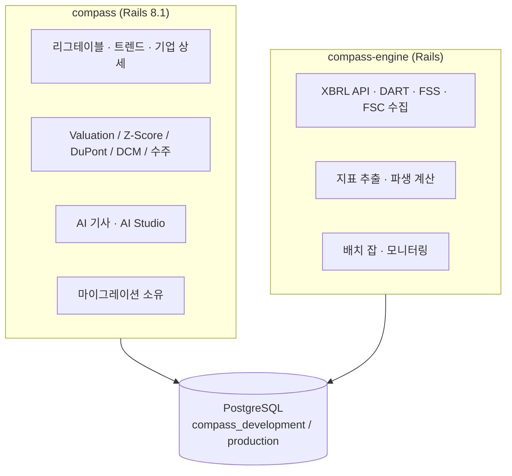
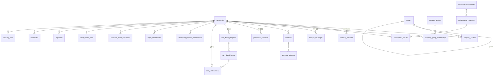
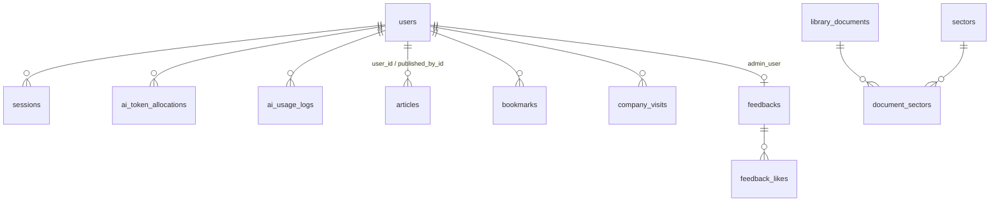
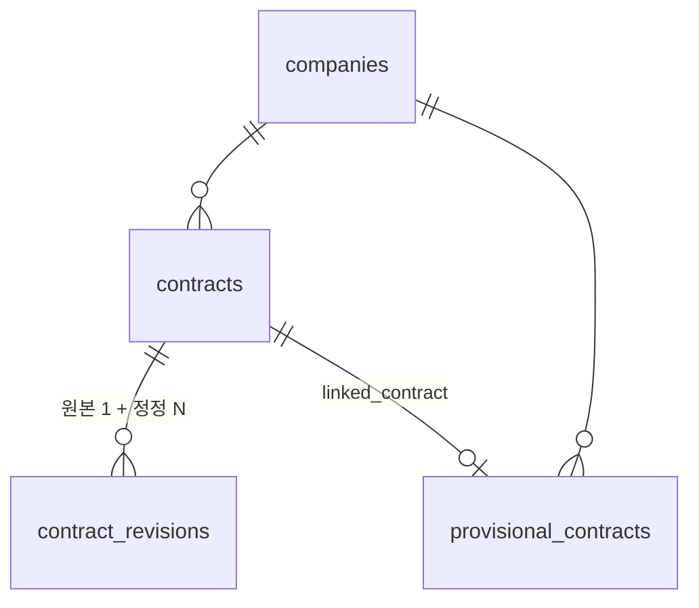

# Compass 데이터베이스 스키마

Compass 데이터베이스의 테이블 구조·컬럼 명세·쿼리 패턴 레퍼런스.
설계 의도와 배경은 [database-design.md](./database-design.md) 참고.

> **권위 있는 출처**: `compass/db/schema.rb` (현재 버전 `2026_07_08_090000`).
> 본 문서는 그 위에 의미·제약·주의사항을 얹은 해설서다. 둘이 다르면 `schema.rb`가 맞다.

---

## 목차

**Part 1. 구조 이해**
- [1. 프로젝트 아키텍처](#1-프로젝트-아키텍처)
- [2. 테이블 인벤토리](#2-테이블-인벤토리)

**Part 2. 도메인별 명세**
- [3. Core — 기업·분류](#3-core--기업분류)
- [4. 기업집단](#4-기업집단)
- [5. Performance — 지표](#5-performance--지표)
- [6. Analysis Coverage](#6-analysis-coverage)
- [7. Contracts — 수주·계약](#7-contracts--수주계약)
- [8. DCM — 채권시장](#8-dcm--채권시장)
- [9. Retirement Pension — 퇴직연금](#9-retirement-pension--퇴직연금)
- [10. Company Data — 기업 부가정보](#10-company-data--기업-부가정보)
- [11. Library — 참고문서](#11-library--참고문서)
- [12. Articles — AI 기사](#12-articles--ai-기사)
- [13. Auth & AI](#13-auth--ai)
- [14. Personalization & Feedback](#14-personalization--feedback)
- [15. Ops — 운영](#15-ops--운영)

**Part 3. 레퍼런스**
- [16. Rails 모델 구조](#16-rails-모델-구조)
- [17. 쿼리 패턴](#17-쿼리-패턴)

**Part 4. 가이드**
- [18. 시드 & 데이터 마이그레이션](#18-시드--데이터-마이그레이션)
- [19. 확장 가이드](#19-확장-가이드)
- [20. 주의사항](#20-주의사항)

**부록**
- [부록 A. 삭제 정책 전체 맵](#부록-a-삭제-정책-전체-맵)
- [부록 B. 데이터 현황](#부록-b-데이터-현황)

> 이하 모든 테이블은 `id BIGSERIAL PRIMARY KEY`와 `created_at` / `updated_at`을 공통으로 가진다
> (예외는 명시). 컬럼 표에서는 생략한다.

---

# Part 1. 구조 이해

## 1. 프로젝트 아키텍처

### 1.1 멀티 프로젝트 구조


```mermaid
flowchart TB
    DB[(PostgreSQL<br/>compass_development / production)]
    subgraph compass["compass (Rails 8.1)"]
        c1[리그테이블 · 트렌드 · 기업 상세]
        c2[Valuation / Z-Score / DuPont / DCM / 수주]
        c3[AI 기사 · AI Studio]
        c4[마이그레이션 소유]
    end
    subgraph engine["compass-engine (Rails)"]
        e1[XBRL API · DART · FSS · FSC 수집]
        e2[지표 추출 · 파생 계산]
        e3[배치 잡 · 모니터링]
    end
    compass --> DB
    engine --> DB
```

**핵심 규칙**

| 규칙 | 내용 |
|------|------|
| 마이그레이션 소유 | **compass에서만** 생성·관리. engine은 참조만 |
| 단일 writer | 테이블마다 주 쓰기 주체를 하나로 유지 |
| 스키마 변경 시 | engine이 쓰는 테이블이면 engine 코드도 함께 확인 |

### 1.2 테이블별 쓰기 소유권

| 쓰기 주체 | 테이블 | 데이터 출처 |
|-----------|--------|------------|
| **compass-engine** | `companies` | DART 기업개황 API |
| | `performance_values` | XBRL API / DART XML / Factbook / FSS / CREFIA / FSC |
| | `retirement_pension_performances` | 금융감독원 통합연금포털 |
| | `dcm_bond_programs`, `dcm_bond_issues`, `dcm_underwritings` | DART 증권신고서 |
| | `major_shareholders` | DART 최대주주 API |
| | `latest_market_caps` | FSC 시세 API (일일 배치) |
| | `company_groups`, `company_group_memberships` | 공정거래위원회 |
| | `ingestions` | 자체 수집 이력 |
| **compass** | `performance_categories`, `performance_indicators` | 시드 |
| | `sectors`, `company_sectors`, `company_relations` | 시드 + WICS 매핑 (engine도 갱신 가능) |
| | `contracts`, `contract_revisions`, `provisional_contracts` | `scripts/data_migrations/` 적재 |
| | `business_report_summaries` | `lib/tasks/business_reports.rake` |
| | `library_documents`, `document_sectors` | 관리자 업로드 |
| | `articles` | AI 기사 생성 |
| | `users`, `sessions`, `ai_token_allocations`, `ai_usage_logs` | 인증·AI 사용 추적 |
| | `bookmarks`, `company_visits` | 사용자 액션 |
| | `feedbacks`, `feedback_likes` | 사용자 피드백 |
| | `data_migrations` | 데이터 마이그레이션 러너 |
| **양쪽** | `analysis_coverages` | 각 도메인 파이프라인이 자기 테마 행을 기록 |

> ⚠️ `compass-engine/db/schema.rb`는 stale하다 (`2026_05_14_100000`). 구 테이블명
> `think_tank_reports` / `report_sectors`가 남아 있다. engine 쪽 스키마를 신뢰하지 말 것.

---

## 2. 테이블 인벤토리

**총 33개 테이블 / 14개 도메인.**

| 도메인 | 테이블 | 개수 |
|--------|--------|------|
| [Core](#3-core--기업분류) | `companies`, `sectors`, `company_sectors`, `company_relations` | 4 |
| [기업집단](#4-기업집단) | `company_groups`, `company_group_memberships` | 2 |
| [Performance](#5-performance--지표) | `performance_categories`, `performance_indicators`, `performance_values` | 3 |
| [Coverage](#6-analysis-coverage) | `analysis_coverages` | 1 |
| [Contracts](#7-contracts--수주계약) | `contracts`, `contract_revisions`, `provisional_contracts` | 3 |
| [DCM](#8-dcm--채권시장) | `dcm_bond_programs`, `dcm_bond_issues`, `dcm_underwritings` | 3 |
| [Retirement Pension](#9-retirement-pension--퇴직연금) | `retirement_pension_performances` | 1 |
| [Company Data](#10-company-data--기업-부가정보) | `major_shareholders`, `business_report_summaries`, `latest_market_caps` | 3 |
| [Library](#11-library--참고문서) | `library_documents`, `document_sectors` | 2 |
| [Articles](#12-articles--ai-기사) | `articles` | 1 |
| [Auth & AI](#13-auth--ai) | `users`, `sessions`, `ai_token_allocations`, `ai_usage_logs` | 4 |
| [Personalization](#14-personalization--feedback) | `bookmarks`, `company_visits` | 2 |
| [Feedback](#14-personalization--feedback) | `feedbacks`, `feedback_likes` | 2 |
| [Ops](#15-ops--운영) | `ingestions`, `data_migrations` | 2 |

### 2.1 전체 ERD (companies 중심)


```mermaid
erDiagram
    companies ||--o{ company_sectors : ""
    sectors   ||--o{ company_sectors : ""
    sectors   ||--o| sectors : "parent"
    companies ||--o{ company_relations : "parent/child"
    companies ||--o{ company_group_memberships : ""
    company_groups ||--o{ company_group_memberships : ""
    companies ||--o{ performance_values : ""
    performance_categories ||--o{ performance_indicators : ""
    performance_indicators ||--o{ performance_values : ""
    companies ||--o{ analysis_coverages : "FK 없음"
    companies ||--o{ contracts : ""
    contracts ||--o{ contract_revisions : ""
    companies ||--o{ provisional_contracts : "FK 없음"
    companies ||--o{ dcm_bond_programs : "발행사"
    dcm_bond_programs ||--o{ dcm_bond_issues : ""
    dcm_bond_issues ||--o{ dcm_underwritings : ""
    companies ||--o{ dcm_underwritings : "인수사"
    companies ||--o{ retirement_pension_performances : ""
    companies ||--o{ major_shareholders : ""
    companies ||--o{ business_report_summaries : ""
    companies ||--o| latest_market_caps : ""
    companies ||--o{ ingestions : ""
    companies ||--o{ bookmarks : ""
    companies ||--o{ company_visits : ""
```

### 2.2 사용자 계열 ERD


```mermaid
erDiagram
    users ||--o{ sessions : ""
    users ||--o{ ai_token_allocations : ""
    users ||--o{ ai_usage_logs : ""
    users ||--o{ articles : "user_id / published_by_id"
    users ||--o{ bookmarks : ""
    users ||--o{ company_visits : ""
    users ||--o| feedbacks : "admin_user"
    feedbacks ||--o{ feedback_likes : ""
    library_documents ||--o{ document_sectors : ""
    sectors ||--o{ document_sectors : ""
```

---

# Part 2. 도메인별 명세

## 3. Core — 기업·분류

시스템의 중심. `companies`가 거의 모든 도메인의 허브다.

### 3.1 companies

기업 마스터. `dart_code`가 사실상 자연키다.

| 컬럼 | 타입 | 설명 |
|------|------|------|
| `dart_code` | varchar(8) NOT NULL | DART 고유번호. **UNIQUE, 자연키** |
| `name` | varchar NOT NULL | 기업명 (통용명) |
| `legal_name` | varchar | 법인 정식명 |
| `english_name` | varchar | 영문명 |
| `stock_code` | varchar(6) | 종목코드 (상장사만) |
| `corporate_number` | varchar(13) | 법인등록번호 |
| `business_number` | varchar(10) | 사업자등록번호 |
| `industry_code` | varchar(5) | DART 업종코드 |
| `market_type` | varchar | `kospi` / `kosdaq` / `konex` / `unlisted` (소문자) |
| `representative_name` | varchar | 대표자명 |
| `fiscal_month` | integer | 결산월 (12 = 12월 결산). 1–12 검증 |
| `listed_shares` | bigint | 상장주식수 — 시가총액 산출용 |
| `stock_price` | decimal(12,2) | 주가 |
| `stock_price_date` | date | 주가 기준일 |
| `established_on` | date | 설립일 |
| `address` / `phone` / `fax` | text / varchar | 연락처 |
| `website_url` / `ir_url` | text | 홈페이지 / IR |
| `views_count` | integer NOT NULL (0) | 기업 상세 조회수 |

**인덱스**: `dart_code`(UNIQUE), `stock_code`, `market_type`, `industry_code`

**검증**: `dart_code` 8자 필수·유일 / `stock_code` 6자 / `market_type` inclusion /
`fiscal_month` 1–12 / **동일 depth에 official 섹터 1개만** (`one_official_sector_per_depth`)

### 3.2 sectors

공식 분류와 테마 분류를 `kind`로 구분해 한 테이블에서 관리. self-reference로 계층 표현.

| 컬럼 | 타입 | 설명 |
|------|------|------|
| `code` | varchar NOT NULL | 분류 코드. **UNIQUE** |
| `name` | varchar NOT NULL | 분류명 |
| `kind` | varchar (`official`) | `official`(공식) / `theme`(테마) — string enum |
| `depth` | integer NOT NULL | 계층 깊이 (1–3) |
| `parent_id` | bigint | 상위 분류 (self-ref, ON DELETE CASCADE) |

**인덱스**: `code`(UNIQUE), `kind`, `(kind, depth)`, `parent_id`

**핵심 메서드**: `Sector#self_and_descendant_ids` — 자신 + 자식 + 손자 ID를 최대 2쿼리로 반환
(depth 3 전제). 섹터 트리 하위 기업 조회에 사용.

### 3.3 company_sectors

기업 ↔ 분류 다대다 조인.

| 컬럼 | 타입 | 설명 |
|------|------|------|
| `company_id` | bigint NOT NULL | ON DELETE CASCADE |
| `sector_id` | bigint NOT NULL | ON DELETE CASCADE |
| `display_order` | integer (0) | 표시 순서 |

**UNIQUE**: `(company_id, sector_id)`

### 3.4 company_relations

법인 간 지분관계. 방향성 있는 엣지.

| 컬럼 | 타입 | 설명 |
|------|------|------|
| `parent_company_id` | bigint NOT NULL | 모회사 (ON DELETE CASCADE) |
| `child_company_id` | bigint NOT NULL | 자회사 (ON DELETE CASCADE) |
| `relation_type` | varchar NOT NULL | `subsidiary` / `affiliate` / `associate` / `parent` |
| `ownership_percentage` | decimal(5,2) | 지분율 0.00–100.00 |
| `effective_from` | date | 유효 시작일 |
| `effective_to` | date | 유효 종료일 (**NULL = 현재 유효**) |
| `metadata` | jsonb | `cross_holding` 등 |

**UNIQUE**: `(parent_company_id, child_company_id, effective_from)`
**인덱스**: `parent_company_id`, `child_company_id`, `(child_company_id, effective_from, effective_to)`, `relation_type`

**모델 검증**
- 자기 자신과의 관계 불가 (`parent_company_id == child_company_id`)
- **역방향 관계는 허용** — 순환출자·상호출자 표현을 위해 의도적으로 열어둠
- `effective_from ≤ effective_to`

**주요 스코프**: `active`(effective_to IS NULL OR ≥ 오늘), `as_of(date)`, `for_parent`, `for_child`

---

## 4. 기업집단

공정거래위원회 지정 기업집단. **법인이 아닌 그룹 단위 엔티티**로, `company_relations`(지분관계)와
별개의 축이다.

### 4.1 company_groups

| 컬럼 | 타입 | 설명 |
|------|------|------|
| `name` | varchar NOT NULL | 그룹명 (예: "지에스", "사조"). **UNIQUE** |
| `designated` | boolean NOT NULL (true) | 공정위 지정 여부 |
| `designated_year` | integer | 지정 연도 |
| `dominant_person` | varchar | 동일인 |
| `total_assets` | bigint | 자산총액 |
| `metadata` | jsonb NOT NULL | |

**인덱스**: `name`(UNIQUE), `designated`, `designated_year`

### 4.2 company_group_memberships

| 컬럼 | 타입 | 설명 |
|------|------|------|
| `company_group_id` | bigint NOT NULL | |
| `company_id` | bigint NOT NULL | |
| `affiliated_on` | date | 계열편입일 |
| `removed_on` | date | 계열제외일 (**NULL = 현재 소속**) |
| `metadata` | jsonb NOT NULL | |

**UNIQUE**: `idx_cg_membership_unique (company_group_id, company_id, affiliated_on)`
→ 편입–제외–재편입 이력이 별도 행으로 보존된다.
**부분 인덱스**: `idx_cg_membership_active` on `company_group_id` WHERE `removed_on IS NULL`

---

## 5. Performance — 지표

경영성과뿐 아니라 **밸류에이션·Z-Score·DuPont의 입력 재료**까지 담는 시스템의 최대 테이블군.

### 5.1 performance_categories

| 컬럼 | 타입 | 설명 |
|------|------|------|
| `code` | varchar NOT NULL | **UNIQUE** |
| `name` | varchar NOT NULL | 카테고리명 |
| `description` | text | |
| `display_order` | integer (0) | UI 표시 순서 |
| `metadata` | jsonb | |

**현재 8개**

| display_order | code | name |
|---|---|---|
| 1 | `growth` | 성장성 |
| 2 | `profitability` | 수익성 |
| 3 | `soundness` | 건전성 |
| 4 | `capital` | 자본적정성 |
| 5 | `productivity` | 생산성 |
| 6 | `market_value` | 시장가치 |
| 7 | `cash_flow` | 현금흐름 |
| 8 | `valuation` | 밸류에이션 |

### 5.2 performance_indicators

| 컬럼 | 타입 | 설명 |
|------|------|------|
| `category_id` | bigint NOT NULL | FK → categories (**ON DELETE RESTRICT**) |
| `code` | varchar NOT NULL | 지표 코드. **UNIQUE** |
| `name` | varchar NOT NULL | 지표명 |
| `unit` | varchar | 표시 단위 (`조원`, `억원`, `%`, `배`, `bp` …) |
| `common` | boolean (false) | 전 업종 공통 지표 여부 |
| `applicable_to` | varchar[] | 적용 업종 배열 (`{holding,bank}`, `{general}` …). **GIN 인덱스** |
| `supported_period_types` | varchar[] NOT NULL | 지원 기간 유형 (`{q,ytd}` …) |
| `formula` | text | 산출 공식 |
| `hierarchy` | jsonb | 계층 구조 (`path`, `depth`) — `breadcrumb` 산출용 |
| `metadata` | jsonb | |

**인덱스**: `code`(UNIQUE), `category_id`, `common`, `applicable_to`(GIN)

**단위 변환** (`Performance::Indicator`)

값은 **항상 원 단위로 저장**한다. `UNIT_SCALES`가 표시 단위 ↔ 원 단위 배율을 정의한다.

| unit | 배율 | | unit | 배율 |
|------|------|---|------|------|
| 조원 | 1e12 | | 백만원 | 1e6 |
| 십억원 | 1e9 | | 만원 | 1e4 |
| 억원 | 1e8 | | 천원 / 원 | 1e3 / 1 |

`RATIO_UNITS = %w[% bp 배]`는 변환 대상이 아니다 (`#ratio_unit?` → `scale` 이 nil).
저장 시 `#to_won(v)`, 표시 시 `#from_won(v)` 사용.

### 5.3 performance_values

| 컬럼 | 타입 | 설명 |
|------|------|------|
| `company_id` | bigint NOT NULL | ON DELETE CASCADE |
| `indicator_id` | bigint NOT NULL | ON DELETE CASCADE |
| `year` | integer NOT NULL | 연도 |
| `quarter` | integer | 분기 1–4 (**NULL = 연간**) |
| `value` | decimal(20,4) | 수치 값 (원 단위) |
| `value_text` | varchar | 텍스트 값 |
| `basis` | varchar(15) NOT NULL (`consolidated`) | `consolidated` / `separate` |
| `period_type` | varchar(10) | `q` / `ytd` / `pit` / `ttm` / `annualized` |
| `calculated` | boolean (false) | 파생 계산값 여부 |
| `source_cell` | varchar(10) | 원본 셀 위치 (Factbook 등) |
| `source_sheet` | varchar(50) | 원본 시트명 |
| `metadata` | jsonb | 추출 근거 |

**UNIQUE**: `index_perf_values_unique (company_id, indicator_id, year, quarter, period_type, basis)`

**인덱스**

| 인덱스 | 용도 |
|--------|------|
| `(company_id, year, quarter)` | 기업 상세 — 특정 기업의 한 분기 전체 지표 |
| `idx_perf_values_indicator_basis_period (indicator_id, basis, year, quarter)` | 리그테이블 — 한 지표를 전 기업 횡단 |
| `(indicator_id, year)` | 지표별 연도 조회 |
| `company_id`, `indicator_id`, `basis`, `period_type` | 단일 컬럼 보조 |

**`period_type` 상세** (`Performance::Value::PERIOD_TYPES`)

| 값 | 상수 키 | 의미 | 비고 |
|----|--------|------|------|
| `q` | `quarterly` | 해당 분기 단독 | |
| `ytd` | `ytd` | 연초 누적 | **리그테이블 기본값** |
| `pit` | `point_in_time` | 시점 잔액 | 자산·자본·시가총액 |
| `ttm` | `ttm` | 직전 12개월 | 밸류에이션 배수 |
| `annualized` | `annualized` | YTD ÷ 경과분기 × 4 | **현재 실데이터 0건** |

**`metadata` (JSONB) 활용**

| 키 | 내용 |
|----|------|
| `source` | 추출 소스 (`dart`, `xbrl_api`, `factbook`, `calculated` …) |
| `components` | 합산 근거 (CAPEX fallback 등, 배열) |
| `source_type` | 파생 지표의 계산 방식 |

**검증**: `value` 또는 `value_text` 중 최소 하나 필수 (`value_or_value_text_present`)

---

## 6. Analysis Coverage

"이 회사에 이 분석 탭을 노출할까"를 판정하는 역정규화 테이블. **행 존재 = 그 테마 보유.**

### 6.1 analysis_coverages

| 컬럼 | 타입 | 설명 |
|------|------|------|
| `company_id` | bigint NOT NULL | **DB 외래키 없음** |
| `theme` | varchar NOT NULL | 분석 테마 |
| `metadata` | jsonb | |

**UNIQUE**: `(theme, company_id)` / **인덱스**: `(company_id, theme)`

**`AnalysisCoverage::THEMES`**: `valuation`, `performance`, `dcm`, `zscore`, `dupont`, `pension`, `contracts`

**API**

```ruby
AnalysisCoverage.mark(company_id, :valuation)            # 멱등 등록 (파이프라인이 호출)
AnalysisCoverage.themes_for(company_id)                  # => ["valuation", "zscore", ...]
AnalysisCoverage.company_ids_for(:dcm, restrict_to: ids) # 테마 보유 기업 집합
AnalysisCoverage.covered?(company_id, :pension)          # 단건 판정
```

**재동기화**

```bash
bin/rails coverage:resync           # DRY RUN — 차이만 보고
bin/rails coverage:resync APPLY=1   # 실제 mark
```

`AnalysisCoverageResync` 서비스가 7개 테마 멤버십을 원천에서 재계산한다.
**정책은 ADDITIVE(추가만)** — 커버리지는 있는데 현재 원천으로 재현되지 않는 stale 행은
*보고만 하고 자동 삭제하지 않는다* (두산밥캣 USD 특수처리처럼 재현 불가하지만 정당한
보유 케이스를 보존하기 위함). stale 정리는 검토 후 수동으로 한다.

> ⚠️ 역정규화 캐시다. **UI 게이팅 전용** — 실제 값은 항상 원본 테이블에서 조회할 것.

---

## 7. Contracts — 수주·계약

DART 단일판매·공급계약 공시 기반. 1차 적재는 건설 21개사(2021-01 ~ 2026-05)이며
compass-engine 추출 확장으로 다른 업종이 같은 테이블에 합류한다.


```mermaid
erDiagram
    companies ||--o{ contracts : ""
    contracts ||--o{ contract_revisions : "원본 1 + 정정 N"
    companies ||--o{ provisional_contracts : ""
    contracts ||--o| provisional_contracts : "linked_contract"
```

### 7.1 contracts

하나의 **계약 사건**. 집계 단위.

| 컬럼 | 타입 | 설명 |
|------|------|------|
| `company_id` | bigint NOT NULL | 공시 주체 |
| `kind` | varchar NOT NULL | `filing`(체결) / `termination`(해지) — string enum |
| `name` | varchar NOT NULL | 계약명 |
| `filed_on` | date NOT NULL | 신고일 |
| `original_filed_on` | date | 최초 신고일 (정정 동기화) |
| `signed_on` / `start_on` / `end_on` | date | 체결일 / 시작 / 종료 |
| `duration_months` | integer | 계약 기간(월) |
| `amount` | decimal(18) | 현재 유효 계약금액 |
| `confirmed_amount` | decimal(18) | 확정 금액 |
| `conditional` / `conditional_amount` | boolean / decimal(18) | 조건부 계약 |
| `sales_ratio` | decimal(8,2) | 최근 매출 대비 비중(%) |
| `recent_revenue` | decimal(20) | 최근 매출액 |
| `counterparty` | varchar | 계약 상대 |
| `counterparty_kind` | varchar | 상대 유형 |
| `counterparty_relation` | varchar | 특수관계 여부 |
| `counterparty_business` | text | 상대 주요사업 |
| `counterparty_revenue` | decimal(20) | 상대 매출액 |
| `contract_type` | varchar | 계약 유형 |
| `overseas` | boolean NOT NULL (false) | 해외 여부 |
| `region` / `province` | text / varchar | 지역 |
| `supply_method` / `payment_terms` | text | 공급·대금 조건 |
| `advance_payment` | boolean | 선급금 |
| `large_corp` | boolean (false) | 대기업 여부 |
| `track_record` | boolean (false) | 실적 인정 |
| `voluntary` | boolean (false) | 자율공시 |
| `revision_count` | integer (0) | 정정 횟수 (**콜백 자동 동기화**) |
| `revision_events` | jsonb (`[]`) | 정정 이벤트 원본 |
| `revision_flags` | jsonb (`{}`) | 정정 플래그. **GIN 인덱스** |
| `revision_history` | text | 정정 이력 원문 |
| `reservation_deadline` / `reservation_reason` | varchar / text | 유보 관련 |
| `termination_reason` | text | 해지 사유 |
| `related_disclosures` | text | 관련 공시 (잠정 연결 ground truth) |
| `rcept_no` | varchar | DART 접수번호 |
| `report_name` | varchar | 보고서명 |
| `notes` | text | |
| `metadata` | jsonb | **GIN 인덱스** |
| `synced_at` | datetime | 동기화 시각 |

**인덱스**: `(company_id, filed_on)`, `(kind, filed_on)`, `filed_on`, `signed_on`,
`original_filed_on`, `kind`, `contract_type`, `counterparty_kind`, `overseas`, `rcept_no`,
`metadata`(GIN), `revision_flags`(GIN)

**주요 메서드**

```ruby
contract.original_amount      # 최초 신고 금액 (정정 전)
contract.amount_drift_pct     # 최초 대비 변동률(%)
contract.amount_revisions     # 금액이 바뀐 정정 이벤트만
contract.category             # 계약명 키워드 기반 사업 유형 (ContractCategory.classify)
contract.in_progress?         # 체결 + 종료일 미래
contract.dart_url             # DART 원문 링크
```

**기간 스코프**: `PeriodScopable` 포함 → `yearly(y)` / `quarterly(y,q)` / `monthly(y,m)`
(기준 컬럼은 `filed_on`)

### 7.2 contract_revisions

정정 이력의 **단일 진실원천**. 원본 1건 + 정정 N건.

| 컬럼 | 타입 | 설명 |
|------|------|------|
| `contract_id` | bigint NOT NULL | |
| `sequence_no` | integer NOT NULL | 1 = 원본, 2~ = 정정 |
| `is_revision` | boolean NOT NULL (false) | 정정 여부 |
| `rcept_no` | varchar NOT NULL | 개별 공시 접수번호 |
| `filed_on` | date NOT NULL | 해당 공시 신고일 |
| `amount` | decimal(18) | 그 시점 계약금액 |
| `sales_ratio` | decimal(8,2) | 그 시점 매출 비중 |
| `name` | text | 그 시점 계약명 |
| `counterparty` | varchar | 그 시점 계약 상대 |
| `start_on` / `end_on` | date | 그 시점 기간 |
| `revision_reason` | text | 정정 사유 |

**UNIQUE**: `(contract_id, sequence_no)` / **인덱스**: `contract_id`, `filed_on`, `rcept_no`

> `after_save` / `after_destroy` 콜백이 부모 `contracts.revision_count`와 `original_filed_on`을
> 동기화한다. **`insert_all` / `delete_all` 등 콜백 우회 경로에서는 별도 재산출이 필요하다.**

### 7.3 provisional_contracts

본계약 전 "투자판단 관련 주요경영사항" = 잠정 수주.

| 컬럼 | 타입 | 설명 |
|------|------|------|
| `company_id` | bigint NOT NULL | **DB 외래키 없음** |
| `rcept_no` | varchar NOT NULL | DART 접수번호 |
| `filed_on` | date NOT NULL | 신고일 |
| `title` | varchar NOT NULL | 프로젝트명 |
| `stage` | varchar NOT NULL | 진행 단계 |
| `link_status` | varchar NOT NULL | 아래 3종 |
| `linked_contract_id` | bigint | 확정 계약 (**FK 없음**) |
| `project_key` | varchar | 프로젝트 매칭 키 |
| `amount` | decimal(18) | 잠정 금액 |
| `currency` | varchar NOT NULL (`KRW`) | 통화 |
| `consortium_share` | decimal(5,2) | 컨소시엄 지분율 |
| `orderer` | varchar | 발주처 |
| `period` | varchar | 기간(원문) |
| `confirm_date` | date | 확정일 |
| `sales_ratio` / `recent_revenue` | decimal | 매출 비중 / 최근 매출 |
| `metadata` | jsonb | |

**UNIQUE**: `(company_id, rcept_no)` / **인덱스**: `filed_on`, `link_status`, `linked_contract_id`

**`link_status`**

| 값 | 의미 |
|----|------|
| `확정연결(링크)` | 단일판매 공시의 ※관련공시 링크로 매칭 |
| `확정연결(명칭)` | 프로젝트명으로 매칭 (링크 누락 보완) |
| `잠정단독` | 본계약 미공시 (진행중 또는 무산) |

> **이중 집계 주의**: 확정연결 건은 이미 `contracts`에 존재한다. 신규 표시 대상은
> `provisional_only` 스코프(`잠정단독`)뿐이다.

---

## 8. DCM — 채권시장

```
companies → dcm_bond_programs → dcm_bond_issues → dcm_underwritings ← companies
   (발행사)                          (트랜치)          (인수)         (증권사)
```

### 8.1 dcm_bond_programs

발행 프로그램 (MTN 등록, 일괄신고 등).

| 컬럼 | 타입 | 설명 |
|------|------|------|
| `company_id` | bigint NOT NULL | 발행사 |
| `established_on` | date | 프로그램 설정일 |
| `total_limit_amount` | decimal(20) | 총 한도 금액 |

### 8.2 dcm_bond_issues

개별 트랜치(회차별 발행).

| 컬럼 | 타입 | 설명 |
|------|------|------|
| `bond_program_id` | bigint NOT NULL | |
| `issue_number` | varchar NOT NULL | 회차 |
| `bond_type` | varchar | `corporate`(일반) / `subordinated`(후순위) / `hybrid`(신종자본) |
| `issue_date` / `maturity_date` / `filing_date` | date | 발행 / 만기 / 신고 |
| `issue_amount` | decimal(20) | 발행금액 |
| `issue_limit` | decimal(20) | 발행한도 |
| `coupon_rate` | decimal(6,4) | 표면금리 |
| `determined_rate` | decimal(6,4) | 확정금리 |
| `determined_rate_expression` | varchar | 확정금리 산식 원문 (예: "국고3년 + 0.5%p") |
| `final_rate` | decimal(6,4) | 최종금리 |
| `rate_band` | varchar | 희망금리 밴드 |
| `rating` | varchar | 신용등급 |
| `demand_amount` | decimal(20) | 수요예측 참여금액 |
| `subscription_amount` | decimal(20) | 청약금액 |
| `competition_rate` | decimal(8,2) | 경쟁률 |
| `target_investors` | varchar | 대상 투자자 |
| `underwriting_method` | varchar | 인수 방식 |
| `guaranteed` | boolean (false) | 보증 여부 |
| `bond_certificate_issued` | boolean (false) | 실물 발행 여부 |
| `pension_participated` | boolean | 연기금 참여 |
| `conglomerate` | varchar | 소속 그룹 |
| `issuance_cost_total` | decimal(20) | 발행 제비용 |
| `issuance_cost_breakdown` | jsonb | 비용 내역 |
| `fund_use` | jsonb | 자금 사용 목적 |
| `regulatory_impact` | jsonb | 규제 영향 |
| `notes` | text | |

**인덱스**: `bond_program_id`, `bond_type`, `issue_date`, `filing_date`, `rating`, `issue_number`

**기간 스코프**: `PeriodScopable` — 기준 컬럼 `issue_date`. 신고일 기준은 `filed_in_period`.

### 8.3 dcm_underwritings

주관사별 인수 계약. 공동주관 지원.

| 컬럼 | 타입 | 설명 |
|------|------|------|
| `bond_issue_id` | bigint NOT NULL | |
| `company_id` | bigint NOT NULL | 인수사(증권사) |
| `role` | varchar NOT NULL | `lead` / `co_lead` / `co_manager` / `syndicate` |
| `amount` | decimal(20) | 인수금액 |
| `lead_credit` | decimal(20) | **대표주관 실적 크레딧** (리그테이블 집계 기준) |
| `fee_rate` | decimal(6,4) | 수수료율 |
| `fee_amount` | decimal(20) | 수수료 금액 |
| `task` | varchar | 업무 내용 |

**UNIQUE**: `(bond_issue_id, company_id)` / **인덱스**: `bond_issue_id`, `company_id`, `role`

**기간 스코프**: `bond_issue.issue_date` 조인 기준

---

## 9. Retirement Pension — 퇴직연금

### 9.1 retirement_pension_performances

| 컬럼 | 타입 | 설명 |
|------|------|------|
| `company_id` | bigint NOT NULL | 사업자 |
| `year` / `quarter` | integer NOT NULL | 기준 분기 |
| `product_type` | **integer** NOT NULL (0) | 상품 유형 — 아래 참고 |
| `provider_type` | varchar | `bank` / `securities` / `life_insurance` / `general_insurance` |
| `db_reserve` / `dc_reserve` / `irp_reserve` | decimal(15,2) | 유형별 적립금 |
| `db_return_{1y,3y,5y,7y,10y}` | decimal(8,4) | DB형 기간별 수익률 |
| `dc_return_{1y,3y,5y,7y,10y}` | decimal(8,4) | DC형 |
| `irp_return_{1y,3y,5y,7y,10y}` | decimal(8,4) | IRP형 |
| `synced_at` | datetime | 동기화 시각 |

**UNIQUE**: `idx_rpp_company_period_product_type (company_id, year, quarter, product_type)`
**인덱스**: `company_id`, `provider_type`, `(year, quarter)`

**`product_type` — 시스템 내 유일한 integer enum**

| 값 | 키 | 설명 |
|----|----|------|
| 0 | `guaranteed` | 원리금보장 — 2025Q2 이전 통합값, 2025Q3~ deposit+market 합산 |
| 1 | `guaranteed_deposit` | 예금성 원리금보장 (2025Q3~ 신규) |
| 2 | `guaranteed_market` | 시장성 원리금보장 (2025Q3~ 신규) |
| 3 | `non_guaranteed` | 원리금비보장 |

> **스키마 변경 이력**: 2025Q3부터 금융감독원이 원리금보장을 예금성/시장성으로 분리 공시.
> `guaranteed`(0)는 과거 데이터 및 시계열 비교용으로 유지된다.
> 시계열 비교 시 `comparable_guaranteed` 스코프(=0)를, 전체 합산 시 `all_guaranteed`(0,1,2)를 사용.

**상수**: `PLAN_TYPES = %w[db dc irp]`, `RETURN_PERIODS = %w[1y 3y 5y 7y 10y]`

---

## 10. Company Data — 기업 부가정보

### 10.1 major_shareholders

DART 최대주주 현황. 현재 약 25만 행.

| 컬럼 | 타입 | 설명 |
|------|------|------|
| `company_id` | bigint NOT NULL | |
| `year` / `quarter` | integer NOT NULL | 기준 분기 |
| `nm` | varchar NOT NULL | 주주명 |
| `relate` | varchar | 관계 |
| `stock_knd` | varchar | 주식 종류 (보통주/우선주) |
| `ownership_pct` | decimal(8,4) | 지분율 |
| `is_summary` | boolean (false) | 합계 행 여부 |

**UNIQUE**: `idx_major_shareholders_unique (company_id, year, quarter, nm, stock_knd)`
**인덱스**: `company_id`, `(company_id, year, quarter)`

> 합계 행과 개별 행이 한 테이블에 섞여 있다. 집계 시 `summary_rows` / `individual_rows`
> 스코프로 반드시 구분할 것.

### 10.2 business_report_summaries

사업보고서 본문 AI 요약.

| 컬럼 | 타입 | 설명 |
|------|------|------|
| `company_id` | bigint NOT NULL | ON DELETE CASCADE |
| `fiscal_year` | integer NOT NULL | 회계연도 |
| `quarter` | integer NOT NULL (4) | 분기 (사업보고서는 4) |
| `rcept_no` | varchar NOT NULL | DART 접수번호 |
| `summary` | text NOT NULL | AI 요약 본문 |
| `raw_text` | text | 원문 |
| `raw_text_chars` | integer | 원문 길이 |
| `metadata` | jsonb NOT NULL | |

**UNIQUE**: `idx_brs_company_fiscal_year_quarter (company_id, fiscal_year, quarter)`

### 10.3 latest_market_caps

**회사당 1행** 최신 시가총액. compass-engine `DualListing::DailyRefreshJob`이 매일 갱신.

| 컬럼 | 타입 | 설명 |
|------|------|------|
| `company_id` | bigint NOT NULL | **UNIQUE** |
| `market_cap` | bigint NOT NULL | 시가총액 |
| `as_of_date` | date NOT NULL | 기준일 |
| `source` | varchar NOT NULL (`fsc_api`) | 출처 |

> 시계열 시가총액은 이 테이블이 아니라 `performance_values`의 `nf_market_cap`
> (분기별 `pit`)을 사용한다.

---

## 11. Library — 참고문서

### 11.1 library_documents

싱크탱크 보고서 등 다운로드 가능한 참고 문서. (구 `think_tank_reports`)

| 컬럼 | 타입 | 설명 |
|------|------|------|
| `title` | varchar NOT NULL | 문서 제목 |
| `slug` | varchar NOT NULL | **UNIQUE** |
| `doc_type` | varchar NOT NULL (`think_tank`) | 현재 `think_tank` 단일 |
| `sector` | varchar | 사용자 지정 섹터 (예: "배터리") |
| `source` | varchar | 발행 기관 |
| `source_url` | varchar | 원문 URL |
| `published_on` | date | 발행일 |
| `summary` | text | 요약 |
| `keywords` | jsonb NOT NULL (`[]`) | 유사 키워드 (예: "2차 전지") |
| `file_path` | varchar NOT NULL | **UNIQUE** |
| `file_format` | varchar NOT NULL | `pdf` / `docx` |
| `file_size` | integer | |
| `metadata` | jsonb NOT NULL | `keywords.companies` 등 |

**인덱스**: `slug`(UNIQUE), `doc_type`, `sector`, `source`, `published_on`

### 11.2 document_sectors

문서 ↔ 섹터 다대다. (구 `report_sectors`)

| 컬럼 | 타입 | 설명 |
|------|------|------|
| `library_document_id` | bigint NOT NULL | ON DELETE CASCADE |
| `sector_id` | bigint NOT NULL | ON DELETE CASCADE |

**UNIQUE**: `idx_report_sectors_unique (library_document_id, sector_id)`

---

## 12. Articles — AI 기사

### 12.1 articles

| 컬럼 | 타입 | 설명 |
|------|------|------|
| `user_id` | bigint NOT NULL | 생성자 |
| `article_type` | varchar NOT NULL (`league_table`) | 아래 9종 |
| `league_type` | varchar | **nullable**. 금융 4종 또는 sector code |
| `category_key` | varchar | 부문별 심층 시 카테고리 |
| `year` / `quarter` | integer NOT NULL | 대상 기간 |
| `period_type` | varchar (`q`) | 기간 유형 |
| `series_name` | varchar | 시리즈명 |
| `title` / `subtitle` | varchar | 제목 / 부제 |
| `body` | text | 본문 (마크다운) |
| `status` | varchar NOT NULL (`draft`) | `draft` / `reviewing` / `published` |
| `visibility` | varchar NOT NULL (`personal`) | `personal`(비공개) / `public`(공개) |
| `data_snapshot` | text | 생성 시점 데이터 (JSON) |
| `prompt_snapshot` | text | 생성 시점 프롬프트 |
| `metadata` | jsonb | DCM 기사의 `date_from`/`date_to` 등 |
| `published_at` | datetime | 게시일 |
| `published_by_id` | bigint | 게시자 |

**인덱스**: `idx_articles_lookup (article_type, league_type, year, quarter)`,
`(league_type, category_key)`, `status`, `visibility`, `published_at`, `user_id`, `published_by_id`

**`ARTICLE_TYPES` (9종)**

| 값 | 라벨 | 콘텐츠 계열 |
|----|------|-----------|
| `league_table` | 리그테이블 | performance |
| `category_detail` | 부문별 심층 | performance |
| `story` | 스토리 분석 | performance |
| `valuation` | 기업가치 | valuation |
| `z_score` | Z스코어 | z_score |
| `dcm` | DCM | dcm |
| `pension` | 퇴직연금 | pension |
| `comprehensive` | 종합 분석 | comprehensive |
| `market_theme` | 전 시장 관점 | market_theme |

> `PERFORMANCE_ARTICLE_TYPES`(`league_table`, `category_detail`, `story`)에 한해
> `league_type`이 **필수**다. 나머지 유형은 nullable.

**`league_type`**
- 금융 리그: `financial_holdings`(4대 금융지주), `banks`(4대 은행), `securities`, `cards`
- 비금융: `sectors.code` 값이 그대로 들어간다 → `Article#sector_league?` / `#league_label`

**`visibility`**: Rails enum `{ personal: "personal", shared: "public" }`
— **enum 키는 `shared`인데 DB 값은 `"public"`**이다. 직접 SQL 작성 시 주의.
`Article.visible_to(user)` 스코프가 공개 기사 + 본인 기사를 반환한다.

---

## 13. Auth & AI

### 13.1 users

| 컬럼 | 타입 | 설명 |
|------|------|------|
| `email_address` | varchar NOT NULL | **UNIQUE**. strip + downcase 자동 정규화 |
| `name` | varchar NOT NULL (`''`) | 이름 |
| `password_digest` | varchar NOT NULL | bcrypt (`has_secure_password`) |
| `role` | varchar (`reporter`) | `reporter` / `editor` / `admin` |
| `active` | boolean (true) | 활성 여부 |
| `must_change_password` | boolean NOT NULL (true) | 최초 로그인 시 변경 강제 |

**비밀번호 정책**: 8자 이상, 영문+숫자 필수 (`/\A(?=.*[a-zA-Z])(?=.*\d).+\z/`)

**역할별 권한**

| 역할 | 설명 | 고유 권한 |
|------|------|----------|
| `reporter` | 기자 (기본값) | 조회, AI 질의 |
| `editor` | 편집자 | + 팀 사용량 조회 |
| `admin` | 관리자 | + 사용자 관리, 팀 사용량 조회 |

### 13.2 sessions

| 컬럼 | 타입 | 설명 |
|------|------|------|
| `user_id` | bigint NOT NULL | ON DELETE CASCADE |
| `ip_address` | varchar | |
| `user_agent` | varchar | |
| `remember_me` | boolean NOT NULL (false) | 로그인 유지 |

### 13.3 ai_token_allocations

| 컬럼 | 타입 | 설명 |
|------|------|------|
| `user_id` | bigint NOT NULL | |
| `period_start` | date NOT NULL | 할당 기간 시작일 (월초) |
| `monthly_limit` | integer NOT NULL (500000) | 월 **크레딧** 한도 |
| `used_tokens` | integer NOT NULL (0) | 사용 **크레딧** (가중치 적용) |

**UNIQUE**: `(user_id, period_start)`

> **토큰이 아니라 크레딧이다.** `Ai::TokenManager::TOKEN_COST_MULTIPLIER = { "haiku" => 1, "sonnet" => 3 }`.
> 즉 Sonnet 1,000토큰 = 3,000크레딧. 실제 API 토큰 수는 `ai_usage_logs`에 별도 기록된다.

**AI 사용 조건**: `User#can_use_ai?` = `active?` AND 월 한도 미초과

### 13.4 ai_usage_logs

| 컬럼 | 타입 | 설명 |
|------|------|------|
| `user_id` | bigint NOT NULL | |
| `query_type` | varchar NOT NULL | 아래 19종 (모델 inclusion 검증) |
| `model` | varchar | `haiku` / `sonnet` |
| `input_tokens` / `output_tokens` | integer NOT NULL (0) | **실제 API 토큰 수** (가중 아님) |
| `question` | text | 질문 내용 |
| `success` | boolean NOT NULL (true) | 성공 여부 |
| `metadata` | jsonb | |

**인덱스**: `user_id`, `query_type`, `created_at`

**`QUERY_TYPES` (19종)**

```
intent_extraction  answer_generation  metric_insight  draft_generation  article_generation
category_insight   category_insight_stream   category_chat   category_chat_summary
trend_insight      trend_insight_stream      trend_chat      trend_chat_summary
integrated_insight_stream   integrated_chat  integrated_chat_summary
securities_insight_stream   securities_chat  securities_chat_summary
```

---

## 14. Personalization & Feedback

### 14.1 bookmarks

| 컬럼 | 타입 | 설명 |
|------|------|------|
| `user_id` | bigint NOT NULL | |
| `company_id` | bigint NOT NULL | |
| `note` | text | 메모 |
| `position` | integer | 정렬 순서 |

**UNIQUE**: `(user_id, company_id)`

### 14.2 company_visits

사용자별 기업 상세 방문 기록. **전체 로그가 아니라 사용자×기업당 1행 스냅샷**이다.

| 컬럼 | 타입 | 설명 |
|------|------|------|
| `user_id` | bigint NOT NULL | ON DELETE CASCADE |
| `company_id` | bigint NOT NULL | ON DELETE CASCADE |
| `visited_at` | datetime NOT NULL | 최근 방문 시각 |

**UNIQUE**: `(user_id, company_id)` / **인덱스**: `(user_id, visited_at)`

```ruby
CompanyVisit.record(user_id, company_id)  # upsert(ON CONFLICT UPDATE) + prune
```

재방문 시 `visited_at`만 갱신하고, 사용자당 `MAX_PER_USER = 20`건 초과분은 기록 시점에 삭제한다.

### 14.3 feedbacks

| 컬럼 | 타입 | 설명 |
|------|------|------|
| `title` | varchar(200) NOT NULL | |
| `content` | text NOT NULL | |
| `nickname` | varchar(50) | 미입력 시 "익명" |
| `category` | varchar NOT NULL | `bug` / `feature` / `improvement` / `other` |
| `status` | varchar NOT NULL (`open`) | `open` / `answered` / `closed` |
| `ip_address_hash` | varchar NOT NULL | SHA256(secret + IP) |
| `likes_count` | integer NOT NULL (0) | **counter cache** |
| `admin_user_id` | bigint | 응답한 관리자 |
| `admin_response` | text | 관리자 응답 |
| `admin_responded_at` | datetime | |

**인덱스**: `category`, `status`, `created_at`, `likes_count`, `admin_user_id`

### 14.4 feedback_likes

| 컬럼 | 타입 | 설명 |
|------|------|------|
| `feedback_id` | bigint NOT NULL | ON DELETE CASCADE |
| `ip_address_hash` | varchar NOT NULL | IP 기반 중복 방지 |

**UNIQUE**: `(feedback_id, ip_address_hash)`

---

## 15. Ops — 운영

### 15.1 ingestions

compass-engine의 데이터 수집 이력. 현재 약 5.7만 행.

| 컬럼 | 타입 | 설명 |
|------|------|------|
| `company_id` | bigint | **NULL 허용** (전사 단위 수집) |
| `year` / `quarter` | integer NOT NULL | 대상 분기 |
| `source` | varchar NOT NULL | 아래 8종 |
| `sector` | varchar NOT NULL | 아래 8종 |
| `status` | varchar NOT NULL | `success` / `partial` / `failed` |
| `saved_count` / `updated_count` | integer (0) | 신규 / 갱신 건수 |
| `total_indicators` | integer | 전체 지표 수 |
| `source_document_id` | varchar | DART `rcept_no` 등 |
| `triggered_by` | varchar | `auto` / `manual` / `rake` |
| `started_at` / `completed_at` | datetime | 처리 시간 |
| `error_message` | text | |
| `details` | jsonb | |

**UNIQUE**: `idx_ingestions_uniqueness (company_id, year, quarter, source)`
**인덱스**: `company_id`, `(sector, year, quarter)`, `(year, quarter, status)`

**`source` (8종)**: `dart`, `factbook`, `fss`, `crefia`, `xbrl_api`, `xbrl_txt`, `fsc_api`, `csv`
**`sector` (8종)**: `holdings`, `banks`, `securities`, `cards`, `insurance`, `general`, `bond`, `valuation`

> ⚠️ **알려진 문제**: 마이그레이션 `20260211010324`는 `company_id IS NULL`용 부분 유니크 인덱스
> `idx_ingestions_uniqueness_without_company`를 선언하지만 **실제 DB에는 존재하지 않는다.**
> PostgreSQL은 NULL을 유니크 비교에서 제외하므로 `idx_ingestions_uniqueness`도 이 행들을 막지 못한다.
>
> **다만 이 인덱스를 그대로 복구해서는 안 된다.** `company_id IS NULL` 행의 유일한 writer는
> `Dart::Base::Logger.start_job`(회사채 추출)이며, 여기서 NULL은 **과도 상태**다 —
> 발행사를 파싱한 뒤 `complete_job`이 채운다. 그러나 **`fail_job`은 company를 갱신하지 않고,
> 발행사 코드 추출에 실패한 성공 건도 NULL로 남는다.** 이런 행이 한 분기에 하나라도 생기면
> 그 분기의 이후 모든 회사채 문서가 `start_job` INSERT에서 막힌다.
> 이 writer의 실제 멱등 키는 `source_document_id`(DART 접수번호)다.
> → [database-design.md §10.2](./database-design.md#102-ingestions-부분-유니크-인덱스) 참고.

### 15.2 data_migrations

데이터 마이그레이션 스크립트 실행 이력. **`created_at` / `updated_at`이 없는 유일한 테이블.**

| 컬럼 | 타입 | 설명 |
|------|------|------|
| `filename` | varchar NOT NULL | 스크립트 파일명. **UNIQUE** |
| `executed_at` | datetime NOT NULL | 실행 시각 |

→ [§18.2 데이터 마이그레이션](#182-데이터-마이그레이션) 참고.

---

# Part 3. 레퍼런스

## 16. Rails 모델 구조

### 16.1 파일 구조

```
app/models/
├── application_record.rb
├── current.rb
├── concerns/
│   └── period_scopable.rb          # yearly/quarterly/monthly 파생 스코프
│
├── company.rb                      # ── Core
├── sector.rb
├── company_sector.rb
├── company_relation.rb
├── company_group.rb                # ── 기업집단
├── company_group_membership.rb
│
├── performance.rb                  # ── Performance (네임스페이스)
├── performance/
│   ├── category.rb
│   ├── indicator.rb
│   └── value.rb
├── analysis_coverage.rb            # ── Coverage
│
├── contract.rb                     # ── Contracts
├── contract_revision.rb
├── provisional_contract.rb
│
├── dcm.rb                          # ── DCM (네임스페이스)
├── dcm/
│   ├── bond_program.rb
│   ├── bond_issue.rb
│   └── underwriting.rb
│
├── retirement_pension.rb           # ── 퇴직연금 (네임스페이스)
├── retirement_pension/
│   └── performance.rb
│
├── major_shareholder.rb            # ── Company Data
├── business_report_summary.rb
├── latest_market_cap.rb
│
├── library_document.rb             # ── Library
├── document_sector.rb
│
├── article.rb                      # ── Content
├── user.rb                         # ── Auth & AI
├── session.rb
├── ai_token_allocation.rb
├── ai_usage_log.rb
│
├── bookmark.rb                     # ── Personalization
├── company_visit.rb
├── feedback.rb                     # ── Feedback
├── feedback_like.rb
└── ingestion.rb                    # ── Ops
```

### 16.2 Company (중심 엔티티)

```ruby
class Company < ApplicationRecord
  # 분류
  has_many :company_sectors, dependent: :destroy
  has_many :sectors, through: :company_sectors

  # 기업 간 지분관계
  #   parent_relations : 내가 모회사인 관계  (FK = parent_company_id)
  #   child_relations  : 내가 자회사인 관계  (FK = child_company_id)
  has_many :parent_relations, class_name: "CompanyRelation",
           foreign_key: "parent_company_id", dependent: :destroy
  has_many :child_relations,  class_name: "CompanyRelation",
           foreign_key: "child_company_id",  dependent: :destroy
  has_many :subsidiaries,     through: :parent_relations, source: :child_company
  has_many :parent_companies, through: :child_relations,  source: :parent_company

  # 공정위 기업집단
  has_many :group_memberships, class_name: "CompanyGroupMembership", dependent: :destroy
  has_many :company_groups, through: :group_memberships

  has_many :business_report_summaries, dependent: :destroy
  has_many :ingestions, dependent: :destroy

  validates :dart_code, presence: true, uniqueness: true, length: { is: 8 }
  validates :name, presence: true
  validates :stock_code, length: { is: 6 }, allow_blank: true
  validates :fiscal_month, inclusion: { in: 1..12 }, allow_nil: true
  validates :market_type, inclusion: { in: %w[kospi kosdaq konex unlisted] }, allow_blank: true
  validate  :one_official_sector_per_depth

  scope :listed,              -> { where(market_type: %w[kospi kosdaq konex]) }
  scope :by_market,           ->(type) { where(market_type: type) }
  scope :with_sector_mapping, -> { ... }   # official 섹터가 매핑된 기업만
  scope :by_sector_tree,      ->(sector) { ... }
  scope :search_by_name_or_code, ->(q) { ... }
end
```

> ⚠️ **`parent_relations` / `child_relations` 방향에 주의.**
> `parent_relations`는 "내가 **모회사인**" 관계(FK `parent_company_id`)다.
> `company.subsidiaries`는 `parent_relations`를 경유한다.

**의도적으로 없는 연관**: `performance_values`, `dcm_bond_programs`,
`retirement_pension_performances`, `major_shareholders`, `contracts`에 대한 `has_many`는
**일부러 정의하지 않았다.** `company.performance_values` 한 줄이 수천~수만 행을 로딩할 수 있기 때문.
이들은 `Performance::Value.where(company: company)` 형태로 조건과 함께 직접 쿼리한다.

**배치 조회 헬퍼**

```ruby
Company.subsidiaries_for_companies(company_ids)  # => { company_id => [subsidiaries] }
company.active_subsidiaries                      # 현재 유효한 자회사
company.official_sector                          # 가장 깊은 official 섹터
```

### 16.3 Performance

```ruby
module Performance
  class Indicator < ApplicationRecord
    self.table_name = "performance_indicators"
    belongs_to :category, class_name: "Performance::Category"
    has_many   :values, class_name: "Performance::Value",
               foreign_key: "indicator_id", dependent: :destroy

    UNIT_SCALES = { "조원" => 1e12, "십억원" => 1e9, "억원" => 1e8,
                    "백만원" => 1e6, "만원" => 1e4, "천원" => 1e3, "원" => 1 }
    RATIO_UNITS = %w[% bp 배]

    def to_won(v)   = ratio_unit? ? v : v * scale   # 저장용
    def from_won(v) = ratio_unit? ? v : v / scale   # 표시용
  end

  class Value < ApplicationRecord
    self.table_name = "performance_values"

    PERIOD_TYPES = { quarterly: "q", ytd: "ytd", point_in_time: "pit",
                     ttm: "ttm", annualized: "annualized" }

    belongs_to :company
    belongs_to :indicator, class_name: "Performance::Indicator"

    validates :company_id, uniqueness: {
      scope: [:indicator_id, :year, :quarter, :period_type, :basis]
    }
    validate :value_or_value_text_present

    scope :for_company,     ->(company_id) { where(company_id: company_id) }
    scope :for_period_type, ->(type)  { where(period_type: type) }
    scope :annual,          -> { where(quarter: nil) }
    scope :quarterly_period, -> { where(period_type: "q") }
    scope :ytd_period,       -> { where(period_type: "ytd") }
    scope :point_in_time,    -> { where(period_type: "pit") }
    scope :calculated_values, -> { where(calculated: true) }
  end
end
```

### 16.4 PeriodScopable

`in_period(start, end)`를 정의한 모델에 `yearly` / `quarterly` / `monthly`를 자동 추가하는 concern.
날짜 컬럼이 모델마다 다르므로(`filed_on` / `issue_date` / 조인) `in_period` 본체는 각 모델이 정의한다.

**포함 모델**: `Contract`, `Dcm::BondIssue`, `Dcm::Underwriting`

```ruby
Contract.quarterly(2026, 1)          # filed_on 기준
Dcm::BondIssue.quarterly(2026, 1)    # issue_date 기준
Dcm::Underwriting.quarterly(2026, 1) # bond_issue.issue_date 조인 기준
```

### 16.5 Enum 타입 정리

| 모델 | 필드 | 방식 | 값 |
|------|------|------|----|
| `RetirementPension::Performance` | `product_type` | **integer** | 0–3 |
| `Sector` | `kind` | string | `official` / `theme` |
| `CompanyRelation` | `relation_type` | string (prefix) | `subsidiary` / `affiliate` / `associate` / `parent` |
| `Contract` | `kind` | string (prefix) | `filing` / `termination` |
| `Dcm::BondIssue` | `bond_type` | string (prefix) | `corporate` / `subordinated` / `hybrid` |
| `Dcm::Underwriting` | `role` | string (prefix) | `lead` / `co_lead` / `co_manager` / `syndicate` |
| `Article` | `visibility` | string | 키 `personal`/`shared` → **값 `personal`/`public`** |

> `product_type`만 정수형이다. 직접 SQL에서는 `WHERE product_type = 0`으로 쓴다.
> `Article#visibility`는 **키와 값이 다르다** (`shared` → `"public"`).

---

## 17. 쿼리 패턴

### 17.1 Performance 조회

```ruby
# 특정 기업의 최근 5년 연간 ROE (연결 기준)
company = Company.find_by(dart_code: "00164779")
roe     = Performance::Indicator.find_by(code: "ROE")

Performance::Value.where(company: company, indicator: roe)
                  .where(year: 2021..2025, quarter: nil, basis: "consolidated")
                  .order(:year)
```

```ruby
# 분기별 당기순이익 (누적 기준)
Performance::Value.where(company: company, indicator: net_income)
                  .for_year(2026)
                  .for_period_type("ytd")
                  .where(basis: "consolidated")
                  .order(:quarter)
```

```ruby
# 리그테이블용 — 한 지표를 전 기업 횡단 (idx_perf_values_indicator_basis_period 활용)
Performance::Value.where(indicator_id: roe.id, basis: "consolidated",
                         year: 2026, quarter: 1, period_type: "ytd")
                  .includes(:company)
```

> **`period_type`과 `basis`를 항상 명시하라.** 생략하면 `q`/`ytd`/`pit`/`ttm` 행이 모두 딸려온다.

### 17.2 그룹사·기업집단

```ruby
# KB금융지주의 현재 자회사
kb = Company.find_by(name: "KB금융지주")
kb.parent_relations.active.relation_type_subsidiary.includes(:child_company)
# 또는
kb.active_subsidiaries

# 특정 시점 기준
kb.parent_relations.as_of(Date.new(2024, 12, 31)).includes(:child_company)

# 지주 + 자회사 ROE 일괄 비교
ids = [kb.id] + kb.active_subsidiaries.ids
Performance::Value.where(company_id: ids, indicator: roe,
                         year: 2026, quarter: 1,
                         period_type: "ytd", basis: "consolidated")
                  .includes(:company)
```

```ruby
# 공정위 기업집단 소속사 (현재 기준)
group = CompanyGroup.find_by(name: "지에스")
group.memberships.active.includes(:company).map(&:company)

# 특정 시점 소속사
group.memberships.as_of(Date.new(2025, 1, 1)).includes(:company)
```

### 17.3 Coverage 게이팅

```ruby
# 기업 상세 탭 노출 판정 (단일 쿼리)
themes = AnalysisCoverage.themes_for(company.id)   # => ["performance", "valuation", ...]
show_valuation_tab = themes.include?("valuation")

# 목록 화면 — 밸류에이션 가능한 기업만
ids = AnalysisCoverage.company_ids_for("valuation", restrict_to: candidate_ids)
```

### 17.4 Contracts

```ruby
# 2026년 1분기 체결 계약 (금액순)
Contract.filings.quarterly(2026, 1).by_amount.includes(:company)

# 정정 이력이 있는 계약 + 변동률
Contract.with_revisions.includes(:contract_revisions).map do |c|
  [c.name, c.original_amount, c.amount, c.amount_drift_pct]
end

# 잠정 수주 중 신규 표시 대상만 (확정연결 제외 — 이중 집계 방지)
ProvisionalContract.provisional_only.krw.in_period(from, to).includes(:company)
```

### 17.5 DCM

```ruby
# 2026년 1분기 발행 건
Dcm::BondIssue.quarterly(2026, 1)
              .includes(bond_program: :company, underwritings: :company)
              .by_amount

# 특정 증권사의 대표주관 실적
Dcm::Underwriting.by_company(company.id)
                 .lead_roles
                 .quarterly(2026, 1)
                 .includes(bond_issue: { bond_program: :company })

# 리그테이블 집계는 amount가 아니라 lead_credit 기준
Dcm::Underwriting.lead_roles.quarterly(2026, 1).group(:company_id).sum(:lead_credit)
```

### 17.6 퇴직연금

```ruby
# 2026년 1분기 원리금보장형 (시계열 비교 가능한 통합값)
RetirementPension::Performance.for_period(2026, 1)
                              .comparable_guaranteed
                              .includes(:company)

# 2025Q3 이후 예금성/시장성 분리 데이터
RetirementPension::Performance.for_period(2026, 1)
                              .where(product_type: [:guaranteed_deposit, :guaranteed_market])
```

### 17.7 주요주주

```ruby
# 합계 행 제외한 개별 주주 (지분율순)
MajorShareholder.for_period(2026, 1)
                .individual_rows
                .where(company: company)
                .order(ownership_pct: :desc)
```

---

# Part 4. 가이드

## 18. 시드 & 데이터 마이그레이션

### 18.1 시드

```bash
bin/rails db:seed
```

`db/seeds.rb`의 `SEED_FILES` **8개**가 의존성 순서대로 로드된다.

| # | 시드 | 의존 | 내용 |
|---|------|------|------|
| 1 | `sectors` | — | 업종 계층 (official 121 + theme 4) |
| 2 | `companies_holdings_banks` | Sector | 4대 지주 + 4대 은행 |
| 3 | `performance_categories` | — | 카테고리 8개 |
| 4 | `companies_securities` | Sector | 증권사 26개 |
| 5 | `companies_cards` | Sector | 카드사 8개 |
| 6 | `theme_sectors` | Company, Sector | 테마 분류 연결 |
| 7 | `company_relations` | Company | 지주–자회사 관계 |
| 8 | `performance_indicators` | Category | **전 업종 통합 지표** |

**db:seed 대상이 아닌 시드 (별도 관리)**

| 시드 | 이유 |
|------|------|
| `users.rb` | 프로덕션 실 사용자 — 패스워드 보호 |
| `companies_general.rb` | 비금융 기업군 — 확정 후 활성화 예정 |
| `sector_mapping_general.rb` | WICS 업종 매핑 (`db/seeds/data/wics_sector_mapping.tsv`) |

**시드 규칙**
- 삭제 로직 없음 — **upsert만** 수행하여 기존 데이터 보호
- `performance_values`는 시드에 포함하지 않는다 (compass-engine 소관)

**개별 실행** (`lib/tasks/seed.rake`)

```bash
bin/rails db:seed:sectors
bin/rails db:seed:themes                    # ← theme_sectors.rb
bin/rails db:seed:performance_categories
bin/rails db:seed:performance_indicators
bin/rails db:seed:companies_holdings_banks
bin/rails db:seed:companies_securities
bin/rails db:seed:companies_cards
bin/rails db:seed:relations                 # ← company_relations.rb
bin/rails db:seed:users
```

> ⚠️ **stale 태스크**: `db:seed:values_holdings_banks`, `db:seed:values_securities`,
> `db:seed:values_cards`는 이미 삭제된 시드 파일을 참조한다. 실행하면 실패한다.

### 18.2 데이터 마이그레이션

스키마가 아닌 **데이터** 보정(값 백필, 잘못 적재된 행 정리 등)은 별도 러너를 쓴다.

```bash
# 전체 pending 적용
bin/rails runner scripts/apply_data_migrations.rb

# 특정 파일만 적용
bin/rails runner scripts/apply_data_migrations.rb 20260713_004_load_provisional_contracts.rb
```

- 스크립트 위치: `scripts/data_migrations/` (`YYYYMMDD_NNN_설명.rb`)
- 실행 이력은 `data_migrations` 테이블에 기록되어 **재실행되지 않는다**
- 이력 테이블은 러너가 없으면 자동 생성한다

`contracts` / `provisional_contracts` / DCM 백필 등 대량 적재가 이 경로로 이뤄진다.

---

## 19. 확장 가이드

### 19.1 새 지표 추가

코드 수정 없이 레코드만 추가한다.

```ruby
category = Performance::Category.find_or_create_by!(code: "profitability") do |c|
  c.name = "수익성"
  c.display_order = 2
end

indicator = Performance::Indicator.create!(
  category: category,
  code: "NEW_RATIO",
  name: "신규 비율",
  unit: "%",                              # RATIO_UNITS → 단위 변환 없음
  formula: "(A / B) * 100",
  common: false,
  applicable_to: %w[general],             # 적용 업종
  supported_period_types: %w[q ytd]
)

Performance::Value.create!(
  company: company, indicator: indicator,
  year: 2026, quarter: 1,
  value: 15.5, basis: "consolidated", period_type: "ytd"
)
```

> 리그테이블에 노출하려면 `app/lib/league_indicators/<league>.rb`의
> **`INDICATORS`와 `CATEGORY_SCHEMA`를 함께** 수정해야 한다.

### 19.2 새 리그 추가

```ruby
# 1) 지표 모듈 — app/lib/league_indicators/new_league.rb
module LeagueIndicators
  module NewLeague
    INDICATORS      = { ... }.freeze  # DB 지표 코드 매핑
    CATEGORY_SCHEMA = { ... }.freeze  # UI 표시 구조 (INDICATORS와 반드시 동기화)
  end
end

# 2) 서비스 — app/services/performance/new_league_data_service.rb
class Performance::NewLeagueDataService < Performance::BaseLeagueDataService
  include LeagueIndicators::NewLeague

  def sector_code = "new_league"   # nil이면 COMPANY_METADATA로 기업 로드
  def categories  = CATEGORY_SCHEMA
end

# 3) 컨트롤러/뷰에서 서비스 호출
```

**`BaseLeagueDataService` 기본값**: `period_type: "ytd"`, `basis: "consolidated"`,
표 8분기 / 트렌드 20분기

### 19.3 새 도메인 추가

`contracts` 도메인이 최근 사례다. 패턴:

```bash
# 1) 마이그레이션 (compass에서만!)
bin/rails g migration CreateEcmTables

# 2) 테이블 — 접두어 통일
#    ecm_deals, ecm_participants

# 3) 모델 — 네임스페이스 분리
#    app/models/ecm.rb, app/models/ecm/deal.rb, app/models/ecm/participant.rb

# 4) 기간 조회가 필요하면 PeriodScopable include + in_period 정의

# 5) 기업 상세 탭에 노출하려면
#    AnalysisCoverage::THEMES에 테마 추가 + 적재 파이프라인에서 mark 호출
```

---

## 20. 주의사항

### 20.1 마이그레이션

```ruby
# ✅ compass에서만 생성
bin/rails g migration AddNewColumnToCompanies

# ❌ compass-engine에서 생성 금지 — 같은 DB를 공유하므로 충돌
```

**방어적 작성**: 스테이징/프로덕션에 옛 테이블이 남아 있을 수 있으므로 `create_table` 전에
`drop_table :x, if_exists: true`를 고려한다.

### 20.2 쿼리

```ruby
# ✅ 연간 데이터
Performance::Value.where(quarter: nil)

# ✅ 분기 데이터 — basis/period_type 명시
Performance::Value.where(year: 2026, quarter: 1,
                         basis: "consolidated", period_type: "ytd")

# ❌ quarter: 0 사용 금지 — 연간은 NULL로 표현
# ❌ period_type 생략 금지 — q/ytd/pit/ttm이 섞여 나온다
```

**주요주주 집계**: `is_summary` 합계 행이 섞여 있다. `individual_rows` / `summary_rows`로 구분할 것.

**잠정 수주 집계**: 확정연결 건은 `contracts`에 이미 있다. `provisional_only`만 더할 것.

**DCM 리그테이블**: 인수 실적은 `amount`가 아니라 `lead_credit` 기준으로 집계한다.

### 20.3 성능

```ruby
# ✅ find_each — 메모리 효율
Company.find_each(batch_size: 100) { |c| ... }

# ✅ bulk insert
Performance::Value.insert_all([...])

# ❌ 루프 내 개별 저장
companies.each { |c| Performance::Value.create!(...) }
```

**인덱스 활용**

| 쿼리 형태 | 사용 인덱스 |
|-----------|-----------|
| `where(company_id:, year:, quarter:)` | `index_performance_values_on_company_id_and_year_and_quarter` |
| `where(indicator_id:, basis:, year:, quarter:)` | `idx_perf_values_indicator_basis_period` |
| `where(indicator_id:, year:)` | `index_performance_values_on_indicator_id_and_year` |

### 20.4 콜백 우회 주의

`contract_revisions`는 `after_save`/`after_destroy`로 부모 `revision_count`를 동기화한다.
`insert_all` / `delete_all` / `update_column` 등 콜백을 건너뛰는 경로로 대량 적재했다면
`revision_count`와 `original_filed_on`을 **별도로 재산출**해야 한다.

동일하게 `feedbacks.likes_count`는 counter cache이므로 `FeedbackLike.delete_all` 후에는
`Feedback.reset_counters`가 필요하다.

---

# 부록

## 부록 A. 삭제 정책 전체 맵

### Company 삭제 시

| FK 소스 | DB ON DELETE | 결과 |
|---------|-------------|------|
| `company_sectors` | CASCADE | 연쇄 삭제 |
| `company_relations` (parent/child) | CASCADE | 연쇄 삭제 |
| `performance_values` | CASCADE | 연쇄 삭제 |
| `business_report_summaries` | CASCADE | 연쇄 삭제 |
| `company_visits` | CASCADE | 연쇄 삭제 |
| `ingestions` | CASCADE | 연쇄 삭제 |
| `bookmarks` | **RESTRICT** | 삭제 차단 |
| `contracts` | **RESTRICT** | 삭제 차단 |
| `dcm_bond_programs` | **RESTRICT** | 삭제 차단 |
| `dcm_underwritings` | **RESTRICT** | 삭제 차단 |
| `retirement_pension_performances` | **RESTRICT** | 삭제 차단 |
| `latest_market_caps` | **RESTRICT** | 삭제 차단 |
| `major_shareholders` | **RESTRICT** | 삭제 차단 |
| `company_group_memberships` | **RESTRICT** | 삭제 차단 |
| `analysis_coverages` | **FK 없음** | ⚠️ **고아 행 잔존** |
| `provisional_contracts` | **FK 없음** | ⚠️ **고아 행 잔존** |

> 데이터가 있는 기업은 사실상 삭제 불가다. 삭제해야 한다면 RESTRICT 대상을 먼저 정리하고,
> **FK가 없는 `analysis_coverages` / `provisional_contracts`는 수동으로 함께 지워야 한다.**

### User 삭제 시

| FK 소스 | DB ON DELETE | Rails `dependent` | 결과 |
|---------|-------------|-------------------|------|
| `sessions` | CASCADE | `:destroy` | 양쪽 삭제 |
| `company_visits` | CASCADE | `:destroy` | 양쪽 삭제 |
| `ai_token_allocations` | RESTRICT | `:destroy` | Rails destroy만 가능 |
| `ai_usage_logs` | RESTRICT | `:destroy` | 동일 |
| `articles` (`user_id`) | RESTRICT | `:destroy` | 동일 |
| `bookmarks` | RESTRICT | `:destroy` | 동일 |
| `articles` (`published_by_id`) | RESTRICT | 없음 | 게시 이력 있으면 차단 |
| `feedbacks` (`admin_user_id`) | RESTRICT | 없음 | 관리자 응답 있으면 차단 |

> **User는 `user.destroy`(Rails)로만 삭제한다.** SQL `DELETE FROM users`는 FK 위반으로 실패한다.

### 기타

| 대상 | ON DELETE | 비고 |
|------|----------|------|
| `performance_categories` → `performance_indicators` | **RESTRICT** | 지표 있으면 카테고리 삭제 불가 |
| `performance_indicators` → `performance_values` | CASCADE | |
| `sectors` → `sectors` (parent) | CASCADE | 상위 삭제 시 하위도 삭제 |
| `sectors` → `company_sectors` / `document_sectors` | CASCADE | |
| `library_documents` → `document_sectors` | CASCADE | |
| `feedbacks` → `feedback_likes` | CASCADE | |
| `contracts` → `contract_revisions` | **RESTRICT** | 이력 있으면 차단 (Rails `dependent: :destroy`) |
| `dcm_bond_programs` → `dcm_bond_issues` | **RESTRICT** | |
| `dcm_bond_issues` → `dcm_underwritings` | **RESTRICT** | |
| `company_groups` → `company_group_memberships` | **RESTRICT** | Rails `dependent: :destroy` |

```ruby
# 카테고리 삭제 시 지표 먼저
Performance::Indicator.where(category: category).destroy_all
category.destroy
```

---

## 부록 B. 데이터 현황

> **개발 DB 기준 (2026-07-27).** 프로덕션과 다를 수 있으며 규모 감각용 참고치다.

### 주요 테이블 행 수

| 테이블 | 행 수 |
|--------|------|
| `performance_values` | 2,916,784 |
| `major_shareholders` | 249,625 |
| `ingestions` | 57,118 |
| `analysis_coverages` | 10,152 |
| `companies` | 5,586 |
| `company_group_memberships` | 3,300 |
| `contract_revisions` | 2,670 |
| `latest_market_caps` | 2,620 |
| `contracts` | 2,311 |
| `retirement_pension_performances` | 2,208 |
| `business_report_summaries` | 1,533 |
| `company_relations` | 1,276 |
| `dcm_bond_issues` | 1,081 |
| `provisional_contracts` | 338 |
| `performance_indicators` | 129 |
| `sectors` | 125 |
| `company_groups` | 92 |
| `articles` | 83 |
| `performance_categories` | 8 |
| `library_documents` | 1 |

### 분포

**companies · market_type**

| 값 | 수 |
|----|----|
| (NULL) | 3,025 |
| `kosdaq` | 1,735 |
| `kospi` | 809 |
| `unlisted` | 17 |

**performance_values · period_type × basis**

| period_type | basis | 행 수 |
|---|---|---|
| `pit` | consolidated | 1,237,806 |
| `ytd` | consolidated | 1,012,485 |
| `q` | consolidated | 639,978 |
| `ttm` | consolidated | 12,897 |
| `ytd` | separate | 7,228 |
| `q` | separate | 3,950 |
| `pit` | separate | 2,440 |
| `annualized` | — | **0** |

**performance_indicators · applicable_to** (129개)

| applicable_to | common | 수 |
|---|---|---|
| `{general}` | false | 52 |
| `{}` | false | 19 |
| `{securities}` | true | 14 |
| `{holding,bank}` | true | 13 |
| `{holding}` | true | 9 |
| `{bank}` | true | 8 |
| `{card}` | true | 6 |
| `{holding,bank,securities,card}` | true | 4 |
| 기타 | | 4 |

**analysis_coverages · theme**

| theme | 기업 수 |
|---|---|
| `performance` | 2,707 |
| `dupont` | 2,514 |
| `zscore` | 2,424 |
| `valuation` | 2,410 |
| `pension` | 44 |
| `dcm` | 32 |
| `contracts` | 21 |

**company_relations · relation_type**

| 유형 | 수 |
|---|---|
| `associate` | 979 |
| `affiliate` | 180 |
| `subsidiary` | 117 |
| `parent` | 0 |

**contracts · kind**

| 유형 | 건수 | 기업 수 |
|---|---|---|
| `filing` | 2,217 | 42 |
| `termination` | 94 | 28 |

**ingestions · source × sector** (상위)

| source | sector | 수 |
|---|---|---|
| `xbrl_txt` | general | 45,891 |
| `xbrl_api` | general | 10,608 |
| `xbrl_api` | securities | 289 |
| `dart` | insurance | 120 |
| `dart` | securities | 100 |
| `dart` | banks | 73 |

---

## 관련 문서

- **[database-design.md](./database-design.md)** — 설계 철학, 과제별 접근 방식, 설계 부채
- **[data-extraction-workflow.md](./data-extraction-workflow.md)** — compass-engine 추출 파이프라인
- **[service-manual.md](./service-manual.md)** — 서비스 기능 매뉴얼

---

**작성일**: 2026-07-27
**버전**: 5.0 (전면 개정 — 33개 테이블 / 14개 도메인, 도메인별 명세 구조로 재편)
**기준 스키마**: `2026_07_08_090000`
