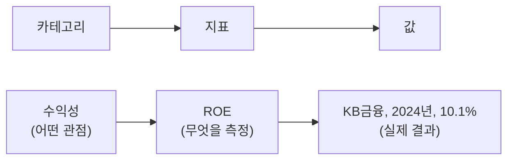

# Compass 데이터베이스 설계

Compass 시스템의 데이터베이스가 **왜 이렇게 설계되었는지** 설명하는 문서.
테이블 상세 명세는 [개발자용 스키마 문서](./database-schema.md) 참고.

---

## 이 시스템이 해결해야 하는 문제

Compass는 금융회사의 경영성과, 지배구조, 재무지표를 수집하고 비교 분석하는 시스템.

### 문제 1: 업종마다 중요한 지표가 다름

- 은행: BIS비율, NPL, NIM, 예대율
- 보험: K-ICS, 손해율, 사업비율
- 증권: NCR, 시장점유율, IB수수료 비중
- 서비스 발전에 따라 지표가 추가/제거될 수 있음
- 지표가 바뀔 때마다 시스템을 수정하는 건 비효율적

→ **지표를 시스템에 고정하지 않고 데이터로 관리**. "어떤 지표가 있는지" 정의하는 테이블과 "실제 값"을 저장하는 테이블을 분리하면, 시스템 수정 없이 지표 추가/제거 가능.

### 문제 2: 다양한 수준의 비교 분석 필요

- 단일 지표 비교: ROE만으로 기업 간 비교
- 카테고리 비교: "수익성" 관점에서 ROE, ROA, 영업이익률을 함께 비교
- 관련 지표들을 묶어서 종합 비교해야 할 때가 있음

→ **지표들을 카테고리로 그룹화**. 카테고리 → 지표 → 값의 3단계 구조로, 단일 지표 비교와 카테고리 단위 비교 모두 지원.

### 문제 3: 공식 산업분류만으로는 의미 있는 비교가 어려움

- KSIC(한국표준산업분류), GICS(글로벌산업분류기준) 등 공식 분류는 법적/행정적 목적
- 분석 목적에 따라 다른 그룹핑 필요
  - 4대 금융지주, 반도체 관련주, 이차전지/로봇 테마주 등
- 한 기업이 여러 그룹에 동시에 속할 수 있어야 함
  - 예: 금융업 + 4대 금융지주 + ESG 우수기업

→ **공식 분류와 테마 분류를 분리**. 공식 분류는 기업당 하나, 테마 분류는 여러 개 가능.

### 문제 4: 기업간 관계 구조의 체계화 필요

- 금융지주사 종합 분석에는 계열사 정보가 필수
  - KB금융지주 분석 시 KB국민은행, KB증권, KB손해보험 등 자회사 현황 파악 필요
  - 지주회사-자회사 관계, 지분율, 관계 유형(자회사/계열사/관계회사) 등
- 관계는 시간에 따라 변함
  - 인수, 매각, 지분 변동 등으로 수시로 변경
  - "현재 자회사"뿐 아니라 "2020년 시점 자회사"도 조회 필요

→ **기업간 관계를 별도 구조로 관리하고 유효 기간 저장**. 관계 유형, 지분율, 유효 기간을 기록하여 특정 시점의 그룹 구조 조회 가능.

### 문제 5: 리그테이블 시스템의 효율적 관리

- 이 서비스의 핵심은 유사한 성격의 기업을 그룹핑하여 리그테이블로 비교 분석하는 것
- 리그테이블은 다양한 기준으로 생성됨
  - 업종별: 은행 ROE, 증권사 순이익
  - 시장별: KOSPI 매출액 Top 100
  - 지표별: 부채비율 낮은 기업
- 리그테이블마다 기준 지표, 대상 범위, 정렬 방향 등이 다름
- 시점별 변동 추적도 필요
  - "지난 분기 3위 → 이번 분기 1위"
  - 매번 새로 계산하면 과거 기록 유실

→ **리그테이블 정의와 결과를 분리**. 정의(기준, 범위, 정렬)는 재사용하고, 결과는 시점별로 스냅샷 보존.

---

## 설계 결정

위 문제들을 해결하기 위해 채택한 구조.

### 1. 카테고리-지표-값 3단계 구조

경영성과, 지배구조, 재무지표 세 영역 모두 동일한 패턴 적용.

예시 (경영성과 영역):
- 카테고리: 수익성
- 지표: ROE
- 값: KB금융지주, 2024년, 10.1%

장점:
- 새 지표 추가 시 시스템 수정 불필요
- 카테고리 단위 비교 분석 가능
- 세 영역이 동일 구조라 일관성 있음

### 2. 공식 분류와 테마 분류 분리

- **공식 분류**: KSIC 기반, 기업당 하나만
- **테마 분류**: 분석 목적별 그룹, 기업당 여러 개 가능

→ "은행업 중 4대 금융지주"처럼 조건 조합 가능.

### 3. 유효 기간이 있는 기업간 관계

기업간 관계 저장 시 유효 기간 함께 저장.

- KB금융지주 → KB국민은행: 2008년 9월 ~ 현재 (자회사)
- KB금융지주 → 옛 계열사: 2015년 1월 ~ 2020년 6월 (매각)

종료일이 비어있으면 현재 유효한 관계.

### 4. 리그테이블 정의와 결과 분리

리그테이블을 3단계로 관리.

1. **정의**: 리그테이블의 기준 설정
   - 기준 지표, 대상 범위, 정렬 방향 등
   - 예: "KOSPI 매출액 Top 100", "은행업 ROE"

2. **스냅샷**: 특정 시점의 계산 결과
   - 예: 2024년 1분기 기준 결과

3. **항목**: 각 기업의 순위와 값
   - 예: KB금융지주 3위, 15조원, 전 분기 대비 2단계 상승

→ 정의는 재사용하고, 결과는 시점별로 보존하여 변동 추적 가능.

---

## 데이터 구조 개요

### 기업 정보
- 시스템에서 관리하는 모든 기업의 기본 정보
- DART 코드를 기업 고유 식별자로 사용 (비상장사는 종목코드가 없으므로)

### 산업 분류
- 계층 구조: 금융업 > 은행 > 시중은행
- 공식 분류 / 테마 분류 구분 저장

### 기업-산업 연결
- 기업과 산업 분류의 연결
- 한 기업이 여러 분류에 속할 수 있어 별도 테이블로 관리

### 기업간 관계
- 모회사-자회사, 계열사 등의 관계
- 관계 유형, 지분율, 유효 기간 포함

### 경영성과 / 지배구조 / 재무지표
- 세 영역 모두 카테고리-지표-값 3단계 구조
- 경영성과: 매출, 이익, 성장률 등 (연간/분기)
- 지배구조: 이사회 구성, 감사 기구, 주주 구성 등 (연간만)
- 재무지표: 부채비율, 유동비율, 현금흐름 등 (연간/분기)

### 랭킹 시스템
- 랭킹 정의 → 스냅샷 → 항목의 3단계 구조
- 순위 변동, 평균 대비 위치, 백분위 등 저장

### 데이터 추출 이력
- 외부 시스템(DART 등)에서 데이터 수집 이력
- 주로 시스템 운영/디버깅용

---

## 관련 문서

- **개발자용 상세 스키마**: [database-schema.md](./database-schema.md)
  - 테이블 구조, 컬럼 명세, Rails 모델 구조, 쿼리 예시 등

---

**작성일**: 2025-11-26
**버전**: 2.0
