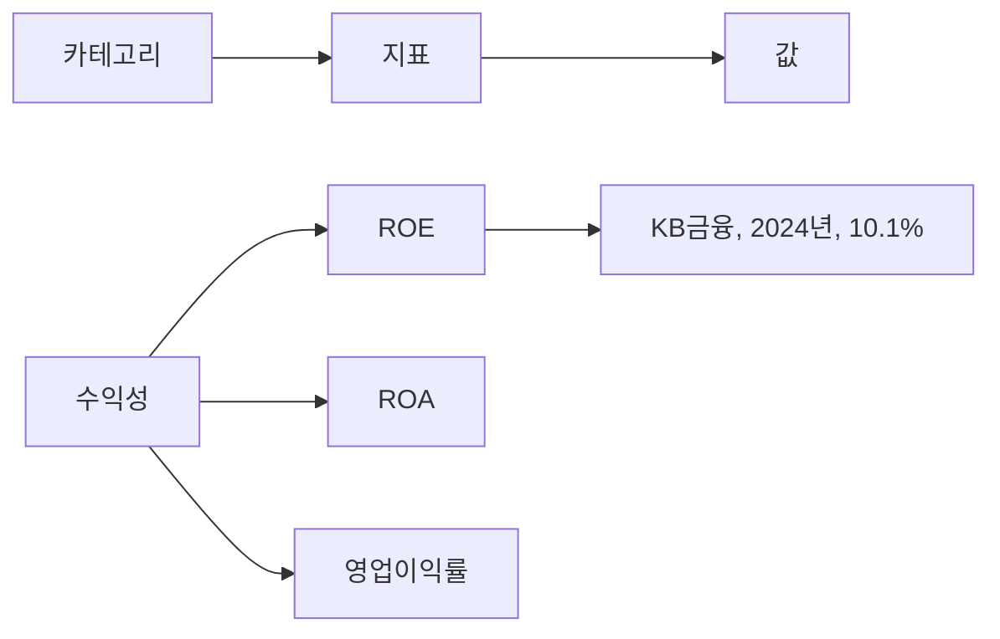
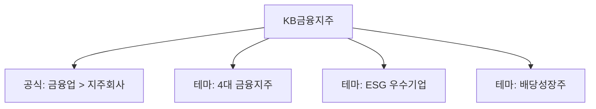
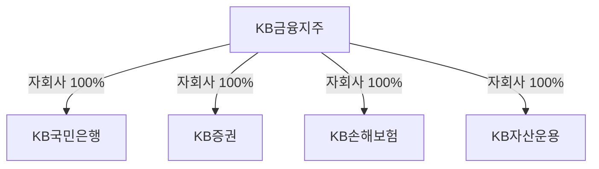
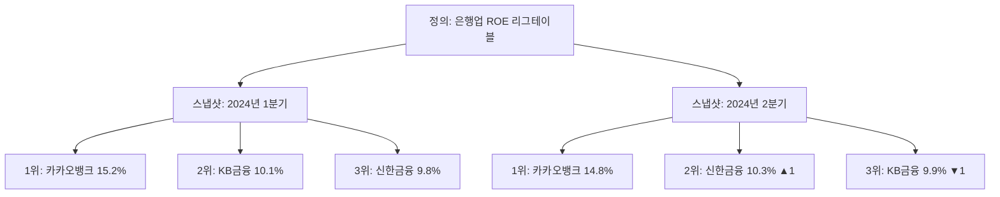

# Compass 데이터베이스 설계

Compass 시스템의 데이터베이스가 **왜 이렇게 설계되었는지** 설명하는 문서.
테이블 상세 명세는 [개발자용 스키마 문서](./database-schema.md) 참고.

---

## 핵심 고려사항

### 문제 1: 지표의 유연한 관리 필요

- 업종마다 중요한 지표가 다름
  - 은행: BIS비율, NPL, NIM, 예대율
  - 보험: K-ICS, 손해율, 사업비율
  - 증권: NCR, 시장점유율, IB수수료 비중
- 서비스 발전에 따라 지표가 추가/제거될 수 있음
- 지표가 바뀔 때마다 시스템을 수정하는 건 비효율적
- 다양한 수준의 비교 분석 필요
  - 단일 지표 비교: ROE만으로 기업 간 비교
  - 카테고리 비교: "수익성" 관점에서 ROE, ROA, 영업이익률을 함께 비교

→ **카테고리-지표-값 3단계 구조로 설계**. 지표를 시스템에 고정하지 않고 데이터로 관리하여 시스템 수정 없이 지표 추가/제거 가능. 카테고리로 그룹화하여 단일 지표 비교와 카테고리 단위 비교 모두 지원.

### 문제 2: 다양한 관점의 기업 비교 분석 필요

- KSIC, GICS 등 공식 산업분류만으로는 의미 있는 비교가 어려움
- 분석 목적에 따라 다른 그룹핑 필요
  - 4대 금융지주, 반도체 관련주, 이차전지/로봇 테마주 등
- 한 기업이 여러 그룹에 동시에 속할 수 있어야 함
  - 예: 금융업 + 4대 금융지주 + ESG 우수기업

→ **공식 분류와 테마 분류를 분리**. 공식 분류는 기업당 하나, 테마 분류는 여러 개 가능.

### 문제 3: 기업간 관계 구조의 체계화 필요

- 금융지주사 종합 분석에는 계열사 정보가 필수
  - KB금융지주 분석 시 KB국민은행, KB증권, KB손해보험 등 자회사 현황 파악 필요
  - 지주회사-자회사 관계, 지분율, 관계 유형(자회사/계열사/관계회사) 등
- 관계는 시간에 따라 변함
  - 인수, 매각, 지분 변동 등으로 수시로 변경
  - "현재 자회사"뿐 아니라 "2020년 시점 자회사"도 조회 필요

→ **기업간 관계를 별도 구조로 관리하고 유효 기간 저장**. 관계 유형, 지분율, 유효 기간을 기록하여 특정 시점의 그룹 구조 조회 가능.

### 문제 4: 체계적인 랭킹 시스템 필요

이 서비스의 핵심은 유사한 성격의 기업을 그룹핑하여 리그테이블로 비교 분석하는 것.

- 랭킹은 다양한 기준으로 생성됨
  - 업종별: 은행 ROE, 증권사 순이익
  - 시장별: KOSPI 매출액 Top 100
  - 지표별: 부채비율 낮은 기업
- 랭킹마다 기준 지표, 대상 범위, 정렬 방향 등이 다름
- 시점별 변동 추적 필요
  - "지난 분기 3위 → 이번 분기 1위"
  - 매번 새로 계산하면 과거 기록 유실

→ **랭킹 정의와 결과를 분리하는 3단계 구조 채택**.
  - **정의(Definition)**: 랭킹의 기준 설정 (기준 지표, 대상 범위, 정렬 방향)
  - **스냅샷(Snapshot)**: 특정 시점의 계산 결과 보존
  - **항목(Entry)**: 각 기업의 순위, 값, 변동폭 기록

---

## 설계 구조

### 1. 카테고리-지표-값 3단계 구조

**적용 영역:**

| 영역 | 카테고리 예시 | 지표 예시 | 데이터 주기 |
|------|-------------|----------|------------|
| 경영성과 | 수익성, 성장성, 안정성 | ROE, 매출성장률, 부채비율 | 연간/분기 |
| 지배구조 | 이사회, 감사기구, 주주구성 | 사외이사비율, 감사위원회설치여부 | 연간 |
| 재무지표 | 자본적정성, 자산건전성, 유동성 | BIS비율, NPL비율, 유동비율 | 연간/분기 |

**장점:**
- 새 지표 추가 시 시스템 수정 불필요 (데이터만 추가)
- 카테고리 단위 종합 비교 가능
- 세 영역 동일 구조로 일관성 확보

### 2. 공식 분류와 테마 분류 분리

**분류 체계:**

| 구분 | 특징 | 기업당 개수 | 예시 |
|------|------|-----------|------|
| 공식 분류 | KSIC 기반 계층 구조 | 1개 | 금융업 > 은행 > 시중은행 |
| 테마 분류 | 분석 목적별 그룹 | 여러 개 | 4대 금융지주, 고배당주, ESG우수 |

**활용:** "은행업 중 4대 금융지주", "KOSPI 내 ESG 우수기업" 등 조건 조합 가능

### 3. 기업간 관계 구조 체계화

**관계 정보:**

| 항목 | 설명 | 예시 |
|------|------|------|
| 관계 유형 | 자회사, 계열사, 관계회사 | 자회사 |
| 지분율 | 소유 비율 | 100% |
| 유효 기간 | 관계 시작/종료일 | 2008.09 ~ 현재 |

**활용:** 특정 시점 기준 그룹 구조 조회 (예: "2020년 말 기준 KB금융지주 자회사 목록")

### 4. 리그테이블 정의와 결과 분리

**3단계 구조:**

| 단계 | 역할 | 저장 정보 |
|------|------|----------|
| 정의 | 리그테이블 기준 설정 | 기준 지표, 대상 범위, 정렬 방향 |
| 스냅샷 | 특정 시점 계산 결과 | 계산일, 대상 기업 수, 평균값 |
| 항목 | 기업별 순위와 값 | 순위, 값, 변동폭, 백분위 |

**활용:** 시점별 순위 변동 추적 ("지난 분기 3위 → 이번 분기 1위")

---

## 관련 문서

- **개발자용 상세 스키마**: [database-schema.md](./database-schema.md)
  - 테이블 구조, 컬럼 명세, Rails 모델 구조, 쿼리 예시 등

---

**작성일**: 2025-11-26
**버전**: 2.0
