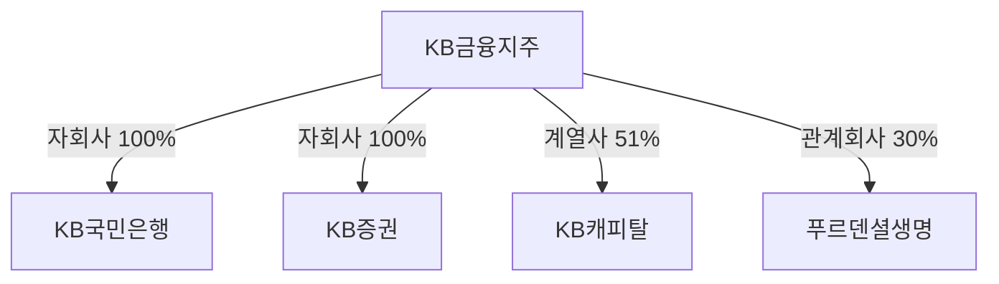

# Compass 데이터베이스 설계

Compass 시스템의 데이터베이스 설계 배경과 원칙을 설명하는 문서.
테이블 상세 명세는 [개발자용 스키마 문서](./database-schema.md) 참고.

---

## 설계 원칙 요약

Compass의 핵심 기능은 유사한 성격의 기업을 그룹핑하여 리그테이블로 비교 분석하는 것. 이를 위해 다음 네 가지 문제를 해결하는 구조로 설계됨.

| 문제 | 해결 방향 | 설계 구조 |
|------|----------|----------|
| 지표의 유연한 관리 | 지표를 코드가 아닌 데이터로 관리 | 카테고리-지표-값 3단계 구조 |
| 다양한 관점의 기업 비교 | 공식 분류와 분석 목적별 분류 분리 | 공식 분류 + 테마 분류 이원화 |
| 그룹사 연계 분석 | 관계 정보를 별도 구조로 관리하고 이력 보존 | 관계 테이블 + 유효 기간 |
| 시점별 순위 변동 추적 | 리그테이블 정의와 계산 결과 분리 | 정의-스냅샷-항목 3단계 구조 |

---

## 1. 지표의 유연한 관리: 카테고리-지표-값 구조

### 문제

- 업종마다 중요한 지표가 다름 (은행: BIS비율, 보험: K-ICS, 증권: NCR 등)
- 지표가 수시로 변경되므로 코드 수정 없이 관리할 수 있어야 함
- 단일 지표 비교와 카테고리 단위 비교를 모두 지원해야 함

### 설계

지표를 코드에 고정하지 않고 데이터로 관리. 카테고리로 그룹화하여 두 가지 비교 방식 모두 지원.

### 적용 영역

이 구조는 시스템의 세 가지 핵심 영역에 동일하게 적용됨.

| 영역 | 카테고리 예시 | 지표 예시 | 데이터 주기 |
|------|-------------|----------|------------|
| 경영성과 | 수익성, 성장성, 안정성 | ROE, 매출성장률, 부채비율 | 연간/분기 |
| 지배구조 | 이사회, 감사기구, 주주구성 | 사외이사비율, 감사위원회설치여부 | 연간 |
| 재무지표 | 자본적정성, 자산건전성, 유동성 | BIS비율, NPL비율, 유동비율 | 연간/분기 |

### 장점

- 새 지표 추가 시 코드 수정 불필요
- 카테고리 단위 종합 비교 가능
- 세 영역에 동일 구조를 적용하여 일관성 확보

---

## 2. 다양한 관점의 기업 비교: 공식 분류와 테마 분류 분리

### 문제

- 공식 산업분류(KSIC, GICS)만으로는 의미 있는 비교가 어려움
- 분석 목적에 따라 다양한 그룹핑 필요 (4대 금융지주, 반도체 관련주 등)
- 한 기업이 여러 그룹에 동시에 속할 수 있어야 함

### 설계

공식 분류(기업당 1개)와 테마 분류(기업당 N개)를 분리.

### 분류 체계

| 구분 | 특징 | 기업당 개수 | 예시 |
|------|------|-----------|------|
| 공식 분류 | KSIC 기반 계층 구조 | 1개 | 금융업 > 은행 > 시중은행 |
| 테마 분류 | 분석 목적별 그룹 | 여러 개 | 4대 금융지주, 고배당주, ESG우수 |

### 활용

- "은행업 중 4대 금융지주", "KOSPI 내 ESG 우수기업" 등 조건 조합 가능

---

## 3. 그룹사 연계 분석: 기업 간 관계 구조

### 문제

- 금융지주사 분석 시 자회사(은행, 보험, 증권 등)를 함께 비교해야 함
- 지배구조 파악을 위해 관계 유형과 지분율 정보가 필요함
- 관계 변동 이력도 조회할 수 있어야 함

### 설계

기업 간 관계를 별도 테이블로 관리. 관계 유형, 지분율, 유효 기간을 저장하여 그룹사 연계 분석과 지배구조 파악 지원.

### 관계 정보

| 항목 | 설명 | 예시 |
|------|------|------|
| 관계 유형 | 자회사, 계열사, 관계회사 | 자회사 |
| 지분율 | 소유 비율 | 100% |
| 유효 기간 | 관계 시작일과 종료일 | 2008.09 ~ 현재 |

### 활용

- KB금융지주 선택 시 KB국민은행, KB증권, KB손해보험 지표를 함께 비교
- 4대 금융지주의 은행 자회사끼리 비교 (KB국민은행 vs 신한은행 vs 하나은행 vs 우리은행)
- 특정 시점 기준 그룹 구조 조회 (예: "2020년 말 기준 자회사 목록")

---

## 4. 시점별 순위 변동 추적: 리그테이블 정의-스냅샷-항목 구조

### 문제

- 리그테이블마다 기준 지표, 대상 범위, 정렬 방향이 다름
- 시점별 순위 변동을 추적해야 하므로 과거 계산 결과를 보존해야 함

### 설계

리그테이블 정의와 계산 결과를 분리하는 3단계 구조 채택.

- **정의(Definition)**: 리그테이블의 기준 설정 (기준 지표, 대상 범위, 정렬 방향)
- **스냅샷(Snapshot)**: 특정 시점의 계산 결과 보존
- **항목(Entry)**: 각 기업의 순위, 값, 변동폭 기록

### 3단계 구조 상세

| 단계 | 역할 | 저장 정보 |
|------|------|----------|
| 정의 | 리그테이블 기준 설정 | 기준 지표, 대상 범위, 정렬 방향 |
| 스냅샷 | 특정 시점 계산 결과 | 계산일, 대상 기업 수, 평균값 |
| 항목 | 기업별 순위와 값 | 순위, 값, 변동폭, 백분위 |

### 활용

- 시점별 순위 변동 추적 (예: "지난 분기 3위 → 이번 분기 1위")

---

## 관련 문서

- **개발자용 상세 스키마**: [database-schema.md](./database-schema.md)
  - 테이블 구조, 컬럼 명세, Rails 모델 구조, 쿼리 예시 등

---

**작성일**: 2025-11-27
**버전**: 2.2
