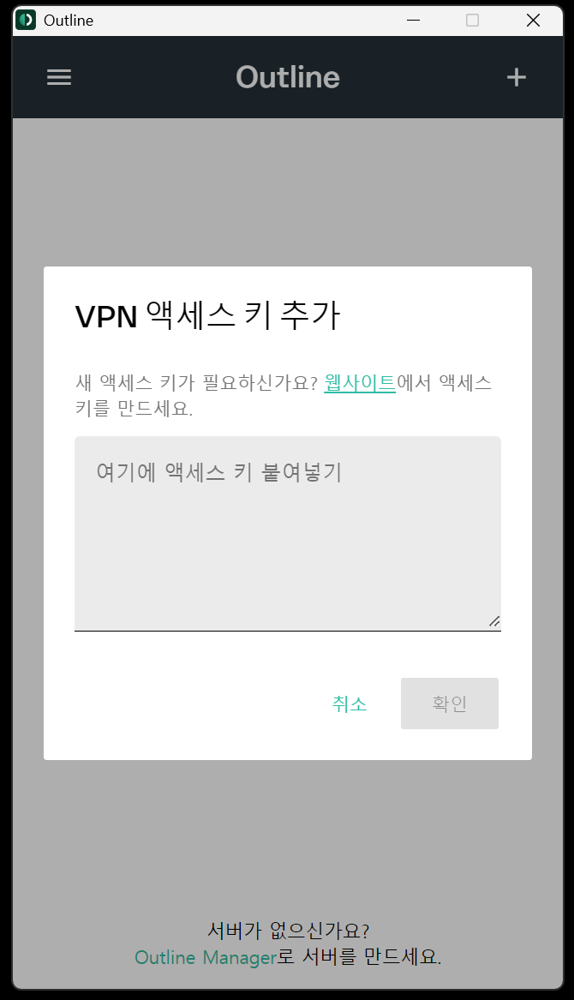
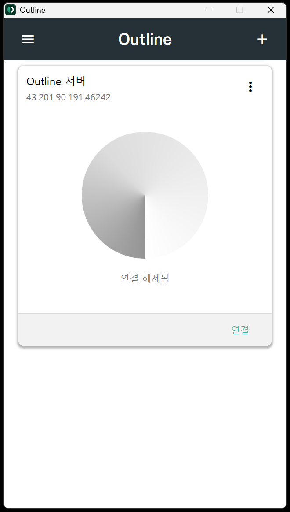
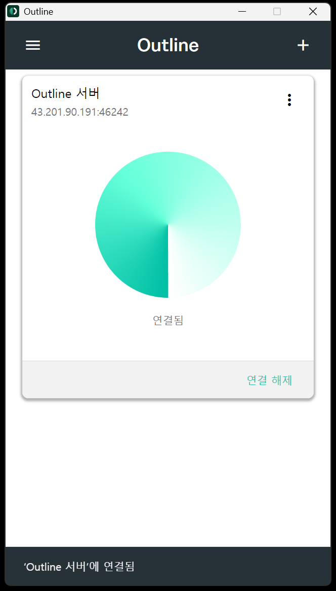
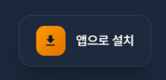

# Compass 시작 가이드

## 사이트 주소

https://staging.thecompass.biz

> **안내**
> 모바일/태블릿 화면은 현재 조정 중입니다. **2월 9일 정식 오픈**부터 지원됩니다.

---

## 접속 방법

### 사내에서 접속
바로 접속 가능합니다.

### 외부에서 접속
VPN 연결이 필요합니다. 아래 **VPN 설정**을 참고해 주세요.

---

## VPN 설정

> **주의사항**
> 월별 VPN 사용량이 한정되어 있습니다. **Compass 접속 외 용도로는 사용을 제한**해 주세요.
> 사용 완료 후에는 반드시 **연결 해제** 버튼을 눌러 VPN 연결을 종료해 주세요.

### 1. Outline 클라이언트 설치

| 운영체제 | 다운로드 링크 |
|---------|-------------|
| Windows | [Outline-Client.exe](https://s3.amazonaws.com/outline-releases/client/windows/stable/Outline-Client.exe) |
| macOS | [App Store](https://apps.apple.com/app/outline-app/id1356178125) |

### 2. 액세스 키 입력

**Step 1.** Outline을 실행하면 **VPN 액세스 키 추가** 화면이 나타납니다.

- 전달받은 **액세스 키**를 입력창에 붙여넣고 **확인**을 클릭합니다.

> 액세스 키는 `ss://...` 형식의 문자열입니다.

**Step 2.** 서버가 추가되면 **연결** 버튼을 클릭합니다.

**Step 3.** 화면이 **녹색**으로 바뀌면 연결 완료입니다.

---

## 앱으로 설치 (선택)

사이트 접속 후 화면 하단의 **앱으로 설치** 버튼을 클릭하면 바로가기가 생성됩니다.

---

## 문제 해결

| 증상 | 해결 방법 |
|-----|----------|
| 연결 버튼을 눌러도 연결되지 않음 | V3, 알약 등 백신 프로그램을 잠시 종료 후 재시도 |
| 액세스 키가 유효하지 않다고 표시됨 | 관리자에게 새 액세스 키 요청 |
| Compass 페이지가 열리지 않음 | VPN 연결 상태 확인 (녹색 표시 여부) |

---

## 문의

접속 관련 문의는 관리자에게 연락해 주세요.
